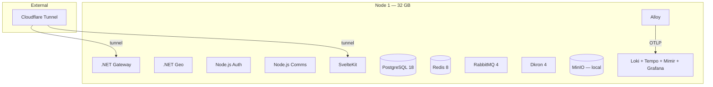

# D²-WORX Internal Planning Document

> **Purpose**: Internal planning, architecture decisions, and status tracking for D²-WORX development.
> This document is for development reference and should not be considered user-facing documentation.

---

## Table of Contents

1. [Roadmap](#roadmap)
   - [Phase 2: Auth Service + SvelteKit Integration](#phase-2-auth-service--sveltekit-integration)
   - [Phase 3: Auth Features (Future)](#phase-3-auth-features-future)
2. [Issues](#issues)
   - [Open — Can Fix Now](#open--can-fix-now)
   - [Open Questions](#open-questions)
   - [Deferred Upgrades](#deferred-upgrades)
   - [Blocked — Can Only Fix Later](#blocked--can-only-fix-later)
3. [Work in Progress](#work-in-progress)
4. [Implementation Status](#implementation-status)
   - [Infrastructure](#infrastructure)
   - [Shared Packages (.NET)](#shared-packages-net)
   - [Shared Packages (Node.js)](#shared-packages-nodejs)
   - [Services](#services)
   - [Gateways](#gateways)
   - [Frontends](#frontends)
5. [Architecture Decisions](#architecture-decisions)
   - [ADR-001: Authentication Architecture](#adr-001-authentication-architecture)
   - [ADR-002: Rate Limiting Strategy](#adr-002-rate-limiting-strategy)
   - [ADR-003: Geo Data Caching Strategy](#adr-003-geo-data-caching-strategy)
   - [ADR-004: Fingerprinting Approach](#adr-004-fingerprinting-approach)
   - [ADR-005: Request Flow Pattern (Hybrid BFF + Direct Gateway)](#adr-005-request-flow-pattern-hybrid-bff--direct-gateway)
   - [ADR-006: Retry & Resilience Pattern](#adr-006-retry--resilience-pattern)
   - [ADR-007: Idempotency Middleware](#adr-007-idempotency-middleware)
   - [ADR-008: Sign-Up Flow & Cross-Service Ordering](#adr-008-sign-up-flow--cross-service-ordering)
   - [ADR-009: Drizzle ORM for Auth Database](#adr-009-drizzle-orm-for-auth-database-replacing-kysely)
   - [ADR-010: Reserved](#adr-010-reserved)
   - [ADR-011: Lightweight DI Container (`@d2/di`)](#adr-011-lightweight-di-container-d2di)
   - [ADR-012: Service-to-Service Trust (S2S)](#adr-012-service-to-service-trust-s2s)
   - [ADR-013: Scheduled Jobs (Dkron)](#adr-013-scheduled-jobs-dkron)
   - [ADR-014: Comms Delivery Engine](#adr-014-comms-delivery-engine)
   - [ADR-015: SvelteKit Strategy](#adr-015-sveltekit-strategy)
   - [ADR-016: Environment Variable Architecture](#adr-016-environment-variable-architecture)
   - [ADR-017: Auth BFF Client Pattern](#adr-017-auth-bff-client-pattern)
   - [ADR-018: Dependency Update Policy](#adr-018-dependency-update-policy)
   - [ADR-019: Three-Tier Playwright Test Architecture](#adr-019-three-tier-playwright-test-architecture)
   - [ADR-020: D2_MOCK_INFRA Infrastructure Stubbing](#adr-020-d2_mock_infra-infrastructure-stubbing)
   - [ADR-021: Grafana Faro Client Telemetry](#adr-021-grafana-faro-client-telemetry)
   - [ADR-022: Design System-First Development](#adr-022-design-system-first-development)
   - [ADR-023: Gateway-Edge i18n Translation](#adr-023-gateway-edge-i18n-translation)
   - [ADR-024: Production Topology (1-Node → 3-Node)](#adr-024-production-topology-1-node--3-node)
   - [ADR-025: Replace .NET Aspire with Docker Compose / Swarm](#adr-025-replace-net-aspire-with-docker-compose--swarm)
   - [ADR-026: File Service Architecture](#adr-026-file-service-architecture)
   - [ADR-027: Node.js JWT Validation Middleware](#adr-027-nodejs-jwt-validation-middleware)
   - [ADR-028: SignalR Real-Time Gateway](#adr-028-signalr-real-time-gateway)
6. [Production Deployment Checklist](#production-deployment-checklist)

---

## Roadmap

### Completed Milestones

- **Phase 1: TypeScript Shared Infrastructure** ✅ — 24 shared `@d2/*` packages mirroring .NET (result, handler, DI, caching, messaging, middleware, batch-pg, errors-pg, i18n, auth/CSRF/translation middleware)
- **Phase 2 Stage A: Cross-cutting foundations** ✅ — Retry utility, idempotency middleware, UUIDv7
- **Phase 2 Stage B: Auth Service DDD layers** ✅ — domain, app, infra, api (969 tests)
- **Comms Service Stage A** ✅ — Delivery engine, email + SMS providers, `@d2/comms-client` (575 tests)
- **E2E Cross-Service Tests** ✅ — 31 tests (22 API-level + 9 browser E2E: Auth → Geo → Comms delivery pipeline + Dkron job chain + BFF client integration)
- **Cross-platform Parity** ✅ — `@d2/batch-pg`, `@d2/errors-pg`, .NET `Errors.Pg`, documented in `backends/PARITY.md`
- **.NET Gateway** ✅ — JWT auth, request enrichment, rate limiting, CORS, service key middleware, translation middleware
- **Geo Service** ✅ — Complete (.NET), 798 tests
- **Production-readiness Sweep** ✅ — 40 items triaged, all high/medium fixed, polish items done
- **Scheduled Jobs (Dkron)** ✅ — 8 daily maintenance jobs (Auth 4, Geo 2, Comms 2), `@d2/dkron-mgr` reconciler (64 tests), full-chain E2E tested
- **SvelteKit Web Client Steps 0–9** ✅ — Design system, routing, auth BFF, gateway client, forms, auth pages, fingerprinting, Faro telemetry, three-tier Playwright tests (706 tests: 551 Vitest + 146 mocked Playwright + 9 browser E2E)
- **Q1 2026 Dependency Update** ✅ — .NET 10.0.103, Node 24.14, pnpm 10.30, auth health gRPC migration (#43)
- **i18n & BCP 47 Locale Migration** ✅ — 10 BCP 47 locales (en-US, en-CA, en-GB, fr-FR, fr-CA, es-ES, es-MX, de-DE, it-IT, ja-JP) replacing 5 bare language codes. D2.Shared.I18n + @d2/i18n packages, gateway-edge translation middleware, Contact.IETFBCP47Tag field, auth middleware extraction to shared packages
- **Shared tests** — 1,127 passing

### Phase 2: Auth Service + SvelteKit Integration

**Stage B.5 — Scheduled Jobs (Dkron) ✅** — See [ADR-013](#adr-013-scheduled-jobs-dkron).

**Dependency Update — Q1 2026 ✅** — Completed. See [ADR-018](#adr-018-dependency-update-policy).

**SvelteKit App Foundations ✅** — Route groups, layouts, sidebar, shadcn-svelte, design system, server middleware (enrichment + rate limiting + idempotency), auth BFF proxy, API gateway client. See [WIP](#work-in-progress) for step-by-step progress.

**Stage C — Auth Client Libraries (In Progress)**

- **@d2/auth-bff-client** ✅ — BFF client for SvelteKit (ADR-017). SessionResolver, JwtManager, AuthProxy, route guards. 42 unit + 10 E2E tests.
- **@d2/auth-client** — Backend gRPC client for other Node.js services (mirrors `@d2/geo-client` pattern). Planned.
- **.NET Auth.Client** — JWT validation via JWKS + `AddJwtBearer()`, gRPC client. Planned.

**Stage D — Auth Integration + Comms Con't**

- ~~**Forms architecture**~~ ✅ — Superforms + Formsnap, Zod 4, field presets, D2Result error mapping (73 tests)
- ~~**Auth pages**~~ ✅ — Sign-in, sign-up, forgot/reset password, email verification. i18n (10 BCP 47 locales)
- ~~**Device fingerprinting**~~ ✅ — Cross-cutting: SvelteKit + Node.js + .NET. `d2-cfp` cookie, DeviceFingerprint dimension
- ~~**Client telemetry**~~ ✅ — Grafana Faro (errors → Loki, traces → Tempo, Web Vitals → Mimir). Alloy `faro.receiver`, Web Vitals RUM dashboard
- **Onboarding** — Post-verification: accept pending invitation(s) or create `customer` org
- **Session management** — Org switching, active session list, sign-out
- **App shell finalization** — Org-type nav, org switcher, emulation banner, breadcrumbs
- **SignalR integration** — Browser → .NET gateway direct (`@microsoft/signalr`)
- **Comms Stage B** — In-app notifications, push via SignalR

Auth service architecture documented in [`AUTH.md`](backends/node/services/auth/AUTH.md).

### Phase 3: Auth Features (Future)

1. **Session management UI** (list sessions, revoke individual, revoke all others)
2. **Org emulation** (support/admin can view any org's data in read-only mode)
3. **User impersonation** (escalated support — act as a specific user, audit-logged, time-limited)
4. **Admin control panel** (cross-org visibility, user/org management, system diagnostics)
5. **Admin alerting** (rate limit threshold alerts via Comms service)
6. **Comms expansion** — In-app notifications, push via SignalR, conversational messaging (Comms Stages B-D)

---

## Issues

[↑ back to top](#table-of-contents)

### Open — Can Fix Now

| #   | Item                                         | Owner | Effort | Notes                                                                                                                                                                                                                                                                                                                                                                                                                                                              |
| --- | -------------------------------------------- | ----- | ------ | ------------------------------------------------------------------------------------------------------------------------------------------------------------------------------------------------------------------------------------------------------------------------------------------------------------------------------------------------------------------------------------------------------------------------------------------------------------------ |
| 40  | OTel alerting rules                          | All   | Medium | Grafana is running — no longer blocked. Define Grafana alert rules + alerting channel config. Targets: error rate >5% 5xx over 5min, latency P99 >2s, rate limit blocks per dimension, delivery failures, gRPC failure rate, service unavailability (RabbitMQ down, Redis down). Requires alert rule YAML + notification channel setup.                                                                                                                            |
| 43  | `@d2/comms-client` missing handler interface | Comms | Low    | `Notify` handler `extends BaseHandler` but does NOT `implements INotifyHandler` — no interface exists. `INotifyKey` is `ServiceKey<Notify>` (typed to class, not interface). Violates established pattern (geo-client does it correctly: all handlers implement interfaces, all keys typed to interfaces). Fix: add `INotifyHandler` interface in `interfaces/pub/`, have `Notify implements INotifyHandler`, update `INotifyKey` to `ServiceKey<INotifyHandler>`. |
| 44  | `GetStorageObject` buffers entire file       | Files | Medium | Download proxy and processing pipeline load full file into a `Buffer`. Safe at current max (25MB org_document). Risk: OOM if large context keys (video, archives) are added. Fix: add `StreamStorageObject` handler for download proxy, keep buffer-based handler for processing pipeline (Sharp/ClamAV need full buffer). Revisit before adding context keys >25MB.                                                                                               |

### Open Questions

- **Emulation/impersonation implementation details**: Authorization model decided (org emulation = read-only no consent, user impersonation = user-level consent, admin bypass). Remaining: should impersonation require 2FA? Should there be a max impersonation duration? How does `emulation_consent` integrate with BetterAuth's `impersonation` plugin hooks?

### Pre-Launch SEO Checklist

Items deferred from the initial SEO sweep that **MUST** be addressed before public launch:

| Item                               | Priority | Notes                                                                                                                                  |
| ---------------------------------- | -------- | -------------------------------------------------------------------------------------------------------------------------------------- |
| `og:image` social card             | P1       | Create a branded social card image (1200x630) for link previews. Add `og:image` to landing page and `twitter:card` / `twitter:image`.  |
| `og:url` canonical URLs            | P1       | Add `og:url` with absolute URL to public pages. Requires passing `$page.url` from server or using `url.href` in `<svelte:head>`.       |
| Twitter Card meta tags             | P2       | Add `twitter:card`, `twitter:title`, `twitter:description`, `twitter:image` to landing page.                                           |
| Canonical `<link rel="canonical">` | P2       | Add self-referential canonical links to all indexable pages to prevent duplicate content across locale variants.                       |
| Terms of Service page (`/terms`)   | P1       | Footer links exist but page not built. Add to sitemap once created.                                                                    |
| Privacy Policy page (`/privacy`)   | P1       | Footer links exist but page not built. Add to sitemap once created.                                                                    |
| Structured data (JSON-LD)          | P3       | `Organization` schema on landing page, `WebApplication` schema. Low priority for pre-alpha.                                            |
| Localize app page titles           | P3       | Dashboard/Profile/Settings/Welcome titles are hardcoded English. Add paraglide message keys when i18n coverage expands beyond auth UX. |
| Prerender public pages             | P3       | Landing, terms, privacy could use `export const prerender = true` for faster TTFB. Requires confirming no dynamic dependencies.        |

### Deferred Upgrades

From Q1 2026 audit:

| Item                           | Priority | Notes                                                                                                                                                   |
| ------------------------------ | -------- | ------------------------------------------------------------------------------------------------------------------------------------------------------- |
| MinIO replacement              | Medium   | Project archived Feb 2026. Pinned images still work. Evaluate Garage (AGPLv3), RustFS (Apache 2.0), or SeaweedFS (Apache 2.0) as a separate initiative. |
| EF Core → 10.0.3               | Blocked  | `Npgsql.EntityFrameworkCore.PostgreSQL` 10.0.0 pins EF Core Relational to 10.0.0. Wait for Npgsql EF provider 10.0.x release.                           |
| Serilog.Enrichers.Span removal | Low      | Deprecated upstream — Serilog now natively supports span data. Low-priority cleanup.                                                                    |
| dotenv.net 4.0                 | Low      | Major version with potential API changes. Only used in .NET Utilities.                                                                                  |
| Mimir 3.0                      | Low      | Major architectural change (Kafka buffer, new MQE, Consul/etcd deprecated). Requires deploying second cluster. Dedicated sprint.                        |
| RedisInsight 3.x               | Low      | Dev tool only. Major version with new UI + storage changes. 2.70.1 still works.                                                                         |

### Blocked — Can Only Fix Later

| #     | Item                                        | Blocker                                     | Priority   | Notes                                                                                                                                                          |
| ----- | ------------------------------------------- | ------------------------------------------- | ---------- | -------------------------------------------------------------------------------------------------------------------------------------------------------------- |
| 1     | Graceful shutdown: drain RabbitMQ consumer  | MessageBus needs new `drain()` API          | P2         | Consumer not drained before SIGTERM — in-flight messages lost                                                                                                  |
| 2     | Graceful shutdown test                      | Needs #1 (drain API) first                  | P2         | Can't test shutdown behavior until drain is implemented                                                                                                        |
| 3     | E2E delivery pipeline retry path test       | Comms retry scheduler not built (Stage B/C) | P2         | Retry processor that picks up failed attempts doesn't exist yet                                                                                                |
| 4     | Hook integration tests with real BetterAuth | BetterAuth test lifecycle infra not built   | P2         | Starting/stopping BetterAuth with real DB in test harness needs new infra                                                                                      |
| 5     | E2E Org contact CRUD flow test              | Stage C (auth org routes not built)         | P2         | Requires auth org contact API routes + multi-service orchestration                                                                                             |
| 8     | `dotnet outdated` in CI pipeline            | CI pipeline not set up yet                  | P3         | Automated dependency staleness checks                                                                                                                          |
| ~~9~~ | ~~Service auto-restart / readiness probes~~ | ~~Deployment infrastructure~~               | ~~Medium~~ | **Resolved.** Docker Compose health checks + `depends_on: condition: service_healthy` for startup ordering. Prod: Swarm `deploy.restart_policy` (ADR-025)      |
| 10    | Verification email delivery confirmation    | SignalR / push infra (Comms Stage B/C)      | P2         | FE should show pending state, listen on SignalR for delivery result. Generalizes to all async delivery feedback. `sendOnSignIn: true` auto-retries on recovery |

---

## Work in Progress

[↑ back to top](#table-of-contents)

Current focus: **File Service + SignalR Gateway** (detour from Step 10 Onboarding — required for user profile management, profile pictures, and real-time push notifications. Onboarding resumes after this is complete.)

Full SvelteKit implementation plan: [`clients/web/IMPLEMENTATION_PLAN.md`](clients/web/IMPLEMENTATION_PLAN.md)

### File Service + SignalR Gateway Implementation

| Step | Name                                       | Status  | Related ADRs     | Notes                                                                                                                                                                                                                                                                                                                                        |
| ---- | ------------------------------------------ | ------- | ---------------- | -------------------------------------------------------------------------------------------------------------------------------------------------------------------------------------------------------------------------------------------------------------------------------------------------------------------------------------------- |
| F1   | File domain layer (`@d2/files-domain`)     | Done    | ADR-026          | Entities, enums, rules, VariantConfig, constants. 236 tests. VariantSize = plain string, per-context-key variant config, no hardcoded context keys                                                                                                                                                                                           |
| F2   | File app layer (`@d2/files-app`)           | Done    | ADR-026          | 6 C/ + 3 Q/ + 1 U/ CQRS handlers, 3 messaging (1 pub + 2 sub), 4 provider groups (storage 7, image-processing, scanning, gRPC callback), repo bundle, 33 service keys, DI registration. 323 total tests                                                                                                                                      |
| F3   | File infra layer (`@d2/files-infra`)       | Done    | ADR-026          | 8 repo handlers (Drizzle/PG), 7 S3 storage handlers, Sharp image-processing (→ WebP), ClamAV scanning (direct TCP clamd), 2 gRPC outbound (FileCallback), SignalR realtime push, 3 messaging handlers (1 pub + 2 sub), 2 consumers (intake + processing), DI registration. 42 Testcontainers integration tests (PG + MinIO). 532 total tests |
| F4   | JWT validation middleware (`@d2/jwt-auth`) | Done    | ADR-027          | Shared package at `backends/node/shared/jwt-auth/`. RS256 JWKS verification (jose), fingerprint check (SHA-256 UA+Accept), IRequestContext population from JWT claims. Hono middleware for public-facing Node.js services                                                                                                                    |
| F5   | File API layer (`@d2/files-api`)           | Done    | ADR-026, ADR-027 | Hono REST (upload/download/list/health routes) + gRPC (FilesService + FilesJobsService). Composition root with DI wiring. Dockerfile (`docker/Dockerfile.files`), `d2-files` docker-compose service (ports 5300/5301), `FILES_S3_PUBLIC_ENDPOINT` for browser-reachable presigned URLs via cloudflared tunnel                                |
| F6   | SignalR Gateway                            | Pending | ADR-028          | Separate .NET service, JWT-authed WebSocket, gRPC interface for internal push notifications. Note: `PushFileUpdate` handler is registered in files-infra DI but not yet wired — will connect when F6 is built.                                                                                                                               |
| F7   | Owning service gRPC callback               | Pending | ADR-026          | Auth implements `OnFileProcessed` RPC — sets `user.image = fileId` for `auth_user_avatar` context                                                                                                                                                                                                                                            |
| F8   | File service tests                         | Pending | ADR-026          | Domain + app + infra + API + E2E. Adversarial upload testing (bad types, oversized, malformed)                                                                                                                                                                                                                                               |
| F9   | SvelteKit profile route + avatar upload    | Pending | ADR-026, ADR-028 | User profile page with avatar upload, real-time update via SignalR                                                                                                                                                                                                                                                                           |

### SvelteKit Implementation Progress

| Step | Name                                | Status      | Notes                                                                                            |
| ---- | ----------------------------------- | ----------- | ------------------------------------------------------------------------------------------------ |
| 0    | Document Implementation Plan        | ✅ Done     |                                                                                                  |
| 1    | Error Handling Foundation + Types   | ✅ Done     | App.Error, hooks, error page, client-error endpoint                                              |
| 2    | shadcn-svelte + Theme + Tokens      | ✅ Done     | Zinc OKLCH theme, Gabarito font, mode-watcher, Sonner toasts                                     |
| 2.5  | Server-Side Middleware              | ✅ Done     | Request enrichment, rate limiting, idempotency. SvelteKit→Geo gRPC                               |
| 3    | Design System Sprint (Kitchen Sink) | ✅ Done     | 27 components, 3 OKLCH presets, live theme editor at `/design`                                   |
| 3.5  | Design Review & Polish              | ✅ Done     | Playwright visual QA, 11 fixes across 6 theme/mode combos                                        |
| 4    | Route Groups + Layout System        | ✅ Done     | (auth), (onboarding), (app) groups, sidebar, auth guard stubs                                    |
| 5    | @d2/auth-bff-client + Auth Proxy    | ✅ Done     | 34 unit + 10 E2E tests. Session resolver, JWT manager (per-session cache), route guards          |
| 6    | API Client Layer (Gateway)          | ✅ Done     | 90 tests. camelCase normalizer, dynamic public URL, service key bypass, shared executeFetch      |
| 6.5  | Chart Showcase (LayerChart 2.0)     | ✅ Done     | 5 chart types: area, bar, line, donut, sparkline                                                 |
| 7    | Forms Architecture (Superforms)     | ✅ Done     | 108 tests. Superforms + Formsnap + Zod 4, field presets, D2Result mapping, form-actions pipeline |
| 8    | Auth Pages (Sign-In, Sign-Up, etc.) | ✅ Done     | Sign-in, sign-up, forgot/reset password, verify-email. i18n (10 BCP 47 locales)                  |
| 9    | Client Telemetry (Grafana Faro)     | ✅ Done     | Faro SDK, Alloy faro.receiver pipeline, Web Vitals → Mimir histograms, RUM dashboard             |
| 10   | Onboarding Flow                     | Blocked F\* | Post-auth org selection/creation + user profile. Needs File Service for profile pictures         |
| 11   | App Shell (Sidebar, Header, Org)    | Pending     | Org-type nav, org switcher, emulation banner, breadcrumbs                                        |
| 12   | SignalR Abstraction Layer           | Blocked F6  | Browser → .NET SignalR gateway direct (`@microsoft/signalr`). Needs SignalR Gateway built first  |

### Other Active Work

| Task                           | Status  | Related ADRs | Notes                                                                                                    |
| ------------------------------ | ------- | ------------ | -------------------------------------------------------------------------------------------------------- |
| Dependency audit & update      | ✅ Done | ADR-018      | Q1 2026 quarterly bump completed (#43)                                                                   |
| @d2/auth-client (backend gRPC) | Planned | —            | Mirrors @d2/geo-client pattern. Inter-service gRPC calls to Auth (user lookup, session validation, etc.) |
| .NET Auth.Client               | Planned | ADR-001      | .NET gRPC client for Auth service (mirrors @d2/auth-client pattern)                                      |

### Recently Completed

- **BCP 47 locale migration**: Migrated from 5 bare language codes (en, fr, es, de, ja) to 10 IETF BCP 47 locale tags (en-US, en-CA, en-GB, fr-FR, fr-CA, es-ES, es-MX, de-DE, it-IT, ja-JP). `contracts/messages/` files renamed, Paraglide config updated, `@d2/i18n` and `D2.Shared.I18n` packages provide locale validation/resolution on both platforms
- **Middleware extraction to shared packages**: Auth middleware (service key, session fingerprint, JWT auth) extracted from gateway-local code to `Auth.Default` (.NET) and `@d2/service-key` + `@d2/session-fingerprint` (Node.js). Translation middleware extracted to `Translation.Default` (.NET) and `@d2/translation` (Node.js). CSRF middleware extracted to `@d2/csrf` (Node-only). Gateways and auth-api now delegate to shared packages for framework-agnostic core logic
- **WhoIs fingerprint removal**: Hash simplified to `SHA256(ip|year|month)` — fingerprint field removed from proto, .NET domain, Node.js geo-client, and request enrichment. Old fingerprint-based records age out naturally via 180-day retention (`PurgeStaleWhoIs` job)
- **Comms delivery_attempt unique constraint** (#42): Added `uq_delivery_attempt_request_channel_attempt` unique index on `(request_id, channel, attempt_number)`
- **.NET i18n gateway-edge translation** (#41): `D2.Shared.I18n` package with `Translator` + `TK` constants. `TranslationMiddleware` in REST gateway resolves `D2-Locale` / `Accept-Language` at response time. Geo validators use `TK.*` keys instead of hardcoded English. See ADR-023
- **Contact.IETFBCP47Tag field**: BCP 47 locale on Geo Contact entity (defaults to `"en-US"`), synced from `User.locale` during `CreateUserContact`. Enables Comms service to deliver notifications in recipient's preferred language
- **SvelteKit web client merged to main** (PR #44): Steps 0–9 complete — design system (27 shadcn components, 3 OKLCH presets), routing (auth/onboarding/app groups), auth BFF proxy + JWT manager, API gateway client, forms (Superforms + Zod 4), auth pages (10 BCP 47 locales), device fingerprinting, Grafana Faro telemetry, three-tier Playwright tests. 706 SvelteKit tests total (551 Vitest + 146 mocked Playwright + 9 browser E2E)
- Browser E2E tests (Tier 2): 9 full-stack tests — sign-up, sign-in, sign-out, password reset. Self-contained via Testcontainers (PG, Redis, RabbitMQ) + .NET Geo child process + in-process Auth + SvelteKit dev server
- Playwright test restructure: Mocked tests moved from `e2e/` to `tests/mocked/` with `D2_MOCK_INFRA` mock injection. 146 mocked tests passing (5 skipped pending authenticated sessions). Three-tier test architecture: mocked CI, local E2E (`tests/e2e/`), true browser E2E (`backends/node/services/e2e/`)
- PR review fixes (#42–#53): CI job for bff-client tests, 72 new tests (reset-password, forgot-password, form-actions, auth-gateway-client, auth.server, middleware.server), shared `executeFetch()` extraction, schema dedup, .NET CORS multi-origin, empty-message fallback bug fix, CLAUDE.md path fix
- Singleflight deduplication (#32): `Singleflight` utility on both .NET and Node.js, wired into FindWhoIs to coalesce concurrent gRPC calls for the same cache key
- Ambient per-request context (#41): AsyncLocalStorage in `@d2/handler` — all Node.js handlers (including pre-auth singletons) automatically see per-request context, matching .NET DI scoping
- PII redaction verification (#6): No IPs in spans/logs, fingerprints + WhoIs IDs hashed, UAs redacted by handler RedactionSpec
- API key enforcement: Auth service requires valid `X-Api-Key` on all endpoints. `isOrgEmulating` span attribute guarded behind `isAuthenticated`
- Circuit breaker (#39): Custom `CircuitBreaker<T>` utility (.NET + Node.js) protecting Geo gRPC calls
- Client telemetry: Grafana Faro SDK, Alloy faro.receiver pipeline, Web Vitals RUM dashboard (Step 9)
- Device fingerprinting: cross-cutting SvelteKit + Node.js + .NET, `d2-cfp` cookie (Step 8.7)
- Debug session page + role audit docs (Step 8.5)
- Auth pages: sign-in, sign-up, forgot-password, reset-password, verify-email (Step 8)
- Forms architecture: Superforms + Formsnap + Zod 4, 108 tests (Step 7)
- Auth-aware public nav, language selector, email branding
- @d2/auth-bff-client package (ADR-017) — 42 unit + 10 E2E tests (per-session JWT cache fix)
- API client layer with camelCase normalizer (ADR-005)
- Design system page + chart showcase (LayerChart 2.0)
- Scoped debug logging with handler I/O redaction (Loki 30-day retention for debug level)

---

## Implementation Status

[↑ back to top](#table-of-contents)

### Infrastructure

| Component     | Status  | Notes                                                         |
| ------------- | ------- | ------------------------------------------------------------- |
| PostgreSQL 18 | ✅ Done | Docker Compose-managed                                        |
| Redis 8.2     | ✅ Done | Docker Compose-managed                                        |
| RabbitMQ 4.1  | ✅ Done | Docker Compose-managed                                        |
| MinIO         | ✅ Done | Docker Compose-managed                                        |
| Dkron 4.0.9   | ✅ Done | Docker Compose-managed, persistent volume, dashboard on :8888 |
| LGTM Stack    | ✅ Done | All telemetry via Alloy (OTLP) → Loki / Tempo / Mimir         |

### Shared Packages (.NET)

| Package                       | Status  | Location                                                                                        |
| ----------------------------- | ------- | ----------------------------------------------------------------------------------------------- |
| D2.Result                     | ✅ Done | `backends/dotnet/shared/Result/`                                                                |
| D2.Result.Extensions          | ✅ Done | `backends/dotnet/shared/Result.Extensions/`                                                     |
| D2.Handler                    | ✅ Done | `backends/dotnet/shared/Handler/`                                                               |
| D2.Interfaces                 | ✅ Done | `backends/dotnet/shared/Interfaces/` (includes GetTtl, Increment)                               |
| D2.Utilities                  | ✅ Done | `backends/dotnet/shared/Utilities/`                                                             |
| D2.ServiceDefaults            | ✅ Done | `backends/dotnet/shared/ServiceDefaults/`                                                       |
| DistributedCache.Redis        | ✅ Done | `backends/dotnet/shared/Implementations/Caching/` (Get, Set, Remove, Exists, GetTtl, Increment) |
| InMemoryCache.Default         | ✅ Done | `backends/dotnet/shared/Implementations/Caching/`                                               |
| Transactions.Pg               | ✅ Done | `backends/dotnet/shared/Implementations/Repository/`                                            |
| Batch.Pg                      | ✅ Done | `backends/dotnet/shared/Implementations/Repository/`                                            |
| **RequestEnrichment.Default** | ✅ Done | `backends/dotnet/shared/Implementations/Middleware/`                                            |
| **RateLimit.Default**         | ✅ Done | `backends/dotnet/shared/Implementations/Middleware/` (uses abstracted cache handlers)           |
| **Idempotency.Default**       | ✅ Done | `backends/dotnet/shared/Implementations/Middleware/` (Idempotency-Key header, Redis-backed)     |
| **Handler.Extensions**        | ✅ Done | `backends/dotnet/shared/Handler.Extensions/` (JWT/auth extensions)                              |
| **Errors.Pg**                 | ✅ Done | `backends/dotnet/shared/Implementations/Repository/Errors/Errors.Pg/` (PG error code helpers)   |
| **D2.Shared.I18n**            | ✅ Done | `backends/dotnet/shared/I18n/` (Translator + TK constants for gateway-edge translation)         |
| **Auth.Default**              | ✅ Done | `backends/dotnet/shared/Implementations/Middleware/` (JWT auth, service key, fingerprint)       |
| **Translation.Default**       | ✅ Done | `backends/dotnet/shared/Implementations/Middleware/` (gateway-edge D2Result translation)        |
| **Geo.Client**                | ✅ Done | `backends/dotnet/services/Geo/Geo.Client/` (includes WhoIs cache handler)                       |

### Shared Packages (Node.js)

> Mirrors .NET shared project structure under `backends/node/shared/`. All packages use `@d2/` scope.
> Workspace root is at project root (`D2-WORX/`) — SvelteKit and other clients can consume any `@d2/*` package.

| Package                     | Status     | Location                                                                       | .NET Equivalent                            |
| --------------------------- | ---------- | ------------------------------------------------------------------------------ | ------------------------------------------ |
| **@d2/result**              | ✅ Done    | `backends/node/shared/result/`                                                 | `D2.Shared.Result`                         |
| **@d2/utilities**           | ✅ Done    | `backends/node/shared/utilities/`                                              | `D2.Shared.Utilities`                      |
| **@d2/protos**              | ✅ Done    | `backends/node/shared/protos/`                                                 | `Protos.DotNet`                            |
| **@d2/testing**             | ✅ Done    | `backends/node/shared/testing/`                                                | `D2.Shared.Tests` (infra)                  |
| **@d2/shared-tests**        | ✅ Done    | `backends/node/shared/tests/`                                                  | `D2.Shared.Tests` (tests)                  |
| **@d2/logging**             | ✅ Done    | `backends/node/shared/logging/`                                                | `Microsoft.Extensions.Logging` (ILogger)   |
| **@d2/service-defaults**    | ✅ Done    | `backends/node/shared/service-defaults/`                                       | `D2.Shared.ServiceDefaults`                |
| **@d2/handler**             | ✅ Done    | `backends/node/shared/handler/`                                                | `D2.Shared.Handler`                        |
| **@d2/interfaces**          | ✅ Done    | `backends/node/shared/interfaces/`                                             | `D2.Shared.Interfaces`                     |
| **@d2/result-extensions**   | ✅ Done    | `backends/node/shared/result-extensions/`                                      | `D2.Shared.Result.Extensions`              |
| **@d2/cache-memory**        | ✅ Done    | `backends/node/shared/implementations/caching/in-memory/default/`              | `InMemoryCache.Default`                    |
| **@d2/cache-redis**         | ✅ Done    | `backends/node/shared/implementations/caching/distributed/redis/`              | `DistributedCache.Redis`                   |
| **@d2/messaging**           | ✅ Done    | `backends/node/shared/messaging/`                                              | Messaging.RabbitMQ (raw AMQP + proto JSON) |
| **@d2/geo-client**          | ✅ Done    | `backends/node/services/geo/geo-client/`                                       | `Geo.Client` (full parity)                 |
| **@d2/request-enrichment**  | ✅ Done    | `backends/node/shared/implementations/middleware/request-enrichment/default/`  | `RequestEnrichment.Default`                |
| **@d2/ratelimit**           | ✅ Done    | `backends/node/shared/implementations/middleware/ratelimit/default/`           | `RateLimit.Default`                        |
| **@d2/idempotency**         | ✅ Done    | `backends/node/shared/implementations/middleware/idempotency/default/`         | `Idempotency.Default`                      |
| **@d2/di**                  | ✅ Done    | `backends/node/shared/di/`                                                     | `Microsoft.Extensions.DependencyInjection` |
| **@d2/batch-pg**            | ✅ Done    | `backends/node/shared/implementations/repository/batch/pg/`                    | `Batch.Pg`                                 |
| **@d2/errors-pg**           | ✅ Done    | `backends/node/shared/implementations/repository/errors/pg/`                   | `Errors.Pg`                                |
| **@d2/comms-client**        | ✅ Done    | `backends/node/services/comms/client/`                                         | — (RabbitMQ notification publisher)        |
| **@d2/auth-bff-client**     | ✅ Done    | `backends/node/services/auth/bff-client/`                                      | — (BFF client, HTTP — no .NET equivalent)  |
| **@d2/csrf**                | ✅ Done    | `backends/node/shared/implementations/middleware/csrf/default/`                | — (Node-only, .NET uses CORS for CSRF)     |
| **@d2/service-key**         | ✅ Done    | `backends/node/shared/implementations/middleware/service-key/default/`         | `Auth.Default` (partial)                   |
| **@d2/session-fingerprint** | ✅ Done    | `backends/node/shared/implementations/middleware/session-fingerprint/default/` | `Auth.Default` (partial)                   |
| **@d2/translation**         | ✅ Done    | `backends/node/shared/implementations/middleware/translation/default/`         | `Translation.Default`                      |
| **@d2/i18n**                | ✅ Done    | `backends/node/shared/i18n/`                                                   | `D2.Shared.I18n`                           |
| **@d2/auth-client**         | 📋 Phase 2 | `backends/node/services/auth/client/`                                          | `Auth.Client` (gRPC, service-to-service)   |

### Services

| Service   | Platform | Status      | Tests       | Notes                                                                             |
| --------- | -------- | ----------- | ----------- | --------------------------------------------------------------------------------- |
| Geo       | .NET     | ✅ Done     | 798 passing | Geographic reference data, locations, contacts, WHOIS, multi-tier caching         |
| Auth      | Node.js  | 🚧 Stage C  | 969 passing | Hono + BetterAuth + Drizzle. Stages A-B done, BFF client done, E2E tested         |
| Comms     | Node.js  | 🚧 Stage B  | 575 passing | Stage A done (delivery engine). Stage B next (in-app notifications, SignalR)      |
| Files     | Node.js  | 🚧 Stage F3 | 532 passing | Domain + app + infra done. Integration tests (Testcontainers PG + MinIO). ADR-026 |
| dkron-mgr | Node.js  | ✅ Done     | 64 passing  | Declarative Dkron job reconciler — drift detection, orphan cleanup                |

### Gateways

| Gateway         | Status     | Notes                                                                     |
| --------------- | ---------- | ------------------------------------------------------------------------- |
| REST Gateway    | ✅ Done    | HTTP/REST → gRPC with request enrichment + rate limiting                  |
| SignalR Gateway | 📋 Planned | Separate .NET service. JWT-authed WebSocket, gRPC push interface. ADR-028 |

### Frontends

| Component            | Status     | Notes                                                                                                                                                                         |
| -------------------- | ---------- | ----------------------------------------------------------------------------------------------------------------------------------------------------------------------------- |
| SvelteKit App        | 🚧 Stage B | Stage A (Steps 0–9) done. Stage B blocked on File Service + SignalR Gateway (Steps F1–F9), then resumes at Step 10                                                            |
| Auth BFF Integration | ✅ Done    | Proxy, session resolver, JWT manager, route guards (ADR-017)                                                                                                                  |
| API Gateway Client   | ✅ Done    | Server-side + client-side, camelCase normalizer (ADR-005)                                                                                                                     |
| Server Middleware    | ✅ Done    | Request enrichment, rate limiting, idempotency on SvelteKit                                                                                                                   |
| Playwright Tests     | ✅ Done    | Three-tier architecture (ADR-019): mocked CI (`tests/mocked/`, 146 passing, 5 skipped), local E2E (`tests/e2e/`), true browser E2E (`backends/node/services/e2e/`, 9 passing) |
| OpenTelemetry        | ✅ Done    | Server instrumentation via OTLP/HTTP. Client telemetry via Grafana Faro (Step 9)                                                                                              |

---

## Architecture Decisions

### ADR-001: Authentication Architecture

[↑ back to top](#table-of-contents)

**Status**: Decided (2025-02), expanded (2026-02-05)

**Context**: Need authentication across multiple services (SvelteKit, .NET gateways, future Node.js services). Must be horizontally scalable — multiple instances of any service can run across different locations behind load balancers, sharing Redis + PostgreSQL.

**Decision**:

- **Auth Service**: Standalone Node.js + Hono + BetterAuth (source of truth)
- **SvelteKit**: Proxy pattern (`/api/auth/*` → Auth Service)
- **.NET Gateways**: JWT validation via JWKS endpoint
- **Request flow**: Hybrid Pattern C (see ADR-005)

#### Session Management (3-Tier Storage)

```
┌─────────────────────────────────────────────────────┐
│  Cookie Cache (5min, compact strategy)              │
│  → Eliminates ~95% of storage lookups               │
│  → Decoded locally, zero network calls              │
├─────────────────────────────────────────────────────┤
│  Redis (secondary storage)                          │
│  → Fast session lookups + near-instant revocation   │
│  → Keys: {token} → {session,user} JSON              │
│  → Active sessions: active-sessions-{userId}        │
├─────────────────────────────────────────────────────┤
│  PostgreSQL (storeSessionInDatabase: true)           │
│  → Audit trail, durability, fallback if Redis down  │
└─────────────────────────────────────────────────────┘
```

**Session config:**

- `expiresIn`: 7 days
- `updateAge`: 1 day (auto-refresh on activity)
- `cookieCache.maxAge`: 5 minutes (the revocation lag window)
- `cookieCache.strategy`: `"compact"` (base64url + HMAC-SHA256, smallest size)

**Session revocation** (all OOTB from BetterAuth):

- `revokeSession({ token })` — kill a specific session
- `revokeOtherSessions()` — "sign out everywhere else"
- `revokeSessions()` — kill all sessions
- `changePassword({ revokeOtherSessions: true })` — revoke on password change
- Individual session revocation supported via server-side API when token not available from `listSessions()`

**Caveat:** With cookie cache enabled, a revoked session may remain valid on the device that has it cached until the cookie cache expires (~5 minutes max). This is acceptable for our use case.

#### JWT Configuration (for .NET Gateway validation)

- **Algorithm**: RS256 (native .NET support via `Microsoft.IdentityModel.Tokens`, no extra packages)
- **Expiration**: 15 minutes (BetterAuth default)
- **JWKS endpoint**: `/api/auth/jwks`
- **Key rotation**: 30-day intervals with 30-day grace period
- **Issuer/Audience**: Configured per environment
- **Custom claims**: User ID, email, name, roles (via `definePayload`)

**Why RS256 over EdDSA (BetterAuth default):** `Microsoft.IdentityModel.Tokens` doesn't natively support EdDSA — would require `ScottBrady.IdentityModel` wrapping Bouncy Castle. RS256 works with standard `AddJwtBearer()`.

#### BetterAuth Plugins

| Plugin   | Purpose                                                    |
| -------- | ---------------------------------------------------------- |
| `bearer` | Session token via `Authorization` header (for API clients) |
| `jwt`    | Issues 15min RS256 JWTs for service-to-service auth        |

**Important distinction:** The Bearer plugin uses the _session token_ (opaque, validated via DB/Redis lookup). The JWT plugin issues _signed JWTs_ (stateless, validated via JWKS public key). They serve different purposes and are both needed.

#### Horizontal Scaling

This architecture requires **no sticky sessions**:

- Cookie cache: session data travels with the request (decoded locally)
- Redis: shared session store any instance can query
- JWTs: self-contained, any instance can validate with cached public key
- New instances/locations just point at the same shared Redis + PG

**Rationale**:

- Single source of truth for auth logic
- SvelteKit retains normal BetterAuth DX (`createAuthClient` works as-is)
- Stateless JWT validation for .NET services (no BetterAuth dependency)
- Horizontally scalable — no sticky sessions, no instance affinity
- 3-tier session storage balances performance, revocability, and durability

**Consequences**:

- SvelteKit needs proxy configuration in `hooks.server.ts`
- .NET gateways need JWT validation middleware (`Microsoft.IdentityModel.Tokens` + `AddJwtBearer`)
- Auth Service must expose `/api/auth/jwks` endpoint
- .NET gateway must be publicly accessible (for direct client-side API calls, see ADR-005)
- CORS must be configured on the .NET gateway for the SvelteKit origin
- Client-side needs a JWT manager utility (obtain, cache in memory, auto-refresh before 15min expiry)

---

### ADR-002: Rate Limiting Strategy

[↑ back to top](#table-of-contents)

**Status**: Decided (2025-02)

**Context**: Need rate limiting across multiple gateways (REST, SignalR, SvelteKit) with protection against distributed attacks.

**Decision**:

- **Storage**: Redis (shared across all services)
- **Dimensions**: IP, userId, fingerprint, city, country
- **Logic**: If ANY dimension exceeds threshold → block ALL dimensions for that request
- **Thresholds**: Two tiers (anonymous: lower, authenticated: higher)
- **Response**: 429 + structured logging + alerting

**Packages**:

- `@d2/ratelimit` (Node.js) - for Auth Service, SvelteKit
- `D2.RateLimit.Redis` (C#) - for .NET gateways

**Key Format**:

```
ratelimit:{dimension}:{value}:{window}
blocked:{dimension}:{value}
```

**Rationale**:

- Multi-dimensional catches attackers spreading across IPs/fingerprints
- Redis enables cross-service rate limit state
- "Any exceeds" logic prevents dimension hopping

---

### ADR-003: Geo Data Caching Strategy

[↑ back to top](#table-of-contents)

**Status**: Decided (2025-02)

**Context**: Rate limiter needs city/country from Geo service. Calling Geo service on every request is inefficient.

**Decision**:

- Local memory cache packages for WhoIs data
- `@d2/geo-client` FindWhoIs handler (Node.js), `D2.Geo.Cache` (C#)
- LRU cache with configurable TTL, configurable entry limit
- Cache miss → gRPC call to Geo service

**Rationale**:

- IP→Geo mapping changes infrequently
- Local cache avoids network hop for hot IPs
- Geo service still source of truth

---

### ADR-004: Fingerprinting Approach

[↑ back to top](#table-of-contents)

**Status**: Revised (2026-03-08, originally Decided 2025-02)

**Context**: Need fingerprinting for rate limiting, but must consider security/privacy tradeoffs. Original design used server-side fingerprint for logging only and optional client fingerprint for rate limiting. Revised to always produce a device-level fingerprint that combines all available signals.

**Decision — Device Fingerprint**:

Combined formula, always evaluated:

```
deviceFingerprint = SHA-256(clientFingerprint + serverFingerprint + clientIp)
```

| Signal            | Source                                                              | Required |
| ----------------- | ------------------------------------------------------------------- | -------- |
| clientFingerprint | Custom JS (canvas, WebGL, screen, timezone, etc.) → `d2-cfp` cookie | No       |
| serverFingerprint | `SHA-256(User-Agent + Accept-Language + Accept-Encoding + Accept)`  | Yes      |
| clientIp          | CF-Connecting-IP / X-Real-IP / X-Forwarded-For / socket             | Yes      |

**Client Fingerprint Delivery**: Cookie (`d2-cfp`), set on first page load by client-side JS. Sent on all requests (navigations + fetch). If missing, the device fingerprint degrades to `SHA-256("" + serverFingerprint + clientIp)` — sharing a rate-limit bucket with anyone on the same network using the same browser profile. This is intentional: not sending the fingerprint is a natural penalty, not a bypass.

**Rate Limiting Change**: The existing `ClientFingerprint` dimension (100/min, skipped if absent) is replaced by `DeviceFingerprint` dimension (always evaluated, no skip). This closes the gap where page-navigation requests were exempt from device-level rate limiting.

**IP Resolution Order** (unchanged):

1. `CF-Connecting-IP` (Cloudflare)
2. `X-Real-IP` (standard proxy)
3. `X-Forwarded-For` (first IP)
4. Socket remote address

**Implementation Scope** (cross-cutting):

| Layer                            | Change                                                                              |
| -------------------------------- | ----------------------------------------------------------------------------------- |
| SvelteKit client                 | Fingerprint generator utility + `d2-cfp` cookie on first load                       |
| Node.js `@d2/request-enrichment` | Read `d2-cfp` cookie, compute `deviceFingerprint`, log warning if client FP missing |
| Node.js `@d2/ratelimit`          | Replace `ClientFingerprint` dimension with `DeviceFingerprint`, always evaluated    |
| .NET `RequestEnrichment.Default` | Same — read cookie, compute combined fingerprint                                    |
| .NET `RateLimit.Default`         | Same — replace dimension, always evaluated                                          |

**Rationale**:

- Combined fingerprint is always present (server FP + IP are always available)
- No branching in rate limiter — one code path, always evaluated
- Missing client FP degrades gracefully (shared bucket = stricter, not weaker)
- Cookie delivery is simpler and more universal than Service Worker or header injection
- Log warning when client FP missing for monitoring (may indicate bot traffic or JS-disabled clients)

---

### ADR-005: Request Flow Pattern (Hybrid BFF + Direct Gateway)

[↑ back to top](#table-of-contents)

**Status**: Decided (2026-02-05)

**Context**: Need to determine how browser clients interact with backend services. Three options: (A) all traffic through SvelteKit, (B) all API traffic direct to gateway, (C) hybrid.

**Decision**: **Pattern C — Hybrid**

Two request paths coexist:

```
Path 1 — SSR + slow-changing data (via SvelteKit server):
  Browser ──cookie──► SvelteKit Server ──JWT──► .NET Gateway ──gRPC──► Services

Path 2 — Interactive client-side fetches (direct to gateway):
  Browser ──JWT──► .NET Gateway ──gRPC──► Services

Auth (always proxied):
  Browser ──cookie──► SvelteKit ──proxy──► Auth Service
```

**Path 1** is for: initial page loads, SEO-critical content, geo reference data, anything that benefits from SSR or SvelteKit-layer caching. SvelteKit server obtains/caches a JWT and calls the gateway on the user's behalf.

**Path 2** is for: search-as-you-type, form submissions, real-time data, anything where the extra hop through SvelteKit would hurt perceived responsiveness. Browser obtains a JWT via `authClient.token()` (proxied through SvelteKit to the Auth Service) and calls the gateway directly.

**Client-side JWT lifecycle:**

1. `authClient.token()` obtains a 15min RS256 JWT
2. Stored in memory only (never localStorage — XSS risk)
3. Auto-refresh ~1 minute before expiry
4. Exposed via a utility function (e.g., `getToken()`) for use in fetch calls

**Rationale**:

- Better UX for interactive features (eliminates SvelteKit hop for API calls)
- SSR still works for initial loads and SEO
- Established pattern used in production by many teams
- Gateway's request enrichment + rate limiting works identically for both paths
- No architectural redesign needed — just opens the gateway to direct client traffic

**Consequences**:

- .NET gateway must be publicly accessible (e.g., `api.d2worx.dev`)
- CORS configuration required on the gateway (accept SvelteKit origin, credentials: true)
- Client needs a JWT manager utility (Svelte store/module)
- Two auth validation paths to maintain (SvelteKit server + direct browser)
- SvelteKit `hooks.server.ts` handles both auth proxy and session population

---

### ADR-006: Retry & Resilience Pattern

[↑ back to top](#table-of-contents)

**Status**: Decided (2026-02-08)

**Context**: Cross-service calls (gRPC, external APIs) can fail transiently. Need a consistent retry strategy across both .NET and Node.js that's opt-in, smart about when to retry, and avoids masking permanent failures.

**Decision**: General-purpose retry utility, opt-in per call site, both platforms.

| Aspect          | Decision                                                             |
| --------------- | -------------------------------------------------------------------- |
| Scope           | General-purpose utility, usable for gRPC + external HTTP APIs        |
| Activation      | Opt-in — not all calls should retry (e.g., validation failures)      |
| Strategy        | Exponential backoff: 1s → 2s → 4s → 8s (configurable)                |
| Max attempts    | 4 retries (5 total attempts, configurable)                           |
| Retry triggers  | Transient only: 5xx, timeout, connection refused, 429 (rate limited) |
| No retry        | 4xx (validation, auth, not found) — these are permanent failures     |
| Jitter          | Add random jitter to avoid thundering herd                           |
| Circuit breaker | Custom `CircuitBreaker<T>` — see below                               |

**Key design principles:**

- **Smart transient detection**: The retrier inspects the error/status code to determine if retry is appropriate. gRPC `UNAVAILABLE`, `DEADLINE_EXCEEDED`, `RESOURCE_EXHAUSTED` → retry. `INVALID_ARGUMENT`, `NOT_FOUND`, `PERMISSION_DENIED` → no retry.
- **Caller controls retry budget**: Each call site decides max attempts and backoff. Critical path (e.g., contact creation during sign-up) might use aggressive retry (4 attempts). Non-critical path (e.g., analytics ping) might use 1-2 attempts or none.
- **Fail loudly after exhaustion**: When retries are exhausted, propagate the last error. Do not swallow failures.

**Packages**: Utility function in both `@d2/utilities` (Node.js) and `D2.Shared.Utilities` (.NET). Not a middleware — a composable function that wraps any async operation.

**Circuit Breaker** (added 2026-03-10):

Custom `CircuitBreaker<T>` utility in both `D2.Shared.Utilities.CircuitBreaker` (.NET) and `@d2/utilities` (Node.js). Three states: **Closed** → **Open** (after N consecutive failures) → **HalfOpen** (one probe after cooldown). Defaults: 5 failures, 30s cooldown. Thread-safe (.NET uses `Interlocked`, Node.js is single-threaded). Currently wired into Geo.Client `FindWhoIs` handlers on both platforms — when Geo gRPC is down, requests fail-open instantly instead of waiting for timeout.

**Rationale**:

- Polly-style libraries are overkill for our current needs — a focused retry function is simpler
- Opt-in prevents accidental retry of non-idempotent operations
- Exponential backoff with jitter is industry standard for distributed systems
- Same pattern on both platforms reduces cognitive overhead

---

### ADR-007: Idempotency Middleware

[↑ back to top](#table-of-contents)

**Status**: Implemented (2026-02-09)

**Context**: External-facing mutation endpoints (sign-up, form submissions, payments) are vulnerable to duplicate requests from double-clicks, network retries, or client bugs. Need a general-purpose idempotency pattern for both .NET gateway and auth service.

**Decision**: `Idempotency-Key` header middleware on external-facing endpoints.

**How it works:**

1. Client generates a UUID and sends it as `Idempotency-Key` header with mutation requests
2. Server middleware checks Redis for the key before executing the handler
3. If key exists → return cached response (status code + body) without re-executing
4. If key doesn't exist → execute handler, cache response in Redis with TTL, return response
5. TTL: 24 hours (configurable) — long enough for client retries, short enough to not bloat Redis

**Key design decisions:**

| Aspect            | Decision                                                                           |
| ----------------- | ---------------------------------------------------------------------------------- |
| Header name       | `Idempotency-Key` (industry standard, used by Stripe, PayPal, etc.)                |
| Key format        | Client-generated UUID (v4 or v7)                                                   |
| Storage           | Redis (shared across instances)                                                    |
| TTL               | 24 hours (configurable)                                                            |
| Scope             | External-facing mutation endpoints only (not internal gRPC)                        |
| Required?         | Optional header — endpoints work without it, but duplicate protection only with it |
| Conflict handling | If a request with the same key is in-flight, return 409 Conflict                   |
| Cache content     | HTTP status code + response body (serialized)                                      |

**Where applied:**

- **.NET gateway**: Middleware on POST/PUT/PATCH/DELETE routes
- **Auth service (Hono)**: Middleware on sign-up, org creation, invitation endpoints
- **NOT on**: Internal gRPC calls (these use retry + domain-level deduplication instead)

**Redis key format:** `idempotency:{service}:{key}` (e.g., `idempotency:auth:550e8400-e29b-41d4-a716-446655440000`)

**Rationale**:

- Industry-standard pattern (Stripe, PayPal, Google APIs)
- Separate from retry logic — retries happen at the caller, idempotency at the server
- Redis storage enables cross-instance deduplication
- Optional header means no breaking change for existing clients

---

### ADR-008: Sign-Up Flow & Cross-Service Ordering

[↑ back to top](#table-of-contents)

**Status**: Decided (2026-02-08)

**Context**: Sign-up involves creating a user (BetterAuth/auth service) and a contact (Geo service). If the user is created first but the contact fails, we have a "stale user" — a user record with no associated contact data. This is problematic because the entire system assumes contact info is always present for a user.

**Decision**: **Contact BEFORE user** — create the Geo contact first, then create the user in BetterAuth.

**Flow:**

```
1. Validate all input (email, name, password, etc.)
2. Pre-generate UUIDv7 for the new user ID
3. Create Geo Contact with relatedEntityId = pre-generated userId
   └─ If Geo unavailable → FAIL sign-up entirely (retry with backoff first)
   └─ Orphaned contact is harmless if user creation later fails
4. Create user in BetterAuth with the pre-generated ID
   └─ If BetterAuth fails → orphaned contact exists but is harmless noise
5. Send welcome/verification email via RabbitMQ (async, fire-and-forget)
6. Return session to client
```

**Key decisions:**

| Aspect                                 | Decision                                                                            |
| -------------------------------------- | ----------------------------------------------------------------------------------- |
| ID format                              | UUIDv7 everywhere (time-ordered, `.NET: Guid.CreateVersion7()`, Node: `uuid` v7)    |
| Pre-generated IDs                      | Yes — userId generated before any service call, passed to both Geo and BetterAuth   |
| Geo unavailable                        | Fail sign-up entirely (after retry with exponential backoff)                        |
| BetterAuth fails after contact created | Orphaned contact is harmless — no cleanup needed                                    |
| Race conditions (duplicate email)      | DB unique constraint on `user.email` is sufficient — no distributed locks           |
| Orphaned contacts                      | Harmless noise — can be cleaned up by periodic job if desired                       |
| Email notifications                    | Async via RabbitMQ (eventual delivery, survives temp notification service downtime) |

**BetterAuth custom ID support** (researched 2026-02-08):

BetterAuth supports programmer-defined IDs via two mechanisms:

1. **`advanced.database.generateId`**: Global function `({ model, size }) => string` called for ALL BetterAuth tables. Set this to return UUIDv7 for all models. This replaces BetterAuth's default ID generation (nanoid/cuid) with our UUIDv7s.

2. **`databaseHooks.user.create.before`**: Per-request hook that can inject a specific pre-generated ID:
   ```typescript
   databaseHooks: {
     user: {
       create: {
         before: async (user) => {
           const preId = getPreGeneratedId(); // from request context
           return { data: { ...user, id: preId }, forceAllowId: true };
         };
       }
     }
   }
   ```
   The `forceAllowId: true` flag is required to override BetterAuth's default ID generation per-request.

**Recommended approach**: Use `generateId` for global UUIDv7 on all tables. Use `databaseHooks.user.create.before` + `forceAllowId` for injecting the pre-generated userId during sign-up (the ID that was already used to create the Geo contact).

**Passing pre-generated ID to BetterAuth**: The sign-up handler sets the pre-generated ID in a request-scoped context (Hono `c.set("preGeneratedUserId", id)`) before calling `auth.api.signUpEmail()`. The `before` hook reads it from the same context.

**GitHub references:**

- Issue [#2881](https://github.com/better-auth/better-auth/issues/2881): Confirms `forceAllowId` works (fixed July 2025)
- Issue [#1060](https://github.com/better-auth/better-auth/issues/1060): Maintainers note persistence in hooks is an "anti-pattern", but `forceAllowId` addresses the ID generation use case
- Issue [#2098](https://github.com/better-auth/better-auth/issues/2098): Hooks not respecting returned data — fixed

**Rationale**:

- Eliminates "stale user" problem entirely — worst case is an orphaned contact (harmless)
- UUIDv7 provides time-ordering for database performance (B-tree friendly)
- Pre-generating IDs enables contact-before-user without BetterAuth changes
- `forceAllowId` is the official mechanism for custom ID injection
- DB unique constraint on email is sufficient for race conditions — simpler than distributed locks

---

### ADR-009: Drizzle ORM for Auth Database (Replacing Kysely)

[↑ back to top](#table-of-contents)

**Status**: Decided (2026-02-15)

**Context**: The auth service initially used Kysely for 3 custom tables (`sign_in_event`, `emulation_consent`, `org_contact`) while BetterAuth used its built-in Kysely adapter internally. This meant two ORMs operating side-by-side — BetterAuth's internal Kysely for its 8 managed tables, and our explicit Kysely for custom tables. Migrations were hand-written with no programmatic runner.

**Decision**: **Drizzle ORM 0.45.x** (stable) as the single ORM for all 11 auth tables.

**Key changes:**

| Aspect                   | Before (Kysely)                                     | After (Drizzle 0.45.x)                                              |
| ------------------------ | --------------------------------------------------- | ------------------------------------------------------------------- |
| BetterAuth adapter       | Built-in Kysely (internal)                          | `drizzleAdapter(db, { provider: "pg", schema })`                    |
| Custom table schema      | Hand-written `kysely-types.ts`                      | `pgTable()` declarations with `$inferSelect`/`$inferInsert`         |
| BetterAuth table schema  | Managed internally by BetterAuth                    | Explicit `pgTable()` declarations matching BetterAuth CLI output    |
| Migration generation     | Hand-written TS files                               | `drizzle-kit generate` from schema diffs                            |
| Migration runner         | None (files existed but no runner)                  | Programmatic `runMigrations(pool)` for app startup + Testcontainers |
| Repository query builder | `Kysely<AuthCustomDatabase>`                        | `NodePgDatabase` + Drizzle query builder                            |
| Column naming            | snake_case (manual)                                 | camelCase JS props → snake_case DB columns (Drizzle convention)     |
| Number of ORMs           | 2 (Kysely explicit + Kysely internal to BetterAuth) | 1 (Drizzle everywhere)                                              |

**Schema files:**

- `infra/src/repository/schema/better-auth-tables.ts` — 8 BetterAuth tables (user, session, account, verification, jwks, organization, member, invitation)
- `infra/src/repository/schema/custom-tables.ts` — 3 custom tables (sign_in_event, emulation_consent, org_contact)
- `infra/drizzle.config.ts` — Points at both schema files, generates to `src/repository/migrations/`

**Rationale:**

- Single ORM eliminates the two-ORM complexity
- Auto-generated migrations from schema diffs (no hand-written SQL)
- Programmatic migration runner enables Testcontainers integration tests
- `$inferSelect`/`$inferInsert` types derived directly from schema (no manual type duplication)
- Drizzle 0.45.x is stable; v1 beta is incompatible with BetterAuth's adapter

**Supersedes**: The Kysely decision in ADR-001's research notes (line "BetterAuth database adapter: Kysely").

---

### ADR-010: Reserved

[↑ back to top](#table-of-contents)

---

### ADR-011: Lightweight DI Container (`@d2/di`)

[↑ back to top](#table-of-contents)

**Status**: Implemented (2026-02-21)

**Context**: The Node.js services used manual factory functions (`createXxxHandlers(deps, context)`) for dependency injection, as decided in the Phase 2 research (2026-02-07). While functional at small scale, this approach had growing pain points as auth and comms services expanded:

- Composition roots manually wired 30+ handlers with explicit dependency threading
- Per-request scoping required ad-hoc patterns (Hono `c.var`, function closures)
- No lifetime management — no distinction between singleton, scoped, and transient services
- Handler `traceId` boilerplate: every handler had to pass `traceId: this.traceId` to D2Result (174 occurrences)

**Decision**: Build `@d2/di` — a lightweight DI container mirroring .NET's `IServiceCollection`/`IServiceProvider` with `ServiceKey<T>` branded tokens for type-safe resolution.

**Core types:**

| Type                | .NET Equivalent      | Purpose                                                                                               |
| ------------------- | -------------------- | ----------------------------------------------------------------------------------------------------- |
| `ServiceKey<T>`     | —                    | Branded runtime token (replaces erased TS interfaces as DI keys)                                      |
| `ServiceCollection` | `IServiceCollection` | Registration builder — `addSingleton`, `addScoped`, `addTransient`, `addInstance`                     |
| `ServiceProvider`   | `IServiceProvider`   | Immutable resolver — `resolve<T>(key)`, `tryResolve<T>(key)`, `createScope()`                         |
| `ServiceScope`      | `IServiceScope`      | Per-request child scope — caches scoped services, `setInstance()` for overrides, `[Symbol.dispose]()` |
| `Lifetime`          | `ServiceLifetime`    | Enum: `Singleton`, `Scoped`, `Transient`                                                              |

**Resolution rules (matching .NET exactly):**

- **Singleton**: Cached once in root, shared across all scopes. Factory receives root provider (captive dependency prevention)
- **Scoped**: Cached per scope (typically per-request). Throws when resolved from root. Factory receives scope provider
- **Transient**: New instance every `resolve()`. Factory receives current provider (root or scope)

**Registration pattern:**

Each service package exports an `addXxx(services, ...)` registration function that mirrors .NET's `services.AddXxx()`:

- `addAuthInfra(services, db)` — 14 transient repo handlers
- `addAuthApp(services, options)` — 17 transient CQRS + notification handlers
- `addCommsInfra(services, db, providerConfig)` — infra handlers + email/SMS providers
- `addCommsApp(services)` — delivery handlers

`ServiceKey` constants are co-located with their interfaces (e.g., `IRecordSignInEventKey` next to the handler interface in `@d2/auth-app`).

**Scoping patterns:**

- **Auth (HTTP)**: `createScopeMiddleware(provider)` on protected routes — builds `IRequestContext` from session data, sets `IHandlerContext` in scope. Routes resolve handlers via `c.get("scope").resolve(key)`. BetterAuth callbacks use `createCallbackScope()` (temporary scope with service-level context)
- **Comms (gRPC)**: Per-RPC scope in gRPC service handlers — `createServiceScope(provider)` with fresh traceId
- **Comms (RabbitMQ)**: Per-message scope in consumer callback — same `createServiceScope(provider)` pattern

**BaseHandler traceId auto-injection:**

`BaseHandler.handleAsync()` now automatically injects the ambient `traceId` from `IHandlerContext` into any `D2Result` that doesn't already have one. This eliminated 174 occurrences of `traceId: this.traceId` across all handler return sites.

**Package location**: `backends/node/shared/di/` (`@d2/di`). Layer 0 — zero project dependencies.

**Rationale:**

- Mirrors .NET's DI patterns (reduces cognitive overhead for polyglot developers)
- Lifetime management prevents captive dependency bugs (singleton depending on scoped)
- `ServiceKey<T>` provides compile-time type safety without runtime reflection
- Per-request scoping enables proper `IRequestContext` isolation (traceId, user context)
- Registration functions (`addXxxApp`, `addXxxInfra`) provide the same composability as .NET extension methods
- ~200 lines of code — no external dependencies, fully testable

**Supersedes**: The manual factory function pattern from the Phase 2 DI research decision (2026-02-07). Factory functions are replaced by `ServiceCollection` registrations + `ServiceProvider` resolution.

---

### ADR-012: Service-to-Service Trust (S2S)

[↑ back to top](#table-of-contents)

**Status**: Implemented (2026-02)

**Context**: Backend services need to call each other (e.g., Dkron → Gateway → Geo for scheduled jobs). These calls should bypass rate limiting and fingerprint validation — they're trusted internal traffic, not browser requests. Need a mechanism to establish trust without coupling services to each other's auth systems.

**Decision**: `X-Api-Key` header validated by `ServiceKeyMiddleware`, setting an `IsTrustedService` flag that downstream middleware and endpoint filters can check.

**Mechanism:**

| Aspect          | Decision                                                                                  |
| --------------- | ----------------------------------------------------------------------------------------- |
| Header          | `X-Api-Key` (single shared key for all services)                                          |
| Middleware      | `ServiceKeyMiddleware` — runs early in pipeline, validates header against configured key  |
| Trust flag      | `IRequestContext.IsTrustedService` — set by middleware, consumed by downstream components |
| Invalid key     | 401 immediately (fail fast, before rate limiting)                                         |
| No key          | Treated as browser request, continues normally through full pipeline                      |
| Pipeline order  | RequestEnrichment → ServiceKeyDetection → RateLimiting → Auth → Fingerprint → Authz       |
| Endpoint filter | `RequireServiceKey()` on endpoints checks `IsTrustedService` flag (no re-validation)      |

**Design principle**: Service key = TRUST (bypasses security layers). JWT = IDENTITY (carries user context). They are independent — a request can have both, either, or neither.

**Trusted service bypasses:**

- Rate limiting — all dimensions skipped (early return in Check handler)
- JWT fingerprint validation — skipped entirely

**Rationale:**

- Simple and effective for dev/pre-prod environments with a single shared key
- Clear separation of trust (service key) and identity (JWT)
- Fail-fast on invalid key prevents wasting resources on malicious requests
- `IsTrustedService` flag is a clean abstraction — no tight coupling between middleware layers

**Future considerations:** Per-service keys, mTLS, or service mesh for production hardening.

---

### ADR-013: Scheduled Jobs (Dkron)

[↑ back to top](#table-of-contents)

**Status**: Implemented (2026-02)

**Context**: Multiple services need periodic data maintenance (purging expired sessions, cleaning stale WhoIs data, removing soft-deleted messages). Need a distributed job scheduler that works with the existing Docker Compose infrastructure and supports the handler pattern.

**Decision**: **Dkron 4.0.9** as the scheduler with `@d2/dkron-mgr` as a declarative job reconciler. Jobs execute via HTTP→gRPC chain through the .NET REST gateway.

**Architecture:**

```
Dkron (cron) → HTTP POST to REST Gateway (X-Api-Key)
  → Gateway forwards via gRPC (API key via AddCallCredentials)
    → Service handler acquires Redis lock (SET NX PX)
      → Batch delete loop
        → Returns result
```

**Key components:**

| Component        | Role                                                                             |
| ---------------- | -------------------------------------------------------------------------------- |
| Dkron 4.0.9      | Persistent Docker container, dashboard at `:8888`, single-node Raft              |
| `@d2/dkron-mgr`  | Node.js reconciler — declarative job definitions → Dkron REST API                |
| REST Gateway     | Receives Dkron HTTP callbacks, forwards via gRPC with service key auth           |
| Service handlers | App-layer CQRS handlers with Redis distributed locks and batch delete operations |

**Job execution flow:**

1. Dkron fires HTTP POST to REST Gateway endpoint
2. Gateway validates `X-Api-Key` header (service key auth)
3. Gateway calls target service via gRPC (API key passed via `AddCallCredentials`)
4. Service handler acquires Redis distributed lock (`SET NX PX`) to prevent concurrent execution
5. Handler performs batch deletes in configurable chunk sizes
6. Returns result (deleted count, lock status)

**`@d2/dkron-mgr` reconciler:**

- Declarative job definitions (cron schedule, endpoint URL, metadata)
- Drift detection — compares desired state against Dkron REST API
- Orphan cleanup — removes jobs not in the desired state
- Idempotent reconciliation loop — safe to run repeatedly
- 64 tests (unit + integration + E2E)

**`handleJobRpc()` utility**: Shared helper in `@d2/service-defaults` that wraps a gRPC job handler with distributed lock acquisition, timeout handling, and structured logging.

**Lock pattern**: Each job handler acquires a Redis lock with configurable TTL via Options pattern. Returns early if lock held by another instance. Lock is released on completion.

**Env vars**: `DKRON_MGR__DKRON_URL`, `DKRON_MGR__GATEWAY_URL`, `DKRON_MGR__SERVICE_KEY` — all in `.env.local`.

**Job schedule (8 daily jobs, staggered 15 min apart, 2:00–3:45 AM UTC):**

| Job                             | Owner | Schedule    | Retention | Notes                                                                                         |
| ------------------------------- | ----- | ----------- | --------- | --------------------------------------------------------------------------------------------- |
| **Purge stale WhoIs**           | Geo   | Daily 02:00 | 180 days  | `geo-purge-stale-whois` — BatchDelete by cutoff year/month. Runs BEFORE location cleanup      |
| **Cleanup orphaned locations**  | Geo   | Daily 02:15 | N/A       | `geo-cleanup-orphaned-locations` — DELETE locations with zero contact + zero WhoIs references |
| **Purge expired sessions (PG)** | Auth  | Daily 02:30 | 0 days    | `auth-purge-sessions` — DELETE `session` WHERE `expires_at < NOW()`                           |
| **Purge sign-in events**        | Auth  | Daily 02:45 | 90 days   | `auth-purge-sign-in-events` — batch delete via `batchDelete()`                                |
| **Cleanup expired invitations** | Auth  | Daily 03:00 | 7 days    | `auth-cleanup-invitations` — DELETE expired invitations past retention grace period           |
| **Cleanup emulation consents**  | Auth  | Daily 03:15 | 0 days    | `auth-cleanup-emulation-consents` — DELETE WHERE expired OR revoked                           |
| **Purge soft-deleted messages** | Comms | Daily 03:30 | 90 days   | `comms-purge-deleted-messages` — batch delete messages past retention                         |
| **Purge delivery history**      | Comms | Daily 03:45 | 365 days  | `comms-purge-delivery-history` — batch delete old delivery_request + delivery_attempt rows    |

**Items already handled by existing TTL/eviction (no Dkron job needed):**

- Idempotency keys: Redis TTL (24h)
- Rate limit counters/blocks: Redis TTL
- Redis cache entries: Redis TTL + LRU eviction
- In-memory cache: Lazy TTL + LRU eviction
- Comms delivery retries: RabbitMQ DLX + tier queue TTLs
- JWKS key rotation: BetterAuth-managed
- BetterAuth verification tokens: Lazy bulk-delete on any `findVerificationValue` call (since v1.2.0)

**Rationale:**

- Dkron is a lightweight, Raft-based scheduler that fits the Docker Compose container model
- Reconciler pattern ensures job definitions are version-controlled and drift-resistant
- HTTP→gRPC chain reuses existing gateway infrastructure and auth patterns
- Redis distributed locks prevent concurrent job execution across instances
- Batch delete pattern avoids long-running transactions

---

### ADR-014: Comms Delivery Engine

[↑ back to top](#table-of-contents)

**Status**: Implemented (2026-02, Phase 1)

**Context**: D²-WORX needs a communications service for transactional notifications (email verification, password reset, invitation emails) and eventually conversational messaging (threads, chat, forums). The old DeCAF system used PG polling with Quartz cron for retries — slow and fragile.

**Decision**: Standalone Node.js delivery engine (`@d2/comms-api`) consuming from RabbitMQ, with a thin publisher client (`@d2/comms-client`) for senders.

**Universal message shape:**

All notifications use a single `NotifyInput` shape — no per-event templates, no event-specific sub-handlers:

| Field                | Type                     | Required | Description                                    |
| -------------------- | ------------------------ | -------- | ---------------------------------------------- |
| `recipientContactId` | `string` (UUID)          | Yes      | Geo contact ID — the ONLY recipient identifier |
| `title`              | `string` (max 255)       | Yes      | Email subject, SMS prefix, push title          |
| `content`            | `string` (max 50,000)    | Yes      | Markdown body — rendered to HTML for email     |
| `plaintext`          | `string` (max 50,000)    | Yes      | Plain text — SMS body, email fallback          |
| `sensitive`          | `boolean`                | No       | Default `false`. `true` = email only           |
| `urgency`            | `"normal"` \| `"urgent"` | No       | Default `"normal"`. `"urgent"` bypasses prefs  |
| `correlationId`      | `string` (max 36)        | Yes      | Idempotency key for deduplication              |
| `senderService`      | `string` (max 50)        | Yes      | Source service identifier (e.g., `"auth"`)     |

**Channel resolution rules:**

1. `sensitive: true` → email ONLY (tokens/PII must not leak via SMS)
2. `urgency: "urgent"` → all channels, bypasses preferences
3. `urgency: "normal"` → respects per-contact channel preferences

**Providers:**

| Channel | Provider   | Notes                                                   |
| ------- | ---------- | ------------------------------------------------------- |
| Email   | Resend     | Markdown → HTML via `marked` + `isomorphic-dompurify`   |
| SMS     | Twilio     | Plain text content, trial mode until 10DLC registration |
| Push    | SignalR GW | gRPC client → SignalR gateway (future, Stage B)         |

**RabbitMQ topology:**

- `comms.notifications` fanout exchange — all senders publish here
- DLX-based retry: 5 tier queues with escalating TTLs (5s → 10s → 30s → 60s → 5min)
- Max 10 attempts, then drop with structured error log
- Always ACK original message — retry via re-publish to tier queues

**Key simplifications over DeCAF:**

- No per-event sub-handlers — single Deliver handler handles everything
- No event registry — consumer dispatches directly to Deliver
- No template wrappers — single hardcoded HTML email template
- No quiet hours — channel resolution uses only `sensitive` and `urgency`
- No userId resolution — contactId only (senders resolve userId → contactId before publishing)
- Two urgency levels only: `"normal"` and `"urgent"`

**Rationale:**

- Universal message shape drastically simplifies the sender API (one handler, one shape)
- RabbitMQ DLX retry replaces fragile PG polling from DeCAF
- contactId-only resolution decouples Comms from Auth (no user lookups)
- Fire-and-forget from sender's perspective — Comms handles delivery lifecycle

See [`backends/node/services/comms/COMMS.md`](backends/node/services/comms/COMMS.md) for full details.

---

### ADR-015: SvelteKit Strategy

[↑ back to top](#table-of-contents)

**Status**: Decided (2026-03-01)

**Context**: Building the D²-WORX web client on SvelteKit 5. Needed to analyze the old DeCAF frontend, identify what to keep/discard, and select libraries for the new architecture. Comprehensive strategy report at [`clients/web/SVELTEKIT_STRATEGY.md`](clients/web/SVELTEKIT_STRATEGY.md).

**Decision**: SvelteKit 5 + Svelte 5 with the following stack:

| Concern              | Library / Approach                                               |
| -------------------- | ---------------------------------------------------------------- |
| UI components        | shadcn-svelte (Bits UI underneath) — copy-paste, own the code    |
| Forms                | Superforms + Formsnap (Zod integration, progressive enhancement) |
| Toasts               | svelte-sonner (integrated with shadcn-svelte)                    |
| Phone input          | intl-tel-input (official Svelte 5 wrapper)                       |
| Data tables          | shadcn-svelte data table (wraps @tanstack/table-core)            |
| Date/time            | Bits UI date components + date-fns                               |
| Icons                | Lucide (tree-shakeable, shadcn-svelte default)                   |
| Font                 | Gabarito (Google Fonts, weight variations for hierarchy)         |
| Theme                | Dark + Light + System (three-way toggle via mode-watcher)        |
| Styling              | Tailwind CSS v4.1                                                |
| Address autocomplete | Radar — as a **Geo service backend** concern, not a frontend dep |
| Real-time            | Browser → .NET SignalR gateway directly (`@microsoft/signalr`)   |
| Client telemetry     | Grafana Faro (errors → Loki, traces → Tempo, Web Vitals → Mimir) |

**Testing strategy:**

| Layer       | Tool                  | Purpose                  |
| ----------- | --------------------- | ------------------------ |
| Component   | vitest-browser-svelte | Isolated component tests |
| E2E         | Playwright            | Full user flow tests     |
| A11y        | axe-core              | Accessibility validation |
| Performance | Lighthouse CI         | Web Vitals budgets       |

**Key architectural decisions:**

- **Address autocomplete is a backend concern** — frontend calls a D2 gateway endpoint, gets `LocationDTO`s in D2 format. Provider (Radar) is swappable at the Geo infra layer. NOT a frontend dependency.
- **Real-time via SignalR direct from browser** (Option A) — SvelteKit stays stateless. Auth via JWT. Connection lifecycle tied to auth state.
- **Design system sprint first** — build kitchen sink/style guide page, make visual decisions in browser before building real pages.

**Rationale:**

- shadcn-svelte provides maximum control (own the code) while maintaining consistency
- Superforms eliminates the custom form system complexity from DeCAF
- Grafana Faro integrates natively with existing LGTM observability stack
- SignalR direct from browser avoids adding WebSocket complexity to SvelteKit

---

### ADR-016: Environment Variable Architecture

[↑ back to top](#table-of-contents)

**Status**: Implemented (2026-03)

> **Note**: The Aspire AppHost layer described below was removed in ADR-025. Services now read env vars directly via `D2Env.Load()` (.NET) or `loadEnv()` (Node.js), and Docker Compose injects container-specific overrides via `environment:` blocks.

**Context**: The .NET Aspire AppHost had hardcoded configuration values (ports, URLs, connection strings) scattered across `Program.cs`. Node.js services used `process.env` directly with no validation. SvelteKit couldn't use Node.js `--import` flag for early env loading. Needed a consistent, typed, validated approach to environment configuration across all platforms.

**Decision**: Platform-specific typed config systems. Docker Compose `env_file:` loads `.env.local` and `environment:` blocks override container-specific values (DNS names, internal ports).

**Three layers:**

| Layer            | Platform | Mechanism                                                             |
| ---------------- | -------- | --------------------------------------------------------------------- |
| Docker Compose   | YAML     | `env_file: .env.local` + `environment:` overrides for container DNS   |
| Node.js services | Node     | `defineConfig()` typed schema with `requiredString`/`defaultInt`/etc. |
| SvelteKit        | Node     | `loadEnv()` in `instrumentation.server.ts` (earliest server hook)     |

**Docker Compose (`docker-compose.yml`):**

- `env_file: .env.local` loads all vars into each service's environment
- `environment:` block overrides container-specific values (Docker DNS names, internal ports)
- Services read env vars directly via `D2Env.Load()` (.NET) or `loadEnv()` (Node.js)
- `.env.local` is the single source of truth — all values parameterized via `${VAR}` in compose

**Node.js `defineConfig()` (`@d2/service-defaults`):**

```typescript
const config = defineConfig("auth-service", {
  databaseUrl: requiredParsed(parsePostgresUrl, "AUTH_DATABASE_URL"),
  port: defaultInt(5100, "AUTH_HTTP_PORT", "PORT"),
  grpcPort: optionalInt("AUTH_GRPC_PORT"),
});
```

- Declarative schema — each field is `required`, `default`, or `optional`
- Multi-key support — first non-empty env var wins (fallback keys)
- Aggregate error reporting — collects ALL missing required fields, throws ONE error
- Returns frozen, fully-typed config object
- `optionalSection()` mirrors .NET's `IOptions<T>` with `Configure<T>(section)` pattern

**SvelteKit `loadEnv()`:**

- SvelteKit can't use `--import` flag (Vite manages the Node.js process)
- `loadEnv()` in `instrumentation.server.ts` — earliest hook SvelteKit provides
- Reads `.env.local` and populates `process.env` before any server code runs

**`.env.local` organization:**

- Sections grouped by service: `# === Auth ===`, `# === Geo ===`, etc.
- `.env.local.example` maintained in parity — same structure, placeholder values
- Both files committed (`.env.local` is gitignored, `.example` is tracked)

**Rationale:**

- Type-safe config catches missing env vars at startup, not at runtime
- Single source of truth (`.env.local`) for all services during local development
- Docker Compose loads `.env.local` via `env_file:` — services receive all vars at startup
- `defineConfig()` provides .NET-style Options pattern for Node.js services
- Aggregate errors prevent the "fix one, find another" debugging loop

---

### ADR-017: Auth BFF Client Pattern

[↑ back to top](#table-of-contents)

**Status**: Implemented (2026-03)

**Context**: SvelteKit needs to authenticate users, proxy auth requests to the Auth service, obtain JWTs for gateway calls, and protect routes based on auth state. Running a local BetterAuth instance in SvelteKit would bypass the Auth service's security middleware (rate limiting, fingerprint binding, sign-in event recording).

**Decision**: `@d2/auth-bff-client` — a backend-only HTTP client library for SvelteKit that proxies all auth operations through the Auth service. No BetterAuth dependency in SvelteKit.

**Components:**

| Module            | Purpose                                                                  |
| ----------------- | ------------------------------------------------------------------------ |
| `SessionResolver` | Forwards cookies to Auth service `GET /api/auth/get-session`             |
| `JwtManager`      | Obtains, caches (in memory), and auto-refreshes RS256 JWTs for gateway   |
| `AuthProxy`       | Catch-all proxy for `/api/auth/[...path]` → Auth service                 |
| Route guards      | `requireAuth()`, `requireOrg()`, `redirectIfAuthenticated()` for layouts |

**Cookie signing behavior:**

BetterAuth cookie values are **signed** (`TOKEN.SIGNATURE`), not raw tokens. The raw token from `auth.api.signInEmail()` works with `Authorization: Bearer` but **cannot** be used as a cookie value — BetterAuth silently returns null for unsigned cookies. This is critical for E2E tests and any code that constructs cookies manually.

**SvelteKit integration points:**

- `hooks.server.ts` — SessionResolver runs on every request, populates `event.locals`
- `/api/auth/[...path]/+server.ts` — AuthProxy catch-all route
- `(auth)/+layout.server.ts` — `redirectIfAuthenticated()` for login/signup pages
- `(onboarding)/+layout.server.ts` — `requireAuth()` for post-signup flows
- `(app)/+layout.server.ts` — `requireOrg()` for org-scoped pages

**JwtManager lifecycle:**

1. First gateway call triggers JWT obtain via Auth service
2. JWT cached in memory (never localStorage — XSS risk)
3. Auto-refresh at ~12 minutes (before 15-minute expiry)
4. Concurrent requests share the same pending refresh promise (dedup)
5. `invalidate()` called on sign-out to clear cache

**Type narrowing:**

```typescript
// After requireAuth() — session and user are guaranteed non-null
const { session, user } = requireAuth(locals);

// After requireOrg() — org fields are guaranteed non-null
const { session } = requireOrg(locals);
session.activeOrganizationId; // string (not string | null)
```

**Testing:** 34 unit tests + 10 E2E integration tests (real Auth service over HTTP).

**Rationale:**

- All auth requests flow through the Auth service's full security pipeline
- No BetterAuth dependency in SvelteKit — only HTTP to the Auth service
- SessionResolver is fail-closed — any error returns null session (safe default)
- JwtManager handles the complexity of token lifecycle in one place
- Route guards provide type-safe narrowing at the layout level

See [`backends/node/services/auth/bff-client/AUTH_BFF_CLIENT.md`](backends/node/services/auth/bff-client/AUTH_BFF_CLIENT.md) for full API reference.

---

### ADR-018: Dependency Update Policy

[↑ back to top](#table-of-contents)

**Status**: Decided (2026-02)

**Context**: The project spans .NET, Node.js, Go, and containerized infrastructure. Dependencies can drift silently — stale packages accumulate security vulnerabilities, miss performance improvements, and cause version conflicts when new libraries are added. Needed a repeatable process to keep everything current without disrupting active feature work.

**Decision**: Quarterly dependency update cycle with a strict "update before new feature phase" timing rule.

**Cadence**: Quarterly (March, June, September, December). Bump everything to latest stable.

**Scope**:

- .NET SDK/runtime, NuGet packages (`dotnet outdated`)
- Node.js/pnpm packages (`pnpm outdated`, all `@d2/*` + third-party)
- Docker image tags in `.env.local` (PostgreSQL, Redis, RabbitMQ, Dkron, LGTM stack)
- Dev tooling (ESLint, Prettier, Vitest, TypeScript, Drizzle Kit, Buf)
- BetterAuth (pin exact, test thoroughly — check known gotchas list in AUTH.md for regressions)

**Process**:

1. Run `dotnet outdated` and `pnpm outdated` to identify stale packages
2. Bump in dependency order (shared packages first, then services, then clients)
3. Run full test suites after each tier (.NET: `dotnet test`, Node: `pnpm vitest`)
4. Fix any breakage before proceeding to next tier
5. Update Docker image tags in `.env.local`, verify `docker compose up` starts cleanly
6. Commit as a single `chore: quarterly dependency update (Q# YYYY)` PR

**Timing rule**: Always do the quarterly bump **before** starting a new major feature phase — especially before pulling in new client-side dependencies (e.g., SvelteKit libraries). This keeps the foundation current and avoids version conflicts with freshly installed packages.

**Rationale**:

- Quarterly cadence balances freshness against update fatigue
- Tiered bumping (shared → services → clients) catches breakage at the source before it propagates
- "Update before feature phase" rule prevents version conflicts when adding new dependencies
- Single PR per quarter keeps the git history clean and makes rollback straightforward
- Exact version pinning (ADR: `.npmrc` `save-exact=true`) means updates are explicit, never implicit

**Update log**:

| Quarter | Date       | Notes                                                                              |
| ------- | ---------- | ---------------------------------------------------------------------------------- |
| Q1 2026 | 2026-03-10 | Completed (#43). .NET 10.0.103, Node 24.14, pnpm 10.30, auth health gRPC migration |

---

### ADR-019: Three-Tier Playwright Test Architecture

[↑ back to top](#table-of-contents)

**Status**: Implemented (2026-03)

**Context**: The initial Playwright E2E tests (`clients/web/e2e/`, 11 spec files) required a live SvelteKit server + all backends (Auth, Geo, Redis) but didn't spin up their own infrastructure. A CI bypass (`D2_MOCK_INFRA`) nulled out middleware/auth so the app rendered without backends, but this made form submission tests meaningless — they silently failed or hung. Tests weren't categorized by what infrastructure they actually needed.

**Decision**: Three tiers with clear boundaries, each with its own config, runner, and CI strategy.

| Tier | Location                      | Infrastructure                                                                      | CI? | Purpose                              |
| ---- | ----------------------------- | ----------------------------------------------------------------------------------- | --- | ------------------------------------ |
| 1    | `clients/web/tests/mocked/`   | SvelteKit dev server only (`D2_MOCK_INFRA=true`), `page.route()` API mocks          | Yes | UI rendering, client validation, nav |
| 2    | `backends/node/services/e2e/` | Full stack: Testcontainers (PG, Redis, RabbitMQ) + .NET Geo + in-process Auth/Comms | Yes | High-value end-to-end user flows     |
| 3    | `clients/web/tests/e2e/`      | Expects all services running externally (Docker Compose)                            | No  | Comprehensive local-only coverage    |

**Tier 1 — Mocked Playwright** (146 tests, 5 skipped):

- Config: `clients/web/playwright.config.ts` → `testDir: "tests/mocked"`
- Mocking: `page.route()` intercepts for auth API, email availability, Geo validation
- Shared fixtures: `tests/mocked/fixtures.ts` — `mockAuthApi()`, `mockGeoApi()`
- CI job: `web-playwright-mocked` — runs on every PR/push, no backends needed

**Tier 2 — True Browser E2E** (9 tests):

- Config: `backends/node/services/e2e/playwright.config.ts`
- Global setup/teardown: starts all infra + services + SvelteKit dev server, exports URLs via env
- Helper: `startSvelteKitServer()` — same pattern as `startGeoService()` (spawn, poll health, return URL)
- Shares infrastructure helpers with existing Vitest E2E tests (Testcontainers, .NET child processes)
- CI job: `e2e-browser` — runs alongside API-level E2E jobs

**Tier 3 — Wide Local E2E** (local only):

- Config: `clients/web/playwright.local.config.ts`
- Script: `pnpm test:e2e:local`
- Not in CI — requires manually running all services

**Key design decision**: Playwright Test runner (not Playwright-as-library-in-Vitest) for Tier 2 because auto per-test page/context isolation, trace viewer, HTML reporter, `--ui` mode, and `globalSetup`/`globalTeardown` are purpose-built for browser E2E.

**Rationale**:

- Clear separation: each tier has one job and no ambiguity about what infrastructure it needs
- CI-friendly: Tier 1 and 2 run in CI with zero external dependencies (mocked or self-contained)
- Mocked tests are fast (~30s) and catch UI regressions without backend complexity
- True E2E tests catch integration bugs that mocks miss (cookie signing, session flow, Geo contact creation)
- Local-only tier allows comprehensive coverage without CI cost

---

### ADR-020: D2_MOCK_INFRA Infrastructure Stubbing

[↑ back to top](#table-of-contents)

**Status**: Implemented (2026-03)

**Context**: SvelteKit's `hooks.server.ts` middleware chain (session resolution, request enrichment, rate limiting, idempotency) requires live backends (Auth service, Redis, Geo gRPC). This blocks Tier 1 Playwright tests and makes local frontend development harder when backends aren't running.

**Decision**: Single environment variable `D2_MOCK_INFRA=true` that toggles ALL infrastructure middleware to stub mode. Set once, stubs everything — no per-middleware flags.

**What gets stubbed:**

| Middleware         | Normal Mode                                       | Mock Mode                                   |
| ------------------ | ------------------------------------------------- | ------------------------------------------- |
| Session resolution | `SessionResolver.resolve(cookies)` → Auth service | Returns `null` session (unauthenticated)    |
| Request enrichment | IP resolution, fingerprinting, WhoIs lookup       | Sets empty/default `IRequestContext` fields |
| Rate limiting      | Redis-backed sliding window counters              | Always passes (no Redis)                    |
| Idempotency        | Redis-backed key dedup                            | Always passes (no Redis)                    |
| Geo ref data       | gRPC call to Geo service for country/locale data  | Returns hardcoded reference data            |

**Implementation**: Single `if` check at the top of `hooks.server.ts`:

```typescript
if (process.env.D2_MOCK_INFRA === "true") {
  // Skip all infra middleware, set default locals
  event.locals.session = null;
  event.locals.user = null;
  // ... resolve handler
}
```

**Where set:**

- Playwright config: `webServer.env.D2_MOCK_INFRA = "true"` (Tier 1 mocked tests)
- Manual dev: `D2_MOCK_INFRA=true pnpm dev` (frontend-only development)
- NOT set in Tier 2/3 tests (they use real infrastructure)
- NOT set in production (obviously)

**Rationale**:

- Single toggle is simpler and less error-prone than per-middleware flags
- Frontend developers can work on UI without running the full backend stack
- Mocked Playwright tests run in ~30s with zero infrastructure dependencies
- Clear semantic: `D2_MOCK_INFRA=true` = "I know there are no backends, skip everything"
- No runtime cost in production — the env var check only runs once at startup

---

### ADR-021: Grafana Faro Client Telemetry

[↑ back to top](#table-of-contents)

**Status**: Implemented (2026-03)

**Context**: Server-side observability was established (OTel → Grafana LGTM stack), but client-side errors, performance, and user experience metrics were invisible. Needed browser-side telemetry that integrates with the existing Grafana stack without adding a separate vendor (Sentry, DataDog, etc.).

**Decision**: **Grafana Faro** SDK for client-side observability, ingested via **Grafana Alloy** `faro.receiver`, distributed to the existing LGTM stack.

**Pipeline:**

```
Browser (Faro SDK) ──HTTP POST──► Alloy (faro.receiver :12347)
  ├─ Errors/Logs ──► Loki (error context, stack traces, component source maps)
  ├─ Traces ──► Tempo (client-initiated spans, fetch instrumentation)
  └─ Web Vitals ──► Mimir (LCP, FID, CLS, TTFB, INP as histograms)
```

**Faro SDK configuration:**

| Concern          | Setting                                                          |
| ---------------- | ---------------------------------------------------------------- |
| Instrumentations | `errors`, `console` (warn+error), `web-vitals`, `fetch`          |
| Session tracking | `SessionInstrumentation` — generates session ID for RUM grouping |
| User identity    | `userId` + `username` only — **never** email, real name, or PII  |
| Batching         | `BatchTransport` — debounce sends, reduce request count          |
| Source maps      | Uploaded at build time for stack trace symbolication             |
| Dev toggle       | Disabled when `PUBLIC_FARO_URL` is not set                       |

**Web Vitals as OTel histograms:**

Faro SDK captures Web Vitals (LCP, FID, CLS, TTFB, INP) and sends them as measurements. Alloy's `faro.receiver` converts these to Prometheus histograms (`browser_web_vital_*`) and forwards to Mimir. A pre-built Grafana RUM dashboard visualizes P50/P75/P95 per page, per session, over time.

**Security constraint**: Client telemetry must never include PII. Faro user identity is limited to `userId` + `username` (display name). No email, phone, IP, or contact details in client-side spans or logs. Server-side enrichment (via trace correlation) can add context that stays server-side.

**Rationale**:

- Native integration with existing Grafana LGTM stack — no new vendor, no new UI
- Alloy `faro.receiver` handles parsing, batching, and routing — Faro SDK just sends JSON
- Web Vitals histograms enable data-driven performance budgets
- Session tracking enables RUM (Real User Monitoring) grouping without PII
- Trace correlation links client-initiated fetches to server-side spans in Tempo
- Open-source stack — no per-event pricing or vendor lock-in

---

### ADR-022: Design System-First Development

[↑ back to top](#table-of-contents)

**Status**: Decided (2026-03)

**Context**: The old DeCAF frontend had no design system — UI was built ad-hoc, component styles were inconsistent, and theme/mode changes required touching dozens of files. Starting SvelteKit development directly with feature pages would repeat this pattern.

**Decision**: Build a comprehensive design system (kitchen sink page) BEFORE any feature pages. All visual decisions are made in the browser against real components, not in Figma mockups or abstract discussions.

**Process:**

1. **Component library setup** — shadcn-svelte components installed, themed with OKLCH color tokens
2. **Theme system** — 3 OKLCH color presets (Zinc, Rose, Blue), dark/light/system toggle, CSS custom properties
3. **Kitchen sink page** (`/design`) — every component rendered in all states, all themes, all modes
4. **Visual QA** — Playwright screenshots across 6 combinations (3 presets × 2 modes), identify and fix inconsistencies
5. **Design polish** — iterate until all components look correct in all combinations
6. **THEN build feature pages** — referencing the design system as the visual source of truth

**Design system deliverables (Step 3):**

- 27 shadcn-svelte components showcased
- 3 OKLCH color presets with live theme editor
- Typography scale (Gabarito font, weight hierarchy)
- Spacing/sizing tokens
- 5 chart types (LayerChart 2.0 — area, bar, line, donut, sparkline)
- Responsive layout patterns

**Rationale**:

- Visual decisions in the browser are faster and more accurate than abstract design specs
- Kitchen sink page serves as living documentation — new developers see all available components
- Theme/mode consistency is verified upfront, not discovered as bugs during feature development
- Design system sprint (Steps 2–3.5) took ~3 days but prevented weeks of per-page styling inconsistencies
- OKLCH color space enables perceptually uniform theme generation — one preset definition generates the full palette

---

### ADR-023: Gateway-Edge i18n Translation

[↑ back to top](#table-of-contents)

**Status**: Decided (2026-03)

**Context**: Geo.App had hardcoded English strings in FluentValidation messages and D2Result `inputErrors`/`messages`. End users see these. Need a .NET i18n solution so handler output respects the caller's locale. Domain-layer validation (entities, value objects) is exempt — domain stays pure, no i18n dependency.

**Decision**: Gateway translates D2Result messages/inputErrors using shared `contracts/messages/*.json`. Services emit `TK.*` key constants, gateway resolves at response time using `D2-Locale` / `Accept-Language`. Contact.IETFBCP47Tag synced from User.locale for async delivery.

**Implementation:**

1. **D2.Shared.I18n** — `Translator` class loads `contracts/messages/*.json` at startup. `TK` static class provides compile-time translation key constants (e.g., `TK.CommonErrors_NotFound`, `TK.GeoValidation_InvalidEmail`). Services reference `TK.*` in D2Result messages/inputErrors instead of hardcoded English
2. **TranslationMiddleware** — REST gateway middleware intercepts responses, resolves locale from `D2-Locale` header (primary) or `Accept-Language` (fallback), translates all `TK.*` keys in D2Result `messages` and `inputErrors` arrays. Untranslated keys pass through as-is
3. **Contact.IETFBCP47Tag** — Geo Contact entity gains an `IETFBCP47Tag` field (BCP 47, default `"en-US"`). Synced from `User.locale` during `CreateUserContact`. Comms service reads this for async notification language resolution (email/SMS templates)

**Rationale:**

- Gateway-edge translation keeps services locale-agnostic — they emit keys, not localized strings
- Shared `contracts/messages/*.json` is the single source of truth for all translations (Node.js Paraglide + .NET Translator)
- Contact.IETFBCP47Tag enables async delivery (Comms) to use the recipient's language without querying Auth

---

### ADR-024: Production Topology (1-Node → 3-Node)

[↑ back to top](#table-of-contents)

**Status**: Proposed (2026-03)

**Context**: D²-WORX runs as a single-node Docker Compose dev setup. Production needs a clear growth path — start simple and add redundancy when justified. 2 nodes is the **worst number** for consensus systems: RabbitMQ quorum queues, Patroni/etcd, Redis Sentinel, and Dkron Raft all need majority quorum, which is impossible with 2 nodes when 1 fails. You get all the complexity of distribution with none of the fault tolerance. The minimum for proper HA is 3 nodes.

**Decision**: Two-phase growth. Phase 1 = single node with Docker Swarm (production-ready, no HA). Phase 2 = add 2 nodes for full active-active-active with proper quorum everywhere. Same container images, same stack file — just add nodes and increase replicas.

#### Phase 1: Single Node (Launch)

Everything on one 32 GB node. Docker Swarm in single-manager mode (`docker swarm init`). Production-ready but no redundancy — node dies = downtime until recovery. Acceptable for early production / small user base.



| Concern           | Config                                                                                              |
| ----------------- | --------------------------------------------------------------------------------------------------- |
| **Orchestration** | Docker Swarm (single-manager). Same stack file as Phase 2, just `replicas: 1`                       |
| **Ingress**       | Cloudflare Tunnel (`cloudflared` on node). No public IPs, built-in DDoS protection                  |
| **PostgreSQL**    | Single instance. Automated `pg_dump` to MinIO (local) + offsite copy (S3/Backblaze B2)              |
| **Redis**         | Single instance. RDB + AOF persistence                                                              |
| **RabbitMQ**      | Single node. Classic queues (quorum requires 3 nodes — no benefit with 1)                           |
| **Dkron**         | Single server (also executes jobs)                                                                  |
| **MinIO**         | Single-node mode (local backups + LGTM object store). NOT erasure-coded — backups are offsite       |
| **LGTM**          | Colocated on same node. Alloy WAL buffers if LGTM components restart                                |
| **Backups**       | Automated `pg_dump` → MinIO → offsite. Redis RDB snapshots → same path. RabbitMQ definitions export |
| **HA**            | None. Node loss = downtime until recovery from backups on replacement hardware                      |

#### Phase 2: 3-Node HA (Scale)

Add 2 nodes to the Swarm (`docker swarm join`). All consensus systems get proper 3-node quorum. Any single node can fail with zero downtime.

```mermaid
graph TB
    subgraph External
        CF[Cloudflare Tunnel / LB]
    end

    subgraph WireGuard Mesh
        subgraph Node1[Node 1]
            GW1[.NET Gateway]
            GEO1[.NET Geo]
            AUTH1[Node.js Auth]
            COMMS1[Node.js Comms]
            SK1[SvelteKit]
            PG1[(PG primary)]
            RD1[(Redis master)]
            RMQ1[RabbitMQ]
            DK1[Dkron server]
            MINIO1[(MinIO 2×drives)]
            ALLOY1[Alloy]
            ETCD1[etcd]
            SENT1[Sentinel]
        end

        subgraph Node2[Node 2]
            GW2[.NET Gateway]
            GEO2[.NET Geo]
            AUTH2[Node.js Auth]
            COMMS2[Node.js Comms]
            SK2[SvelteKit]
            PG2[(PG standby)]
            RD2[(Redis replica)]
            RMQ2[RabbitMQ]
            DK2[Dkron server]
            MINIO2[(MinIO 2×drives)]
            ALLOY2[Alloy]
            ETCD2[etcd]
            SENT2[Sentinel]
        end

        subgraph Node3[Node 3 — LGTM dedicated]
            PG3[(PG standby)]
            RD3[(Redis replica)]
            RMQ3[RabbitMQ]
            DK3[Dkron server]
            MINIO3[(MinIO 2×drives)]
            ETCD3[etcd]
            SENT3[Sentinel]
            LOKI[Loki]
            TEMPO[Tempo]
            MIMIR[Mimir]
            GRAFANA[Grafana]
            ALLOY3[Alloy]
        end
    end

    CF -->|failover| GW1 & GW2
    CF -->|failover| SK1 & SK2

    PG1 -- streaming replication --> PG2 & PG3
    RD1 -- replication --> RD2 & RD3
    RMQ1 -- quorum queue Raft --> RMQ2 & RMQ3
    MINIO1 -- erasure coding --> MINIO2 & MINIO3

    ALLOY1 -->|OTLP| LOKI & TEMPO & MIMIR
    ALLOY2 -->|OTLP| LOKI & TEMPO & MIMIR
    ALLOY3 -->|OTLP| LOKI & TEMPO & MIMIR
```



#### Why Skip 2 Nodes

2 nodes gives you all the complexity of distribution with none of the fault tolerance. Every consensus system degrades:

| System     | 2 Nodes (majority = 2)                                     | 3 Nodes (majority = 2)                                            |
| ---------- | ---------------------------------------------------------- | ----------------------------------------------------------------- |
| PostgreSQL | Patroni/etcd can't elect leader on 1 failure (no quorum)   | 1 failure → 2 remaining nodes elect new leader (quorum = 2)       |
| Redis      | Sentinel needs 3rd tiebreaker container (hacky)            | 3 Sentinels — natural quorum, 1 per node                          |
| RabbitMQ   | Quorum queues unavailable on 1 failure (no Raft majority)  | 1 failure → 2 remaining nodes have majority, queues stay writable |
| Dkron      | 2-node Raft can't elect leader on 1 failure                | 1 failure → 2 remaining elect leader, jobs continue               |
| etcd       | Same — 2-node cluster can't achieve consensus on 1 failure | Standard 3-node cluster, survives 1 failure                       |
| MinIO      | 2×2=4 drives (EC:2) — works but tight margin               | 3×2=6 drives (EC:3) — survives full node loss comfortably         |

**Bottom line**: 1 node is honest (no HA, fast recovery from backups). 3 nodes is correct (proper quorum everywhere). 2 nodes is the worst of both worlds.

#### Design Principles (Phase 2)

**Any single node failure**: All consensus systems maintain quorum (majority = 2 of 3). Zero downtime for all workloads including async messaging.

- **Node 1 or Node 2 dies**: PostgreSQL standby auto-promotes (Patroni), Redis replica becomes master (Sentinel), RabbitMQ quorum queues stay writable (2 of 3 = majority), Dkron re-elects leader. App services on remaining nodes continue serving.
- **Node 3 (LGTM) dies**: All services continue. Telemetry buffers in Alloy WAL on Nodes 1 & 2. Grafana dashboards unavailable until recovery. Stateful infra (PG standby, Redis replica, RMQ member) on Node 3 loses one replica — quorum maintained by Nodes 1 & 2.
- **Two simultaneous node failures**: Degraded — no quorum for any consensus system. This requires 2 of 3 nodes to fail simultaneously, which is an acceptable risk.

#### Component HA (Phase 2)

**PostgreSQL 18 — Streaming Replication + Patroni**

| Concern            | Config                                                                                        |
| ------------------ | --------------------------------------------------------------------------------------------- |
| Topology           | 1 primary (Node 1) + 2 standby (Nodes 2, 3). Async streaming replication                      |
| Failover           | Patroni auto-promotes best standby. DCS: 3-node etcd cluster (1 per node)                     |
| Connection routing | PgBouncer or Patroni REST endpoint. Apps connect to VIP or Swarm service name                 |
| Backup             | `pg_basebackup` (initial) + continuous WAL archiving to MinIO                                 |
| Per-service DBs    | `d2-services-geo`, `d2-services-auth`, `d2-services-comms` — all replicated together          |
| Sync replication   | Optional for RPO=0 (set `synchronous_commit = on` + `synchronous_standby_names` to 1 standby) |

**Redis 8 — Sentinel**

| Concern     | Config                                                                     |
| ----------- | -------------------------------------------------------------------------- |
| Topology    | 1 master (Node 1) + 2 replicas (Nodes 2, 3). 3 Sentinels (1 per node)      |
| Failover    | Sentinel auto-promotes replica. ioredis reconnects via Sentinel discovery  |
| Quorum      | 2 of 3 Sentinels must agree — natural majority, no tiebreaker hacks needed |
| Persistence | RDB + AOF on all 3 nodes                                                   |

**RabbitMQ 4 — 3-Node Cluster + Quorum Queues**

| Concern         | Config                                                                                                 |
| --------------- | ------------------------------------------------------------------------------------------------------ |
| Cluster         | 3-node Erlang cluster (shared cookie, nodes join via `--cluster-with`)                                 |
| Queue type      | Quorum (`x-queue-type: quorum`) — Raft-replicated across all 3 nodes                                   |
| Code change     | `@d2/messaging` `subscribe()`: add `arguments: { "x-queue-type": "quorum" }`                           |
| DLX             | Compatible with quorum queues (retry topology works as-is)                                             |
| Partition       | `pause-minority` — minority (1 node) pauses until partition heals. Works correctly with 3 nodes        |
| Fault tolerance | 1 node loss → 2 remaining = Raft majority. Queues stay fully writable. No async messaging interruption |

**Dkron 4 — 3 Servers (Raft)**

| Concern       | Config                                                                             |
| ------------- | ---------------------------------------------------------------------------------- |
| Topology      | 3 servers (1 per node). All can execute jobs. Raft elects leader                   |
| Failover      | 1 server dies → 2 remaining elect new leader. Jobs continue uninterrupted          |
| Job placement | Tag-based targeting or any-node execution (default). Swarm overlay handles routing |

**etcd — 3-Node Cluster (Patroni DCS)**

| Concern  | Config                                                                          |
| -------- | ------------------------------------------------------------------------------- |
| Topology | 3-node cluster (1 per node). Used as Patroni DCS for PostgreSQL leader election |
| Quorum   | 2 of 3 = majority. Survives 1 node loss                                         |
| Data     | Lightweight — only Patroni leader/member state. Minimal disk/memory footprint   |

**MinIO — Distributed Erasure Coding**

| Concern    | Config                                                                      |
| ---------- | --------------------------------------------------------------------------- |
| Topology   | 3 nodes × 2 drives = 6 drives total (EC:3)                                  |
| Redundancy | Survives loss of 1 full node (2 drives). 4 remaining drives > EC parity     |
| Buckets    | `loki-logs`, `tempo-traces`, `mimir-blocks`, `mimir-ruler`, `minio-uploads` |

#### Networking

| Layer                 | Config                                                                                                                                                                                                                                                              |
| --------------------- | ------------------------------------------------------------------------------------------------------------------------------------------------------------------------------------------------------------------------------------------------------------------- |
| **External ingress**  | **Cloudflare Tunnel** (`cloudflared` on Nodes 1 & 2 → Cloudflare edge). No public IPs, built-in DDoS protection. Cloudflare routes to healthy node via tunnel health checks                                                                                         |
| **Inter-node**        | **Same LAN**: private IPs directly (no tunnel needed). **Different locations**: WireGuard kernel module (built into Linux kernel, `wg-quick up` with a config file). All cross-node traffic (PG replication, Redis, RabbitMQ, etcd, OTLP) stays on the private link |
| **Load balancing**    | Cloudflare LB across tunnels. Health-check failover. Sticky sessions NOT needed (stateless JWT for .NET gateway, Redis-backed sessions for SvelteKit)                                                                                                               |
| **Service discovery** | Docker Swarm overlay network (built-in DNS round-robin across nodes)                                                                                                                                                                                                |

No additional vendors. Cloudflare (already used) handles external. Inter-node is either direct LAN or WireGuard (kernel-level, no account/service).

#### LGTM Placement

| Phase                 | Placement                                                                                                              | Failover                                                           |
| --------------------- | ---------------------------------------------------------------------------------------------------------------------- | ------------------------------------------------------------------ |
| **Phase 1 (1 node)**  | Colocated on the single node                                                                                           | Node dies = everything dies. Recover from backups                  |
| **Phase 2 (3 nodes)** | Dedicated on Node 3 (isolated failure domain). Node 3 also runs stateful infra replicas (PG standby, Redis, RMQ, etc.) | Node 3 dies = telemetry lost, services continue. Alloy WAL buffers |
| **Alternative**       | Grafana Cloud — zero ops, SLA-backed, dashboards port 1:1. Switch if self-hosted ops burden grows                      | It's an Alloy config change (remote_write endpoint), not code      |

#### Orchestration

| Concern            | Docker Swarm (Recommended)                          | k3s (Alternative)                   |
| ------------------ | --------------------------------------------------- | ----------------------------------- |
| Multi-node         | Native overlay network                              | Native (Flannel/Calico)             |
| Service placement  | `--constraint node.hostname==X`                     | `nodeSelector` / `affinity`         |
| Rolling updates    | Built-in (`--update-delay`, `--update-parallelism`) | Built-in (`Deployment` strategy)    |
| Secrets            | Docker Secrets (encrypted at rest)                  | K8s Secrets (+ Sealed Secrets/SOPS) |
| Health checks      | Docker `HEALTHCHECK` → auto-restart                 | Liveness/readiness probes           |
| Stateful workloads | Named volumes                                       | StatefulSets + PVCs                 |
| Learning curve     | Low (already using Docker)                          | Steep (but k3s simplifies)          |
| Phase 1 → 2        | Identical stack file — add nodes, increase replicas | Identical manifests — add nodes     |

**Recommendation**: Docker Swarm. Already using Docker, native multi-node, minimal tooling. The same stack file works for 1 and 3 nodes. Migrate to k3s later if GitOps (ArgoCD/Flux) or autoscaling is needed.

#### CI/CD

| Concern        | GitHub Actions (Recommended)                   | Self-Hosted (Woodpecker/Drone)       |
| -------------- | ---------------------------------------------- | ------------------------------------ |
| Runners        | GitHub-hosted (3000 min/mo via Pro org)        | On a node (competes for resources)   |
| Registry       | ghcr.io (private repos via Pro org)            | Self-hosted Harbor / Docker Registry |
| Deploy trigger | SSH → `docker stack deploy` or `kubectl apply` | Same                                 |
| Secrets        | GitHub Secrets (encrypted)                     | Environment variables                |

**Pipeline:**

```
Push to main → GitHub Actions:
  1. Build .NET + Node.js + SvelteKit
  2. Test (dotnet test + pnpm vitest + playwright)
  3. Lint (eslint + prettier + stylecop + jb inspectcode)
  4. Build container images → push to ghcr.io
  5. Deploy: SSH to manager node → docker stack deploy (Swarm)
```

**Container images:**

| Image          | Base                                   | Contents                 |
| -------------- | -------------------------------------- | ------------------------ |
| `d2-gateway`   | `mcr.microsoft.com/dotnet/aspnet:10.0` | .NET REST gateway        |
| `d2-geo`       | `mcr.microsoft.com/dotnet/aspnet:10.0` | .NET Geo service + API   |
| `d2-auth`      | `node:24-slim`                         | Node.js Auth service     |
| `d2-comms`     | `node:24-slim`                         | Node.js Comms service    |
| `d2-sveltekit` | `node:24-slim`                         | SvelteKit (node adapter) |

#### Decision Summary

| Decision      | Recommended                                                          | Alternative            | Switch when                          |
| ------------- | -------------------------------------------------------------------- | ---------------------- | ------------------------------------ |
| Topology      | 1 node → 3 nodes (skip 2)                                            | —                      | —                                    |
| Orchestration | Docker Swarm                                                         | k3s                    | Need GitOps/HPA, advanced scheduling |
| LGTM          | Colocated (Phase 1) → Node 3 (Phase 2)                               | Grafana Cloud          | Ops burden > cost                    |
| PG failover   | None (Phase 1) → Patroni + 3-node etcd (Phase 2)                     | repmgr (manual)        | Simpler ops, less automation needed  |
| Redis HA      | None (Phase 1) → 3 Sentinels (Phase 2)                               | —                      | —                                    |
| RabbitMQ HA   | Single node (Phase 1) → 3-node quorum queues (Phase 2)               | —                      | —                                    |
| Networking    | Cloudflare Tunnels (external) + private LAN / WireGuard (inter-node) | —                      | —                                    |
| CI/CD         | GitHub Actions + ghcr.io                                             | Self-hosted Woodpecker | Air-gapped / on-prem CI              |

#### Deployment & Migration Strategy

**Principle**: Migration `up`/`down` is the primary rollback mechanism. DB backup restore is the disaster-recovery fallback — only used when migration `down` itself is broken.

**Every migration MUST have a tested `down` step.** No exceptions. If a migration cannot be reversed (rare), it must be explicitly marked as irreversible and requires manual approval before deploy.

##### Standard Deploy (additive changes, bug fixes)

Most deploys are additive: new columns with defaults, new tables, new indexes, code changes with no schema impact.

**Phase 1 (single node):**

```
1. GitHub Actions: build → test → lint → push container images to ghcr.io
2. SSH to Node 1:
   a. Enable maintenance page (Cloudflare custom response rule)
   b. Backup all DBs to MinIO (automated pg_dump — safety net, not primary rollback)
   c. Pull new container images
   d. Run migrations in dependency order:
      - Geo (EF Core — no deps)
      - Auth (Drizzle — depends on Geo for contacts)
      - Comms (Drizzle — depends on Geo + Auth)
   e. Restart services (docker service update --image ...)
   f. Disable maintenance page
3. Total downtime: ~30-60 seconds (migration + restart)
```

**Phase 2 (3 nodes):**

```
1. GitHub Actions: build → test → lint → push container images to ghcr.io
2. SSH to manager node (deploy coordinator):
   a. Enable maintenance page (Cloudflare custom response rule)
   b. Backup all DBs to MinIO (automated pg_dump — safety net, not primary rollback)
   c. Pull new container images on all nodes
   d. Run migrations in dependency order:
      - Geo (EF Core — no deps)
      - Auth (Drizzle — depends on Geo for contacts)
      - Comms (Drizzle — depends on Geo + Auth)
   e. Rolling restart: --update-parallelism 1 --update-delay 10s (one node at a time, health check between)
   f. Disable maintenance page
3. Total downtime: ~30-60 seconds (migration window). Service restart is rolling — zero downtime
```

**Rollback (hours/days later):**

```
1. Enable maintenance page
2. Deploy old container images (previous tag from ghcr.io)
3. Run migrations DOWN in reverse dependency order:
   - Comms down
   - Auth down
   - Geo down
4. Restart / rolling restart with old images
5. Disable maintenance page
```

No data loss. New rows written to new columns are dropped by `down`, but all pre-existing data is intact. This is acceptable — the alternative (keeping incompatible schema) is worse.

##### Destructive Schema Changes (expand-contract)

When a migration removes, renames, or changes the type of an existing column/table, use the 3-phase expand-contract pattern. This is NOT for zero-downtime — it's for **data preservation during rollback**.

**Phase 1 — Expand** (deploy N):

| Step         | Action                                                | `down` safety                               |
| ------------ | ----------------------------------------------------- | ------------------------------------------- |
| Migration up | Add new column/table alongside old                    | `down` = drop new column (old still intact) |
| Code change  | Dual-write: write to BOTH old and new                 | Old code only writes to old (safe)          |
| Backfill     | Copy existing data from old → new (idempotent script) | New data is supplementary, old is source    |

Rollback at this point: `migration down` drops the new column. Zero data loss. Old column was never touched.

**Phase 2 — Cutover** (deploy N+1, days/weeks later):

| Step         | Action                                           | `down` safety              |
| ------------ | ------------------------------------------------ | -------------------------- |
| Code change  | Read from new, stop writing to old               | `down` = resume dual-write |
| Migration up | (optional) Add NOT NULL constraint on new column | `down` = drop constraint   |

Rollback at this point: deploy old code (resumes dual-write) + `migration down` (drop constraint). Old column still has all data from Phase 1 dual-writes.

**Phase 3 — Cleanup** (deploy N+2, after confidence period):

| Step         | Action                | `down` safety                                  |
| ------------ | --------------------- | ---------------------------------------------- |
| Migration up | Drop old column/table | `down` = re-add column (**empty** — data loss) |

This is the only point where rollback loses data. By Phase 3 you've had days/weeks of production confidence. If you still need to roll back past Phase 3, that's a disaster-recovery scenario → restore from backup.

**Phase timing**: Phases are separate deploys, not separate PRs. Each phase is a normal deploy that goes through the standard deploy flow. Minimum gap between phases: long enough to be confident (hours for low-risk, days for high-risk).

##### Migration Rules

| Rule                                                    | Rationale                                                       |
| ------------------------------------------------------- | --------------------------------------------------------------- |
| Every `up` has a matching `down`                        | `down` is the primary rollback mechanism                        |
| `down` must be tested (CI runs `up` then `down`)        | Untested `down` = no rollback                                   |
| Additive migrations: single deploy                      | No dual-write overhead for safe changes                         |
| Destructive migrations: 3-phase expand-contract         | Preserves data at every rollback point except final cleanup     |
| Migrations run in dependency order (Geo → Auth → Comms) | Prevents FK / cross-service reference failures                  |
| Migrations roll back in reverse order                   | Comms → Auth → Geo                                              |
| Never mix additive + destructive in one migration       | Keeps rollback granularity clean                                |
| Backfills are idempotent                                | Safe to re-run if deploy is retried                             |
| DB backup to MinIO before every deploy                  | Disaster-recovery fallback only — not the primary rollback path |

##### When to Use What

| Scenario                        | Strategy                | Rollback cost       |
| ------------------------------- | ----------------------- | ------------------- |
| New column (nullable/defaulted) | Standard deploy         | `down` drops column |
| New table                       | Standard deploy         | `down` drops table  |
| New index                       | Standard deploy         | `down` drops index  |
| Bug fix (no schema change)      | Standard deploy         | Deploy old image    |
| Drop column                     | 3-phase expand-contract | Zero until Phase 3  |
| Rename column                   | 3-phase expand-contract | Zero until Phase 3  |
| Change column type              | 3-phase expand-contract | Zero until Phase 3  |
| Merge two tables                | 3-phase expand-contract | Zero until Phase 3  |

---

### ADR-025: Replace .NET Aspire with Docker Compose / Swarm

[↑ back to top](#table-of-contents)

**Status**: Resolved (2026-03)

**Context**: .NET Aspire was used as the local orchestrator during early development, but accumulated five critical limitations:

1. **AppHost crash kills all networking** — a crash in the Aspire AppHost process severs all inter-service networking instantly. Services stay running but can't communicate, requiring a full restart of the entire stack
2. **No telemetry through Alloy pipeline** — Aspire's built-in dashboard intercepts OTLP telemetry, bypassing the Alloy → Loki/Tempo/Mimir pipeline that production uses. Dev telemetry and prod telemetry flow through completely different paths, hiding configuration issues until deployment
3. **No auto-restart or failure recovery** — if a service crashes, Aspire does not restart it. Manual intervention required for every service failure during development
4. **Useless outside dev / bloats codebase** — the AppHost project, Aspire hosting packages, and ServiceDiscovery references add complexity that serves no purpose in production. The AppHost is a dev-only artifact with no prod equivalent
5. **Can't mirror production locally** — Aspire's orchestration model has no equivalent in any production environment. The gap between "works in Aspire" and "works in production" is unbridgeable — different networking, different service discovery, different health checking

**Decision**: Replace Aspire with Docker Compose (dev) + Docker Swarm (prod). This aligns with the topology established in ADR-024.

**Implementation:**

1. **6 multi-stage Dockerfiles** in `docker/` — each service has a dev stage (hot-reload via volume-mounted source) and a prod stage (compiled/optimized). Dev: `dotnet watch` (.NET), `tsx watch` (Node.js), `vite dev` (SvelteKit). Prod: published .NET binaries, transpiled Node.js, built SvelteKit output
2. **`docker-compose.yml`** — full local stack definition. All services, infrastructure (PostgreSQL, Redis, RabbitMQ, Dkron), and observability (Alloy, Loki, Tempo, Mimir, Grafana). `depends_on` with health checks for correct startup ordering
3. **`docker-compose.prod.yml`** — production overlay with compiled images, resource limits, restart policies, and Swarm-compatible configuration
4. **Per-service database auto-creation** — each service creates its own database on startup if it doesn't exist. No external migration runner or init container needed. Services are fully self-contained
5. **`Makefile`** — developer ergonomics: `make up`, `make down`, `make logs`, `make rebuild <service>`, etc.
6. **Portainer Business Edition** — visual management UI for Docker Swarm (optional, included in stack for production monitoring)

**Consequences:**

- **90% dev-prod parity** — same container images, same networking model, same health checks. Docker Compose locally, `docker stack deploy` in production. The gap between dev and prod is minimal
- **Services are fully self-contained** — self-create databases, self-configure via environment variables, self-register health checks. No orchestrator-level magic needed
- **Hot reload preserved** — dev Dockerfiles volume-mount source directories. `dotnet watch`, `tsx watch`, and `vite dev` work inside containers with file-watching
- **Telemetry unified** — all telemetry flows through Alloy in both dev and prod. No more Aspire dashboard intercepting OTLP. Issues surface in dev, not after deployment
- **Removed**: AppHost project, `Aspire.Hosting.*` packages, `Aspire.ServiceDiscovery` references, all Aspire-specific configuration
- **Added**: `docker-compose.yml`, `docker-compose.prod.yml`, `Makefile`, 6 Dockerfiles in `docker/`, Portainer service definition

---

### ADR-026: File Service Architecture

[↑ back to top](#table-of-contents)

**Status**: Resolved (2026-03)

**Context**: Users need to upload profile pictures, and future features require org-level document uploads, message attachments, and other file-based operations. Files require processing (resize, format conversion, metadata stripping), access control (public/private/org-scoped), and integration with owning services (Auth for avatars, future services for documents). A dedicated file service is needed.

**Decision**: Build a Node.js File Service following the same patterns as Auth and Comms. MinIO for object storage (already in the stack). gRPC callback orchestration — the File Service stores, processes, and calls owning services directly to finalize (fail-last).

**Key Design Decisions:**

1. **Node.js, not Go** — Reuses 100% of existing shared infrastructure (`@d2/handler`, `@d2/di`, `@d2/result`, `@d2/service-defaults`, OTel, etc.). Adding Go would require rebuilding all shared foundations from scratch for minimal performance benefit. `sharp` (libvips) handles image processing at near-native speed. Go is reconsidered when a genuinely compute-bound workload appears.

2. **Utility service pattern (like Geo)** — The File Service is domain-agnostic. It doesn't understand users, orgs, or profiles. It stores files, processes them, and calls owning services via gRPC callbacks. Owning services (Auth, future services) react to processing completion.

3. **contextKey + relatedEntityId** — Same entity ownership pattern as Geo contacts. Files have `contextKey` (e.g., `"auth_user_avatar"`, `"org_document"`) and `relatedEntityId` (userId, orgId). Cross-service isolation enforced by contextKey prefix. The File Service doesn't interpret these — it just stores and queries by them.

4. **Users never provide contextKeys** — Purpose-specific REST endpoints determine context; identity comes from the validated JWT. `POST /avatar` → contextKey hardcoded to `"auth_user_avatar"`, relatedEntityId = JWT `sub`. `POST /org/:orgId/document` → contextKey = `"org_document"`, relatedEntityId validated against JWT `activeOrganizationId`. This eliminates IDOR and contextKey manipulation attacks. Internal gRPC API allows trusted services to specify arbitrary contextKeys.

5. **Presigned upload flow**:
   - **Step 1 (Permission + Presign)**: Client calls Files API (purpose-specific endpoint) → Files Service resolves contextKey + relatedEntityId from endpoint + JWT → looks up context key config (§18) → **upload permission check** per `uploadResolution`: `jwt_owner`/`jwt_org` validated locally from JWT claims, `callback` via gRPC `CanAccess(action: "upload")` → validate content type against `allowedCategories` + size against `maxSizeBytes` → create DB record (status: `pending`) → generate presigned PUT URL (with size constraint) → return `{fileId, presignedUrl, status: "pending"}`
   - **Step 2 (Direct upload)**: Client uploads directly to MinIO via presigned PUT URL (binary payload never transits the Files API)
   - **Step 3 (Notification + Intake)**: MinIO bucket notification (`s3:ObjectCreated:*`) fires → lightweight intake consumer extracts fileId from object key, validates DB record exists (status: `pending`) → publishes to `files.processing` queue. Orphan uploads (no pending record) discarded silently.
   - **Step 4 (Async processing)**: Worker validates magic bytes → ClamAV scan → sharp processing → stores variants → delete raw upload
   - **Step 5 (Fail-last finalization)**: gRPC `OnFileProcessed` callback to owning service (e.g., Auth sets `user.image = fileId`) → on SUCCESS: update DB (status: `ready`, variants) → SignalR push to browser. On FAILURE: file stays in `processing` → retry via queue. Nothing changes in consuming service or frontend until everything succeeds.

6. **Two gRPC callback points (both agnostic via `FileCallback` proto)** — The File Service makes two types of gRPC calls to owning services. Both use the same `FileCallback` proto service at the context key's `callbackAddress` (single gRPC `host:port` per context key — the owning service implements the full `FileCallback` service):
   - **`CanAccess`** (before presigned URL + on reads): "Can this user upload/read?" Only called when the resolution type is `callback` (e.g., `thread_*`). JWT-resolvable types (`jwt_owner`, `jwt_org`, `authenticated`) are evaluated locally — no gRPC call. Includes `action` field (`"read"` or `"upload"`) so the owning service can differentiate. Responses cached in-memory (configurable TTL, default 5min).
   - **`OnFileProcessed`** (after processing): "File is done, update your records." Called for ALL context keys — every context key MUST have a `callbackAddress`. This is the fail-last gate.

7. **MinIO behind infra layer only** — App layer works with `IFileStorage` (put/get/delete/presign). Only the infra layer knows about MinIO. No SvelteKit, gateway, or other service ever touches MinIO directly. Provider is swappable (S3, Garage, SeaweedFS) by changing the infra implementation.

8. **Dual-resolution access control** — Upload and read permissions are configured independently per context key because they differ (e.g., only you upload your avatar, but everyone sees it). No separate visibility/owner columns — access is derived from `contextKey` + `relatedEntityId` + the resolution strategy.

   **Resolution types:**
   - **`jwt_owner`** — JWT `sub` must match `relatedEntityId` (e.g., user uploading their own avatar)
   - **`jwt_org`** — JWT `activeOrganizationId` must match `relatedEntityId` (e.g., org members managing documents)
   - **`authenticated`** — any valid JWT (e.g., reading avatars/logos — visible to all authenticated users)
   - **`callback`** — gRPC `CanAccess` to owning service, with `action` field (`"read"` or `"upload"`) so the owning service can differentiate. Used when Files cannot determine access from JWT alone (e.g., thread membership is Comms' domain, not Files')

   **Resolution matrix (initial context keys):**

   | contextKey          | Upload Resolution | Read Resolution | Callback Address (gRPC) |
   | ------------------- | ----------------- | --------------- | ----------------------- |
   | `user_avatar`       | `jwt_owner`       | `jwt_owner`     | `auth:5101`             |
   | `org_logo`          | `jwt_org`         | `jwt_org`       | `auth:5101`             |
   | `org_document`      | `jwt_org`         | `jwt_org`       | `auth:5101`             |
   | `thread_attachment` | `callback`        | `authenticated` | `comms:3200`            |

   **Unmapped context keys → deny** (fail-closed). No implicit public access.

   **`CanAccess` callback responses cached in-memory** with configurable TTL (default 5 minutes) to avoid per-request gRPC round-trips for repeated reads (e.g., scrolling through a chat with many images from the same thread). Files never vendors in external logic — it just asks and caches. Both `CanAccess` and `OnFileProcessed` use the same `callbackAddress` (gRPC `host:port`) per context key — the owning service implements the full `FileCallback` proto service.

   **Proto contract (`FileCallback` service)** — both RPCs live in a single service definition. Any owning service implements this:

   ```protobuf
   service FileCallback {
     rpc CanAccess(CanAccessRequest) returns (CanAccessResponse);
     rpc OnFileProcessed(FileProcessedRequest) returns (FileProcessedResponse);
   }
   message CanAccessRequest {
     string context_key = 1;
     string related_entity_id = 2;
     string requesting_user_id = 3;
     string requesting_org_id = 4;
     string action = 5;            // "read" or "upload"
   }
   message CanAccessResponse {
     bool allowed = 1;
   }
   message FileProcessedRequest {
     string file_id = 1;
     string context_key = 2;
     string related_entity_id = 3;
     string status = 4;            // "ready" or "rejected"
     repeated FileVariantInfo variants = 5;
   }
   message FileProcessedResponse {
     bool success = 1;
   }
   message FileVariantInfo {
     string size = 1;
     int32 width = 2;
     int32 height = 3;
     int32 size_bytes = 4;
     string content_type = 5;
   }
   ```

9. **Publicly exposed REST API** — File uploads go directly to the File Service (Hono), not through the .NET gateway or SvelteKit. This is a special case for binary payloads. Requires JWT validation middleware (ADR-027). Rate limiting, request enrichment, and service key validation reused from existing `@d2/*` packages.

10. **Presigned PUT URLs for upload, proxy for reads** — Uploads use presigned PUT URLs (client uploads directly to MinIO). Per-purpose size limits enforced at presigned URL generation (MinIO `Content-Length` conditions). Magic bytes validation happens post-upload in the processing step (since bytes don't transit the service). **Reads are proxied through the Files API** — no presigned GET URLs. The Files API performs access checks, streams bytes from MinIO, and returns them with aggressive HTTP cache headers. URLs are deterministic (`/api/v1/files/{fileId}/{variant}`) and never expire. Consuming services store only `fileId` references (never URLs).

    **Browser caching strategy**: Files are immutable after processing — variants never change once `status: ready`. The proxy response includes `Cache-Control: public, max-age=31536000, immutable` and an `ETag` derived from fileId + variant (deterministic, content-addressable). Browsers cache for up to a year and never revalidate. When a user uploads a new avatar, the `fileId` changes (new file entity) → URL changes → browser fetches the new resource. No cache-busting logic needed. Error responses (404 for rejected/missing files) use `Cache-Control: no-store` to prevent caching failures.

    **`user.image` dual-format**: BetterAuth auto-populates `user.image` with the social provider's profile picture URL on OAuth sign-up (e.g., Google avatar URL). The `OnFileProcessed` callback overwrites it with a fileId (UUID) when the user uploads a custom avatar via the Files service. The frontend handles both formats dynamically — if the value looks like a UUID, resolve via `GET /api/v1/files/{fileId}/{variant}`; if it's a URL, render directly.

11. **MinIO bucket notifications** — MinIO is configured to publish `s3:ObjectCreated:*` events to RabbitMQ via a **direct exchange** (`files.events`) with routing key `file-uploaded`. Two-stage pipeline: (1) MinIO events → `files.intake` queue → intake consumer validates the pending record, then publishes to stage 2; (2) `files.events` exchange (routing key `file-process`) → `files.processing` queue → processing consumer runs scan/transform/notify pipeline. Both queues use **competing consumers** — each message processed by exactly one worker (no duplicates under horizontal scaling). MinIO cannot publish to the default exchange (it unconditionally calls `ExchangeDeclare`), so a named direct exchange is required. The Files API itself doesn't know when the upload completes — MinIO tells it.

12. **Image processing** — `sharp` (libvips) for resize, format conversion (→ webp), EXIF/metadata stripping. **Variant sizes are configured per context key** (not hardcoded) — each context key defines its own variants with `name` (arbitrary string: "thumb", "preview", "banner") and optional `maxDimension` (longest side pixel cap; omit for original pass-through). Sharp is only invoked for image content with resize variants (`maxDimension > 0`); non-image files and original variants skip sharp entirely (raw buffer stored as-is). Video/audio: store-and-serve only (original + thumbnail for video via sharp, graceful degradation if extraction fails). No transcoding — size limit is the guard.

13. **Domain layer is pure business rules, not operational config** — The `@d2/files-domain` package contains entities, enums, status transitions, content type mappings (MIME → category), variant dimension definitions, and field length limits. It does NOT contain per-context-key configuration (resolution strategies, size limits, allowed categories, callback URLs) — those are runtime config owned by the app layer and loaded from env vars (§18). This mirrors Geo, where `contextKey` is just a plain string field with no resolution logic in the domain. The domain `createFile()` factory accepts an optional `maxSizeBytes` parameter — the app layer passes the runtime-configured limit; the domain provides a sensible default fallback (`DEFAULT_MAX_SIZE_BYTES`) for safety. Hardcoded per-purpose size constants (e.g., `AVATAR_MAX_SIZE_BYTES`), prefix resolution maps (`CONTEXT_KEY_PREFIXES`), and format validation (`isValidContextKeyFormat`) are removed from the domain — they either move to runtime config or are unnecessary.

**File metadata schema (conceptual):**

| Column          | Type      | Description                                                                           |
| --------------- | --------- | ------------------------------------------------------------------------------------- |
| id              | uuid (v7) | Primary key                                                                           |
| contextKey      | text      | Ownership + categorization (`"user_avatar"`, `"org_document"`, `"thread_attachment"`) |
| relatedEntityId | text      | Entity ID in the owning domain (userId, orgId, threadId)                              |
| status          | text      | `"pending"`, `"processing"`, `"ready"`, `"rejected"`                                  |
| contentType     | text      | Validated MIME type (`"image/webp"`, `"application/pdf"`)                             |
| displayName     | text      | User-provided filename (display only, never used for storage paths)                   |
| sizeBytes       | bigint    | Raw file size                                                                         |
| variants        | jsonb     | Processed variants `[{size: "thumb", key: "...", width: 64, height: 64}]`             |
| createdAt       | timestamp | Upload time (also used for stuck-processing detection: `status + createdAt`)          |
| updatedAt       | timestamp | Last modification (DB-managed, not on domain entity)                                  |

**Upload data flow:**

```
Browser ──POST /avatar──→ File Service (Hono REST, JWT-authed)
                            ├─ resolve contextKey + relatedEntityId from endpoint + JWT
                            ├─ upload permission check (per uploadResolution):
                            │     jwt_owner → JWT sub must match relatedEntityId
                            │     jwt_org → JWT orgId must match relatedEntityId
                            │     callback → gRPC CanAccess(action: "upload") to owning service
                            ├─ validate content type + size limit for contextKey
                            ├─ create DB record (status: pending)
                            ├─ generate presigned PUT URL (with size constraint)
                            └─ return {fileId, presignedUrl, status: "pending"}

Browser ──PUT (binary)──→ MinIO (direct upload via presigned URL)
                            └─ fires s3:ObjectCreated:* bucket notification → RabbitMQ

File Service (intake worker, triggered by MinIO bucket notification)
  ├─ extract fileId from object key
  ├─ lookup DB record — if not found (orphan upload), discard notification
  ├─ if found → publish to files.processing queue for heavy processing

File Service (processing worker, triggered by intake)
  ├─ validate magic bytes (content matches declared type?)
  ├─ ClamAV scan (always)
  │     ├─ infected → delete from MinIO, mark rejected, STOP
  │     └─ clean → continue
  ├─ sharp processing (resize, webp convert, strip EXIF/metadata)
  ├─ store variants → MinIO
  ├─ delete raw upload from MinIO (variants replace it)
  ├─ gRPC callback → owning service (per-context-key callbackAddress → FileCallback.OnFileProcessed)
  │     e.g., user_avatar → auth:5101 OnFileProcessed
  │     owning service reacts (Auth: sets user.image = fileId)
  │     ├─ SUCCESS → update DB (status: ready, variants: [...])
  │     └─ FAILURE → retry (file stays in processing state)
  ├─ push → SignalR Gateway (gRPC) → browser WebSocket
        {targetUserId, event: "file:ready", payload: {fileId, variants}}

Browser (reads — any time after file is ready)
  GET /api/v1/files/{fileId}/medium ──→ File Service
    ├─ read permission check (per readResolution):
    │     authenticated → any valid JWT (avatars, logos)
    │     jwt_owner → JWT sub must match relatedEntityId
    │     jwt_org → JWT orgId must match relatedEntityId
    │     callback → gRPC CanAccess(action: "read") [cached in-memory, configurable TTL]
    ├─ stream bytes from MinIO
    └─ return with Cache-Control headers (browser caches)
```

14. **Fail-last `OnFileProcessed` callback** — After processing variants, the File Service calls the owning service via gRPC `OnFileProcessed` (at `callbackAddress`) BEFORE marking the file as `ready`. Every context key MUST have a `CALLBACK_ADDR` configured (see §18). The owning service reacts (e.g., Auth sets `user.image = fileId`). **Only after the gRPC call succeeds** does the File Service update DB status to `ready`. If the call fails → file stays in `processing` → retry via queue. SignalR push happens LAST (after DB = `ready`) so the frontend always pulls correct state. No limbo files.

15. **Consuming services store `fileId` only** — Auth stores `user.image = fileId` (set via the `OnFileProcessed` callback). Frontend resolves to pixels via proxy: `GET /api/v1/files/{fileId}/medium`. No URLs stored in consuming service tables.

16. **Intake step for MinIO notifications** — MinIO `s3:ObjectCreated:*` events go to a lightweight intake consumer that extracts `fileId` from the object key, validates a matching DB record exists (status: `pending`), and only then publishes to the heavy `files.processing` queue. Orphan uploads (no DB record) are discarded silently.

17. **Unified cleanup job** — A single Dkron-triggered hourly job cleans up files in ANY non-terminal-success state (`pending`, `processing`, `rejected`) that have been stuck longer than configurable thresholds (env vars per status, e.g., `FILES_CLEANUP_PENDING_TTL_MINUTES=15`, `FILES_CLEANUP_PROCESSING_TTL_MINUTES=30`, `FILES_CLEANUP_REJECTED_TTL_DAYS=30`). Deletes associated MinIO objects (raw + partial variants) and DB records.

18. **Context key configuration (validated at startup)** — Each registered context key is configured via separate indexed env var fields (option B):

| Field                 | Required | Description                                                                                                                     |
| --------------------- | -------- | ------------------------------------------------------------------------------------------------------------------------------- |
| `KEY`                 | Always   | Context key string (e.g., `user_avatar`)                                                                                        |
| `UPLOAD_RESOLUTION`   | Always   | `jwt_owner`, `jwt_org`, or `callback`                                                                                           |
| `READ_RESOLUTION`     | Always   | `jwt_owner`, `jwt_org`, `authenticated`, or `callback`                                                                          |
| `CALLBACK_ADDR`       | Always   | gRPC address (`host:port`) of the owning service's `FileCallback` service. Used for both `CanAccess` and `OnFileProcessed` RPCs |
| `CATEGORY__n`         | ≥1       | Indexed content categories (e.g., `CATEGORY__0=image`, `CATEGORY__1=document`)                                                  |
| `MAX_SIZE_BYTES`      | Always   | Max upload size in bytes (e.g., `5242880` for 5 MB)                                                                             |
| `VARIANT__n__NAME`    | ≥1       | Variant identifier (e.g., `thumb`, `preview`, `original`)                                                                       |
| `VARIANT__n__MAX_DIM` | Optional | Longest side pixel cap. Omit for original pass-through (no resize)                                                              |

Example env vars:

```
FILES_CK__0__KEY=user_avatar
FILES_CK__0__UPLOAD_RESOLUTION=jwt_owner
FILES_CK__0__READ_RESOLUTION=jwt_owner
FILES_CK__0__CALLBACK_ADDR=auth:5101
FILES_CK__0__CATEGORY__0=image
FILES_CK__0__MAX_SIZE_BYTES=5242880
FILES_CK__0__VARIANT__0__NAME=thumb
FILES_CK__0__VARIANT__0__MAX_DIM=64
FILES_CK__0__VARIANT__1__NAME=small
FILES_CK__0__VARIANT__1__MAX_DIM=128
FILES_CK__0__VARIANT__2__NAME=medium
FILES_CK__0__VARIANT__2__MAX_DIM=256
FILES_CK__0__VARIANT__3__NAME=original

FILES_CK__1__KEY=org_document
FILES_CK__1__UPLOAD_RESOLUTION=jwt_org
FILES_CK__1__READ_RESOLUTION=jwt_org
FILES_CK__1__CALLBACK_ADDR=auth:5101
FILES_CK__1__CATEGORY__0=document
FILES_CK__1__MAX_SIZE_BYTES=26214400
FILES_CK__1__VARIANT__0__NAME=original

FILES_CK__2__KEY=thread_attachment
FILES_CK__2__UPLOAD_RESOLUTION=callback
FILES_CK__2__READ_RESOLUTION=authenticated
FILES_CK__2__CALLBACK_ADDR=comms:3200
FILES_CK__2__CATEGORY__0=image
FILES_CK__2__CATEGORY__1=document
FILES_CK__2__CATEGORY__2=video
FILES_CK__2__CATEGORY__3=audio
FILES_CK__2__MAX_SIZE_BYTES=26214400
FILES_CK__2__VARIANT__0__NAME=thumb
FILES_CK__2__VARIANT__0__MAX_DIM=150
FILES_CK__2__VARIANT__1__NAME=preview
FILES_CK__2__VARIANT__1__MAX_DIM=800
FILES_CK__2__VARIANT__2__NAME=original
```

**Startup validation** (service panics if any fail):

- Every entry must have `KEY`, `UPLOAD_RESOLUTION`, `READ_RESOLUTION`, `CALLBACK_ADDR`, ≥1 `CATEGORY__n`, `MAX_SIZE_BYTES`, ≥1 `VARIANT__n__NAME`
- `CALLBACK_ADDR` is always required (gRPC `host:port` — both `CanAccess` and `OnFileProcessed` go to the same owning service)
- No duplicate `KEY` values
- Resolution values must be valid enum members
- `CATEGORY__n` values must be valid `ContentCategory` members (from domain)
- `MAX_SIZE_BYTES` must be a positive integer
- `VARIANT__n__MAX_DIM` must be a positive integer if present (0 is invalid — omit instead for originals)
- Variant names must be non-empty strings

**Consequences:**

- File Service is fully domain-agnostic and reusable by any future service
- Binary payloads never transit through SvelteKit, the .NET gateway, OR the Files API (presigned PUT → MinIO direct)
- Auth never handles file bytes — it reacts to gRPC callback (`OnFileProcessed`) and stores only `fileId`
- Same `contextKey`/`relatedEntityId` pattern as Geo contacts ensures consistent cross-service isolation
- Dual-resolution access control (upload vs read, per context key) — no separate visibility/owner columns. `contextKey` + `relatedEntityId` + runtime config cover ownership, categorization, AND access
- Read-side proxy with HTTP caching means URLs are stable (no client-side URL refresh logic), access control always enforced, and browser caching handles performance
- Consuming services store only `fileId` — completely decoupled from storage strategy
- Thread-scoped files (and any future cross-service scope) supported via generic `IAccessCheck` gRPC callback — Files stays decoupled from consuming services
- Fail-closed access: unmapped `contextKey` prefixes are denied by default. New scopes require explicit endpoint configuration
- MinIO bucket notifications decouple upload completion from processing — the Files API doesn't need to know when the upload finishes
- Intake step validates notifications against DB records — orphan uploads (no pending record) are discarded
- Fail-last pattern: file only marked `ready` after owning service confirms via gRPC — no limbo files
- Unified cleanup job catches all stuck states (pending, processing, rejected) with configurable thresholds
- All per-context-key config (resolution, size limits, allowed categories, callback address) is runtime-configurable via env vars — no rebuilds for policy changes
- Domain layer contains only pure business rules (entities, enums, MIME mappings, variant dimensions); operational config lives in app layer
- Requires ADR-027 (JWT validation) and ADR-028 (SignalR Gateway) as prerequisites

---

### ADR-027: Node.js JWT Validation Middleware

[↑ back to top](#table-of-contents)

**Status**: Resolved (2026-03)

**Context**: Today, JWT validation only happens in the .NET REST gateway (via `Microsoft.IdentityModel.Tokens` + `JwtFingerprintMiddleware`). The Node.js side only _issues_ JWTs (BetterAuth in Auth Service) — no Node.js service validates them. The `JwtManager` in `@d2/auth-bff-client` caches tokens but does not verify signatures.

The File Service (ADR-026) exposes a public REST API that must validate JWTs independently (it doesn't sit behind the .NET gateway). Any future public-facing Node.js service would need the same capability.

**Decision**: Create a shared package `@d2/jwt-auth` (under `backends/node/shared/implementations/middleware/`) that provides Hono middleware for JWT validation. This is the Node.js equivalent of the .NET `Auth.Default` middleware.

**Responsibilities:**

1. **Bearer token extraction** — Pull JWT from `Authorization: Bearer <token>` header
2. **RS256 signature verification** — Using `jose` library against Auth Service's JWKS endpoint (`{authBaseUrl}/.well-known/openid-configuration`)
3. **JWKS caching** — Proactive refresh (8 hours), forced refresh on unknown key ID (5 minutes cooldown). Matches .NET gateway's `AutomaticRefreshInterval` / `RefreshInterval` strategy
4. **Standard claim validation** — `iss`, `aud`, `exp` (with 30-second clock skew tolerance)
5. **Fingerprint claim validation** — Same `SHA-256(User-Agent + "|" + Accept)` check as .NET `JwtFingerprintMiddleware`. Trusted services (valid `X-Api-Key`) bypass fingerprint check
6. **IRequestContext population** — Map JWT claims (`sub`, `orgId`, `orgType`, `role`, emulation/impersonation claims) into `IRequestContext` fields, matching the .NET gateway's behavior exactly

**Package structure:**

```
backends/node/shared/implementations/middleware/jwt-auth/default/
├── package.json        (@d2/jwt-auth)
├── tsconfig.json
└── src/
    ├── index.ts
    ├── jwks-cache.ts           # JWKS fetcher + cache (jose RemoteJWKSet)
    ├── verify-token.ts         # RS256 verification + claim validation
    ├── fingerprint-check.ts    # SHA-256(UA + Accept) matching
    └── hono-middleware.ts      # Hono middleware: extract → verify → populate context
```

**Dependencies:** `jose` (RS256/JWKS), `@d2/handler` (IRequestContext), `@d2/service-key` (trusted service detection for fingerprint bypass)

**Consequences:**

- Any Node.js service can be publicly exposed with JWT auth (not just Auth)
- Exact parity with .NET gateway JWT validation (same claims, same fingerprint check, same clock skew)
- Unblocks File Service (ADR-026) and any future direct-to-public Node.js service
- Platform parity: .NET has `Auth.Default`, Node.js gets `@d2/jwt-auth`

---

### ADR-028: SignalR Real-Time Gateway

[↑ back to top](#table-of-contents)

**Status**: Resolved (2026-03)

**Context**: Long-running operations (file processing, future background jobs, notification delivery) need to push results to connected clients in real-time. Polling is wasteful and provides poor UX. The SvelteKit implementation plan (Step 12) already identified SignalR as the real-time transport — this ADR defines the architecture.

**Decision**: Build a separate .NET SignalR Gateway service. It accepts WebSocket connections from browsers (JWT-authed) and receives push requests from internal services via gRPC. It is NOT part of the REST gateway — WebSocket connections are stateful and should be isolated from the stateless REST fan-out layer.

**Architecture:**

```
Browser ──WebSocket──→ SignalR Gateway (.NET, JWT-authed)
                         ← push events ←── gRPC ←── internal services (File, Comms, Auth, etc.)
```

**Key Design Decisions:**

1. **Separate service from REST gateway** — WebSocket connections are stateful (long-lived, memory per connection). The REST gateway is stateless (request/response fan-out). Mixing them couples scaling characteristics and failure modes. Shared middleware (`Auth.Default`, `RequestEnrichment`, `RateLimit`) is already abstracted into packages — reuse is plug-and-play.

2. **JWT authentication on connect** — Client provides JWT as access token during WebSocket handshake. SignalR Gateway validates using the same `Auth.Default` middleware (JWKS, fingerprint check). Connection is associated with `userId` from JWT `sub` claim. Token refresh handled by client-side reconnect.

3. **gRPC interface for internal push** — Internal services call the SignalR Gateway via gRPC to push events to specific users. Proto contract: `PushNotification(targetUserId, event, payload)`. Service-key authenticated. The SignalR Gateway maps `targetUserId` → active connection(s) and pushes.

4. **Event shape** — All push events follow a common shape: `{event: string, payload: object}`. Examples: `file:ready`, `notification:delivered`, `job:completed`. Consumers (browser) switch on event type.

5. **Connection lifecycle** — Connect on auth, disconnect on sign-out. Client-side reconnect with exponential backoff (handled by `@microsoft/signalr` HubConnectionBuilder). If user has multiple tabs/devices, all connections receive the push (user-level targeting, not connection-level).

**Proto contract (conceptual):**

```protobuf
service SignalRBridge {
  rpc PushToUser (PushRequest) returns (PushResponse);
}

message PushRequest {
  string target_user_id = 1;
  string event = 2;
  string payload_json = 3;
}

message PushResponse {
  bool delivered = 1;          // true if user had active connection(s)
  int32 connections_reached = 2;
}
```

**SvelteKit integration:**

- `@microsoft/signalr` client library in browser
- Connection initialized after auth, torn down on sign-out
- Svelte store wraps connection state + event subscriptions
- Events dispatched to component-level handlers (e.g., avatar update, toast notification)

**Consequences:**

- Real-time push for all long-running operations (file processing, notifications, job completions)
- No polling anywhere in the frontend
- Clean separation: REST gateway = stateless request/response, SignalR gateway = stateful push
- Internal services push via gRPC — no direct WebSocket knowledge needed
- Unblocks File Service real-time feedback (ADR-026) and future notification features

---

## Production Deployment Checklist

[↑ back to top](#table-of-contents)

Prerequisites and tasks required to deploy D²-WORX to production (ADR-024 Phase 1: single-node Docker Swarm). Tracks the gap between "works in Docker Compose locally" and "runs in production."

### 1. Secrets & Credentials

| Task                                      | Status   | Notes                                                                                                                                                                 |
| ----------------------------------------- | -------- | --------------------------------------------------------------------------------------------------------------------------------------------------------------------- |
| Create `.env.prod` with production values | Pending  | Copy `.env.local.example`, fill with real credentials. **Never commit.** Store encrypted (e.g., `age`/SOPS) or in a secrets manager                                   |
| Generate all API keys / service keys      | Pending  | Each `*_API_KEY`, `*_SERVICE_KEY`, `GATEWAY_SERVICEKEY__VALIDKEYS__*` needs a unique, cryptographically random value. Use `openssl rand -hex 32`                      |
| Generate RS256 key pair for JWT signing   | Pending  | BetterAuth generates on first start (stored in `jwks` table), but verify the key persists across restarts via PG volume                                               |
| Resend production API key                 | Pending  | Replace `re_your_api_key_here` with production Resend key. Verify sender domain (not `resend.dev`)                                                                    |
| Twilio production credentials             | Pending  | Replace test SID/token with production values. Purchase production phone number                                                                                       |
| IPInfo production token                   | Pending  | Replace dev token with production tier if needed (free = 50K req/month)                                                                                               |
| Portainer admin password                  | Pending  | Set `PORTAINER_ADMIN_PASSWORD` to a strong value. Consider disabling Portainer in prod (`profiles: [dev-tools]`) if not needed                                        |
| Docker Secrets migration (Phase 2)        | Deferred | Convert credential env vars to Docker Secrets (`_FILE` convention) for Swarm secret injection. Not required for Phase 1 single-node but recommended before multi-node |

### 2. Environment Configuration

| Task                                     | Status  | Notes                                                                                            |
| ---------------------------------------- | ------- | ------------------------------------------------------------------------------------------------ |
| `OTEL_ENVIRONMENT=Production`            | Pending | Distinguishes prod telemetry from dev in Grafana dashboards                                      |
| `OTEL_CLUSTER_NAME=d2-prod` (or similar) | Pending | Labels all metrics/logs/traces with cluster identity                                             |
| `GRAFANA_COOKIE_SECURE=true`             | Pending | Required when Grafana is behind HTTPS (Cloudflare tunnel)                                        |
| `GRAFANA_STRICT_TRANSPORT_SECURITY=true` | Pending | HSTS header for Grafana                                                                          |
| `GRAFANA_COOKIE_SAMESITE=strict`         | Pending | Tighten from `lax` to `strict` in prod                                                           |
| `AUTH_BASE_URL` / `AUTH_EMAIL_BASE_URL`  | Pending | Set to production domain (e.g., `https://app.dcsv.io`). Email verification/reset links use this  |
| `AUTH_CORS_ORIGINS__*`                   | Pending | Set to production domain(s) only. Remove `localhost` entries                                     |
| `CorsOrigin`                             | Pending | Gateway CORS — set to production frontend URL                                                    |
| `PUBLIC_GATEWAY_URL`                     | Pending | Public-facing gateway URL (Cloudflare tunnel endpoint)                                           |
| `PUBLIC_FARO_COLLECTOR_URL`              | Pending | Alloy Faro endpoint, accessible from browser through Cloudflare tunnel or separate subdomain     |
| `FARO_CORS_ORIGINS`                      | Pending | Set to production frontend origin(s) for browser telemetry                                       |
| `RESEND_FROM_ADDRESS`                    | Pending | Branded sender with verified domain (e.g., `D²-WORX <noreply@dcsv.io>`)                          |
| `VITE_ALLOWED_HOSTS`                     | Pending | Set to production hostname                                                                       |
| `AUTO_MIGRATE=false` (or remove)         | Pending | Disable auto-migration in prod. Run migrations as a deliberate deploy step, not on every startup |

### 3. Infrastructure Setup

| Task                                           | Status  | Notes                                                                                                                                                         |
| ---------------------------------------------- | ------- | ------------------------------------------------------------------------------------------------------------------------------------------------------------- |
| Provision production node (32 GB+ RAM)         | Pending | Linux (Debian/Ubuntu recommended). Docker Engine + Docker Compose plugin installed                                                                            |
| `docker swarm init`                            | Pending | Initialize single-manager Swarm on the production node                                                                                                        |
| Install `cloudflared`                          | Pending | Cloudflare Tunnel daemon — routes public traffic to internal services without exposing ports                                                                  |
| Configure Cloudflare Tunnel routes             | Pending | Map public domains → internal Docker services (e.g., `app.dcsv.io → d2-sveltekit:5173`, `api.dcsv.io → d2-gateway:5461`). Include Grafana, Faro collector     |
| Firewall — block all inbound except Cloudflare | Pending | No public ports. Only Cloudflare Tunnel egress + SSH for management. UFW/nftables rules                                                                       |
| Docker log rotation                            | Pending | Configure Docker daemon `log-driver` with `max-size` / `max-file` to prevent disk exhaustion. Alloy scrapes logs — Docker's own JSON logs are a fallback only |
| Create Docker volumes on host                  | Pending | Swarm creates volumes automatically, but verify volume driver and backup-ability                                                                              |
| RabbitMQ classic queues (not quorum)           | Pending | Single-node = classic queues only. Quorum queues provide no benefit with 1 node. Verify existing queue config doesn't default to quorum                       |

### 4. CI/CD Pipeline

| Task                                     | Status  | Notes                                                                                                                                                          |
| ---------------------------------------- | ------- | -------------------------------------------------------------------------------------------------------------------------------------------------------------- |
| GitHub Actions workflow for image builds | Pending | Build all 6 Dockerfiles with `--target prod`, tag with commit SHA + `latest`, push to `ghcr.io/dcsv-io/d2-worx/<service>`                                      |
| GHCR authentication                      | Pending | `GITHUB_TOKEN` or PAT with `write:packages` scope. Configure in GitHub Actions secrets                                                                         |
| `IMAGE_TAG` strategy                     | Pending | Compose prod uses `${IMAGE_TAG:-latest}`. CI sets this to git SHA or semver tag. Deploy script pulls specific tag                                              |
| Automated tests in CI                    | Pending | `dotnet build` → `dotnet test` → `pnpm vitest run` → `pnpm lint` → `pnpm format:check` before image push                                                       |
| Deploy script / GitHub Action            | Pending | SSH to prod node → `docker pull` new images → `docker stack deploy -c docker-compose.yml -c docker-compose.prod.yml d2-worx`. Consider rolling update strategy |
| Migration strategy in CI                 | Pending | Run migrations as a separate deploy step (not `AUTO_MIGRATE`). Order: Geo → Auth → Comms. Rollback: reverse order                                              |

### 5. Backups & Recovery

| Task                                   | Status  | Notes                                                                                                                                     |
| -------------------------------------- | ------- | ----------------------------------------------------------------------------------------------------------------------------------------- |
| Automated `pg_dump` to MinIO           | Pending | Dkron job or cron: `pg_dump` all 3 databases → MinIO local bucket. Daily minimum, hourly for production traffic                           |
| Offsite backup replication             | Pending | MinIO mirror / `mc mirror` to Backblaze B2 or S3. Backups on-node are useless if the node dies                                            |
| Redis RDB/AOF persistence verification | Pending | Verify Redis `save` config and AOF enabled. Snapshot to MinIO alongside PG dumps                                                          |
| RabbitMQ definitions export            | Pending | Automated `rabbitmqctl export_definitions` → MinIO. Queues/exchanges/bindings can be recreated from this                                  |
| Backup restoration test                | Pending | **Critical** — verify you can actually restore from backups. `pg_restore` round-trip, Redis load, RabbitMQ import. Document the procedure |
| Disaster recovery runbook              | Pending | Document: new node setup → install Docker → pull images → restore backups → `docker stack deploy`. Target: <1 hour recovery               |

### 6. Monitoring & Alerting

| Task                            | Status  | Notes                                                                                                                                                         |
| ------------------------------- | ------- | ------------------------------------------------------------------------------------------------------------------------------------------------------------- |
| Grafana alert rules (Issue #40) | Pending | Error rate >5% 5xx/5min, P99 latency >2s, rate limit spikes, delivery failures, gRPC errors, service down                                                     |
| Alert notification channel      | Pending | Email (Resend), Slack webhook, or PagerDuty for production alerts. Configure in Grafana                                                                       |
| Uptime monitoring (external)    | Pending | External ping from outside Cloudflare (e.g., UptimeRobot, Checkly) → public health endpoint. Catches total-node-down scenarios that internal monitoring can't |
| Disk space alerts               | Pending | Docker volumes, `/var/lib/docker`, Loki/Tempo/Mimir storage. Alert at 80% capacity                                                                            |
| Log retention tuning            | Pending | Loki retention period, Tempo trace retention, Mimir metric retention — size for production volume. Dev defaults may be too generous                           |

### 7. Security Hardening

| Task                        | Status  | Notes                                                                                                                                                                 |
| --------------------------- | ------- | --------------------------------------------------------------------------------------------------------------------------------------------------------------------- |
| SSH key-only authentication | Pending | Disable password auth on production node                                                                                                                              |
| Docker socket access        | Pending | Only Alloy and cAdvisor need Docker socket (`/var/run/docker.sock`). Verify no other containers have access. Consider socket proxy for read-only access               |
| Non-root containers         | Pending | Verify all Dockerfiles run as non-root user in prod stage. .NET `aspnet` image runs as `app` by default. Node.js needs explicit `USER node`                           |
| Grafana public access       | Pending | Decide: Cloudflare tunnel with auth (Cloudflare Access) or VPN-only. Internal dashboards should NOT be publicly accessible without authentication                     |
| Rate limiting review        | Pending | Dev rate limits may be too generous for prod. Review dimensions in [RATE_LIMIT.md](backends/dotnet/shared/Implementations/Middleware/RateLimit.Default/RATE_LIMIT.md) |
| CORS production lockdown    | Pending | Remove all `localhost` origins. Only production domains in `AUTH_CORS_ORIGINS`, `CorsOrigin`, `FARO_CORS_ORIGINS`                                                     |

### 8. Pre-Deploy Verification

| Task                                    | Status  | Notes                                                                                                                                  |
| --------------------------------------- | ------- | -------------------------------------------------------------------------------------------------------------------------------------- |
| Build all prod images locally           | Pending | `docker compose -f docker-compose.yml -f docker-compose.prod.yml build` — verify all 6 Dockerfiles build with `--target prod`          |
| Test prod stack locally                 | Pending | `docker compose --env-file .env.prod -f docker-compose.yml -f docker-compose.prod.yml up -d` — verify all services reach healthy state |
| Verify telemetry in prod mode           | Pending | Confirm logs/metrics/traces flow through Alloy → LGTM with `OTEL_ENVIRONMENT=Production` labels                                        |
| Health check endpoints work with `wget` | Pending | Prod .NET images use `wget` not `curl`. Verify health checks pass in prod images                                                       |
| Email delivery end-to-end               | Pending | Send a real verification email through prod Resend credentials. Verify SPF/DKIM/DMARC on sender domain                                 |
| Load test (basic)                       | Pending | Verify resource limits in `docker-compose.prod.yml` are adequate. Stress test key endpoints, watch for OOM kills                       |

---

_Last updated: 2026-03-16_
