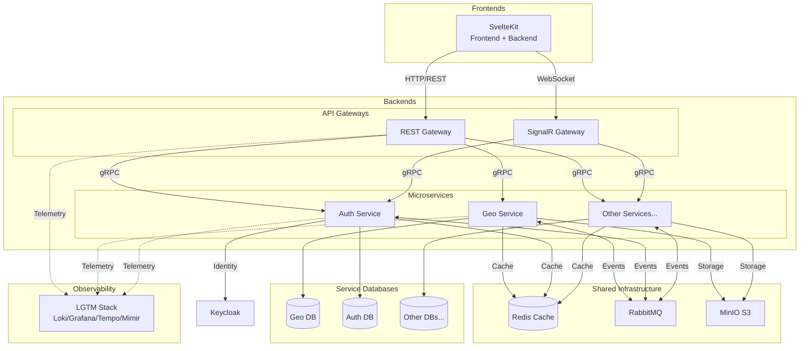

# D²-WORX — Decisive Distributed Application Framework for DCSV WORX
D²-WORX is the distributed evolution of the Decisive Commerce Application Framework (DeCAF). It is an effort to create a scalable foundation for modern SMB-focused SaaS applications, with an emphasis on strong developer experience, and future commercial deployment for WORX or other products.

## Project Status 🚨
This project is in its **earliest stages**. The public repo documents the ongoing evolution of D² as it transitions from a modular monolith (DeCAF) into a distributed framework. Expect frequent changes and incremental progress.

## Quickstart Guide 🚀

### Getting started with local dev environment:
1. **Pre-reqs**: to run this project on your machine, you will need the [.NET 10 SDK](https://dotnet.microsoft.com/en-us/download/dotnet/10.0), [Node v24.7.0+](https://nodejs.org/en/download), [PNPM 10.15.1+](https://pnpm.io/installation), [Docker Desktop](https://docs.docker.com/desktop/setup/install/windows-install/) and to, obviously, clone this repository.
2. Using a command line utility, navigate to the AppHost folder (`/backends/AppHost`) and set the following secrets using the `dotnet user-secrets set <key> <value>` command:

    | Secret Key                  | Description             |
     |-----------------------------|-------------------------|
     | `Parameters:mq-username`    | RabbitMQ username       |
     | `Parameters:mq-password`    | RabbitMQ password       |
     | `Parameters:db-username`    | PostgreSQL username     |
     | `Parameters:db-password`    | PostgreSQL password     |
     | `Parameters:dba-email`      | PgAdmin4 admin email    |
     | `Parameters:dba-password`   | PgAdmin4 admin password |
     | `Parameters:cache-password` | Redis password          |
     | `Parameters:kc-username`    | Keycloak username       |
     | `Parameters:kc-password`    | Keycloak password       |
     | `Parameters:otel-username`  | Grafana username        |
     | `Parameters:otel-password`  | Grafana password        |
     | `Parameters:s3-username`    | MinIO username          |
     | `Parameters:s3-password`    | MinIO password          |

3. To verify your entries, use the `dotnet user-secrets list` command.
4. Edit any `appsettings.*.json` files as needed.
5. Create a `.env` file in the `/frontends/sveltekit` directory using the `.env.example` as a template (update as needed).
6. Run the AppHost project either via CLI or IDE of your choice.
7. Once running, access:
    - Aspire dashboard: `http://localhost:15888`
    - Grafana dashboard: `http://localhost:3000`

## Philosophy 🤔
**Distributed, Scalable**: built around bounded contexts and event-driven communication to support horizontal scalability.

**Developer-focused**: prioritizes maintainability and DX. Write minimum code with maximum power and intent.

**Pragmatic**: Balances modern patterns with real-world constraints for SMB SaaS.

## Architecture 🏗️

**Key Architectural Patterns:**
- **API Gateway**: REST/SignalR gateways handle external traffic and route to services via gRPC
- **Service Autonomy**: Each service owns its PostgreSQL database
- **Inter-Service Communication**: Services use gRPC for synchronous operations, RabbitMQ for async events
- **Shared Infrastructure**: Redis for distributed caching, MinIO for object storage
- **Centralized Identity**: Auth service manages Keycloak; gateways validate tokens
- **Unified Observability**: All components emit telemetry to LGTM stack

### Backend Services

**Orchestration:**

| Component                              | Description                                    |
|----------------------------------------|------------------------------------------------|
| [AppHost](backends/AppHost/APPHOST.md) | Aspire orchestration and service configuration |

**Contracts:**

| Component                                                                                     | Description                                    |
|-----------------------------------------------------------------------------------------------|------------------------------------------------|
| [DistributedCache.Redis](backends/Contracts/DistributedCache.Redis/DISTRIBUTEDCACHE_REDIS.md) | Redis distributed caching implementation       |
| [Handler](backends/Contracts/Handler/HANDLER.md)                                              | Base handler patterns with logging and tracing |
| [Interfaces](backends/Contracts/Interfaces/INTERFACES.md)                                     | Shared contract interfaces                     |
| [MemoryCache.Default](backends/Contracts/MemoryCache.Default/MEMORYCACHE_DEFAULT.md)          | In-memory caching implementation               |
| [Result](backends/Contracts/Result/RESULT.md)                                                 | D2Result pattern for consistent error handling |
| [ServiceDefaults](backends/Contracts/ServiceDefaults/SERVICE_DEFAULT.md)                      | Shared service configuration and telemetry     |
| [Tests](backends/Contracts/Tests/TESTS.md)                                                    | Shared testing infrastructure and base classes |
| [Utilities](backends/Contracts/Utilities/UTILITIES.md)                                        | Shared utility extensions and helpers          |

**Services:**

| Component                                                                      | Description                       |
|--------------------------------------------------------------------------------|-----------------------------------|
| [Protos.DotNet](backends/Services/_protos/_gen/Protos.DotNet/PROTOS_DOTNET.md) | Generated gRPC service contracts  |
| [Geo.Domain](backends/Services/Geo/Geo.Domain/GEO_DOMAIN.md)                   | Domain entities and value objects |
| [Geo.Tests](backends/Services/Geo/Geo.Tests/GEO_TESTS.md)                      | Integration and unit tests        |

## Story & Background 🌙

### DCSV
DCSV (or "Decisive") is a technology startup founded by [@Tr-st-n](http://github.com/tr-st-n) to create software for SMBs.

### DeCAF
DeCAF (Decisive Commerce Application Framework) is [@Tr-st-n](http://github.com/tr-st-n)'s Nth attempt at building a modular monolithic web application that can serve as a base for various products. Its third iteration features a .NET 9 back end and a SvelteKit front end, backed by PostgreSQL, Redis, and other dependencies.

DeCAF uses interfaces and settings to decouple "features" (modules) and "providers", allowing cross-communication without a fully distributed architecture. While still deployed with CI/CD and Docker, this simplified design is ideal for small-to-medium traffic apps, saving significant dev time and improving DX compared to traditional N-tier and distributed approaches.

DeCAF v1 and v2 are in production use by thousands of users (closed source). Out of the box, DeCAF provides authentication, authorization, multi-tenant organization management, invoicing, billing, payments, payouts, products, categories, tagging, checkout, payment methods, account credits, administration, and affiliate dashboards, among other features.

### D²
D² (Decisive Distributed Application Framework) is the distributed evolution of DeCAF v3. It is built with .NET Aspire (.NET 10 / C# 14), retains a SvelteKit front end, and uses PostgreSQL as its core relational database. The goal of D² is to provide a **horizontally scalable successor** to DeCAF while keeping the strong developer experience.

### WORX
WORX (pronounced "works") is a SaaS product [@Tr-st-n](http://github.com/tr-st-n) is developing for SMBs, including sole proprietors running time-and-materials businesses. Its focus is **workflow automation, client management, invoicing, and communication** — all powered by the evolving D² framework.

While WORX itself will be a commercial product, this repository exists (for now, publicly) as a **reference implementation of D²**. It shows how the framework builds on DeCAF and adapts it into a distributed system while maintaining the same empowering DX.

## License 📜
This project is protected by the [PolyForm Strict License 1.0.0](https://polyformproject.org/licenses/strict/1.0.0). See [LICENSE.md](LICENSE.md) for more information.

Summary:

✅ Free to view, fork, and run locally for learning and evaluation.

❌ Not permitted for production or commercial use without explicit permission.

## Contributing 🤝
See [CONTRIBUTING.md](CONTRIBUTING.md) for guidelines on submitting issues and pull requests.
