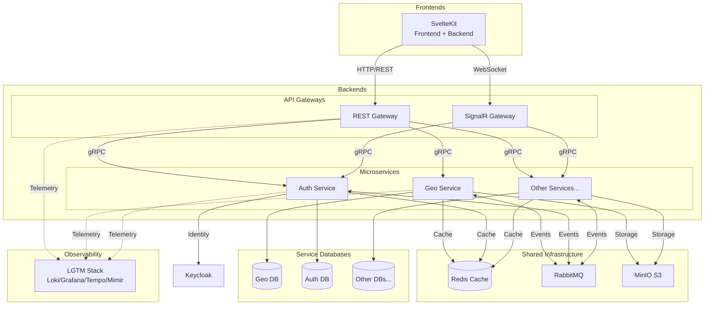

# D²-WORX — Decisive Distributed Application Framework for DCSV WORX
D²-WORX is the distributed evolution of the Decisive Commerce Application Framework (DeCAF). It is an effort to create a scalable foundation for modern SMB-focused SaaS applications, with an emphasis on strong developer experience, and future commercial deployment for WORX or other products.

#### Backend Stack

#### Infrastructure & Orchestration

#### Frontend Stack

#### Communication & Serialization

#### Observability (LGTM Stack)

#### Testing & Quality

#### CI/CD & Code Quality

#### Documentation

#### Architecture & License

## Project Status 🚨

**Phase:** Pre-Alpha (Core Infrastructure)

**✅ Completed:**
- Geo service domain model with immutable entities and content-addressable hashing
- Geo service infrastructure layer with EF Core configurations and multi-tier caching
- Multi-tier caching strategy (PostgreSQL → Redis → Memory → Disk with protobuf serialization)
- Handler-based CQRS architecture with OpenTelemetry tracing
- Full LGTM observability stack (Loki, Grafana, Tempo, Mimir, Alloy)
- Comprehensive testing infrastructure with Testcontainers integration
- Complete technical documentation (domain models, architecture diagrams, service guides)
- Geo service infrastructure layer (MassTransit + RabbitMQ messaging integration)

**🚧 In Progress:**
- Geo service application layer (CQRS handlers for reference data operations)

**📋 Planned:**
- Geo service API layer (gRPC endpoint implementation)
- REST API Gateway (HTTP/REST to gRPC routing)
- SignalR Gateway (WebSocket to gRPC routing)
- Auth service implementation

**🎯 Target:** Complete first vertical slice (browser → SvelteKit → REST Gateway → Geo gRPC → cache/database) for initial demonstrable release.

This is a **public reference implementation** documenting D²'s evolution from DeCAF's modular monolith architecture into a distributed microservices system. Expect frequent changes and incremental progress.

## Quickstart Guide 🚀

### Getting started with local dev environment:
1. **Pre-reqs**: to run this project on your machine, you will need the [.NET 10 SDK](https://dotnet.microsoft.com/en-us/download/dotnet/10.0), [Aspire 13.0 CLI](https://aspire.dev/get-started/install-cli/), [Node v24.7.0+](https://nodejs.org/en/download), [PNPM 10.15.1+](https://pnpm.io/installation), [Docker Desktop](https://docs.docker.com/desktop/setup/install/windows-install/) and to, obviously, clone this repository.
2. Using a command line utility, navigate to the AppHost folder (`/backends/AppHost`) and set the following secrets using the `dotnet user-secrets set <key> <value>` command:

    | Secret Key                  | Description             |
     |-----------------------------|-------------------------|
     | `Parameters:mq-username`    | RabbitMQ username       |
     | `Parameters:mq-password`    | RabbitMQ password       |
     | `Parameters:db-username`    | PostgreSQL username     |
     | `Parameters:db-password`    | PostgreSQL password     |
     | `Parameters:dba-email`      | PgAdmin4 admin email    |
     | `Parameters:dba-password`   | PgAdmin4 admin password |
     | `Parameters:cache-password` | Redis password          |
     | `Parameters:kc-username`    | Keycloak username       |
     | `Parameters:kc-password`    | Keycloak password       |
     | `Parameters:otel-username`  | Grafana username        |
     | `Parameters:otel-password`  | Grafana password        |
     | `Parameters:s3-username`    | MinIO username          |
     | `Parameters:s3-password`    | MinIO password          |

3. To verify your entries, use the `dotnet user-secrets list` command.
4. Edit any `appsettings.*.json` files as needed.
5. Create a `.env` file in the `/frontends/sveltekit` directory using the `.env.example` as a template (update as needed).
6. Run the AppHost project either via CLI or IDE of your choice.
7. Once running, access:
    - Aspire dashboard: `http://localhost:15888`
    - Grafana dashboard: `http://localhost:3000`

## Philosophy 🤔
**Distributed, Scalable**: built around bounded contexts and event-driven communication to support horizontal scalability.

**Developer-focused**: prioritizes maintainability and DX. Write minimum code with maximum power and intent.

**Pragmatic**: Balances modern patterns with real-world constraints for SMB SaaS.

## Architecture 🏗️

**Key Architectural Patterns:**
- **API Gateway**: REST/SignalR gateways handle external traffic and route to services via gRPC
- **Service Autonomy**: Each service owns its PostgreSQL database
- **Inter-Service Communication**: Services use gRPC for synchronous operations, RabbitMQ for async events
- **Shared Infrastructure**: Redis for distributed caching, MinIO for object storage
- **Centralized Identity**: Auth service manages Keycloak; gateways validate tokens
- **Unified Observability**: All components emit telemetry to LGTM stack

### Backend Services and Libraries Documentation 📚

**📖 Architecture Guide:** See [BACKENDS.md](backends/BACKENDS.md) for detailed explanation of the hierarchical structure, category definitions, and architectural decisions.

>**Orchestration:**
>
>*Aspire-based service orchestration for local development and deployment configuration.*
>
>| Component                              | Description                                    |
>|----------------------------------------|------------------------------------------------|
>| [AppHost](backends/AppHost/APPHOST.md) | Aspire orchestration and service configuration |
>
>**Contracts:**
>
>*Core abstractions, patterns, and interfaces shared across all services. These define the "what" without implementation.*
>
>| Component                                                                   | Description                                    |
>|-----------------------------------------------------------------------------|------------------------------------------------|
>| [Handler](backends/Contracts/Handler/HANDLER.md)                            | Base handler patterns with logging and tracing |
>| [Interfaces](backends/Contracts/Interfaces/INTERFACES.md)                   | Shared contract interfaces                     |
>| [Messages](backends/Contracts/Messages/MESSAGES.md)                         | Domain event messages for pub-sub messaging    |
>| [Result](backends/Contracts/Result/RESULT.md)                               | D2Result pattern for consistent error handling |
>| [ServiceDefaults](backends/Contracts/ServiceDefaults/SERVICE_DEFAULT.md)    | Shared service configuration and telemetry     |
>| [Tests](backends/Contracts/Tests/TESTS.md)                                  | Shared testing infrastructure and base classes |
>| [Utilities](backends/Contracts/Utilities/UTILITIES.md)                      | Shared utility extensions and helpers          |
>
>**Contracts (Implementations):**
>
>*Reusable, drop-in implementations of contract interfaces. Services consume these via DI without reinventing common functionality like caching, transactions, or shared business logic.*
>
>*Caching:*
>
>| Component                                                                                                                         | Description                              |
>|-----------------------------------------------------------------------------------------------------------------------------------|------------------------------------------|
>| [DistributedCache.Redis](backends/Contracts/Implementations/Caching/Distributed/DistributedCache.Redis/DISTRIBUTEDCACHE_REDIS.md) | Redis distributed caching implementation |
>| [InMemoryCache.Default](backends/Contracts/Implementations/Caching/InMemory/InMemoryCache.Default/INMEMORYCACHE_DEFAULT.md)       | In-memory caching implementation         |
>
>*Common:*
>
>| Component                                                                                                | Description                          |
>|----------------------------------------------------------------------------------------------------------|--------------------------------------|
>| [GeoRefData.Default](backends/Contracts/Implementations/Common/GeoRefData.Default/GEOREFDATA_DEFAULT.md) | Multi-tier georeference data caching |
>
>*Repository:*
>
>| Component                                                                                                        | Description                                |
>|------------------------------------------------------------------------------------------------------------------|--------------------------------------------|
>| [Transactions.Pg](backends/Contracts/Implementations/Repository/Transactions/Transactions.Pg/TRANSACTIONS_PG.md) | PostgreSQL transaction management handlers |
>
>**Services:**
>
>*Domain-specific microservices implementing business logic. Each service owns its data and communicates via gRPC (sync) or RabbitMQ (async).*
>
>| Component                                                                      | Description                                                                       |
>|--------------------------------------------------------------------------------|-----------------------------------------------------------------------------------|
>| [Protos.DotNet](backends/Services/_protos/_gen/Protos.DotNet/PROTOS_DOTNET.md) | Generated gRPC service contracts                                                  |
>| [Geo](backends/Services/Geo/GEO_SERVICE.md)                                    | Geographic reference data, locations, contacts, and WHOIS with multi-tier caching |

## Story & Background 🌙

### DCSV
DCSV (or "Decisive") is a technology startup founded by [@Tr-st-n](http://github.com/tr-st-n) to create software for SMBs.

### DeCAF
DeCAF (Decisive Commerce Application Framework) is [@Tr-st-n](http://github.com/tr-st-n)'s Nth attempt at building a modular monolithic web application that can serve as a base for various products. Its third iteration features a .NET 9 back end and a SvelteKit front end, backed by PostgreSQL, Redis, and other dependencies.

DeCAF uses interfaces and settings to decouple "features" (modules) and "providers", allowing cross-communication without a fully distributed architecture. While still deployed with CI/CD and Docker, this simplified design is ideal for small-to-medium traffic apps, saving significant dev time and improving DX compared to traditional N-tier and distributed approaches.

DeCAF v1 and v2 are in production use by thousands of users (closed source). Out of the box, DeCAF provides authentication, authorization, multi-tenant organization management, invoicing, billing, payments, payouts, products, categories, tagging, checkout, payment methods, account credits, administration, and affiliate dashboards, among other features.

### D²
D² (Decisive Distributed Application Framework) is the distributed evolution of DeCAF v3. It is built with Aspire (.NET 10 / C# 14), retains a SvelteKit front end, and uses PostgreSQL as its core relational database. The goal of D² is to provide a **horizontally scalable successor** to DeCAF while keeping the strong developer experience.

### WORX
WORX (pronounced "works") is a SaaS product [@Tr-st-n](http://github.com/tr-st-n) is developing for SMBs, including sole proprietors running time-and-materials businesses. Its focus is **workflow automation, client management, invoicing, and communication** — all powered by the evolving D² framework.

While WORX itself will be a commercial product, this repository exists (for now, publicly) as a **reference implementation of D²**. It shows how the framework builds on DeCAF and adapts it into a distributed system while maintaining the same empowering DX.

## License 📜
This project is protected by the [PolyForm Strict License 1.0.0](https://polyformproject.org/licenses/strict/1.0.0). See [LICENSE.md](LICENSE.md) for more information.

Summary:

✅ Free to view, fork, and run locally for learning and evaluation.

❌ Not permitted for production or commercial use without explicit permission.

## Contributing 🤝
See [CONTRIBUTING.md](CONTRIBUTING.md) for guidelines on submitting issues and pull requests.
