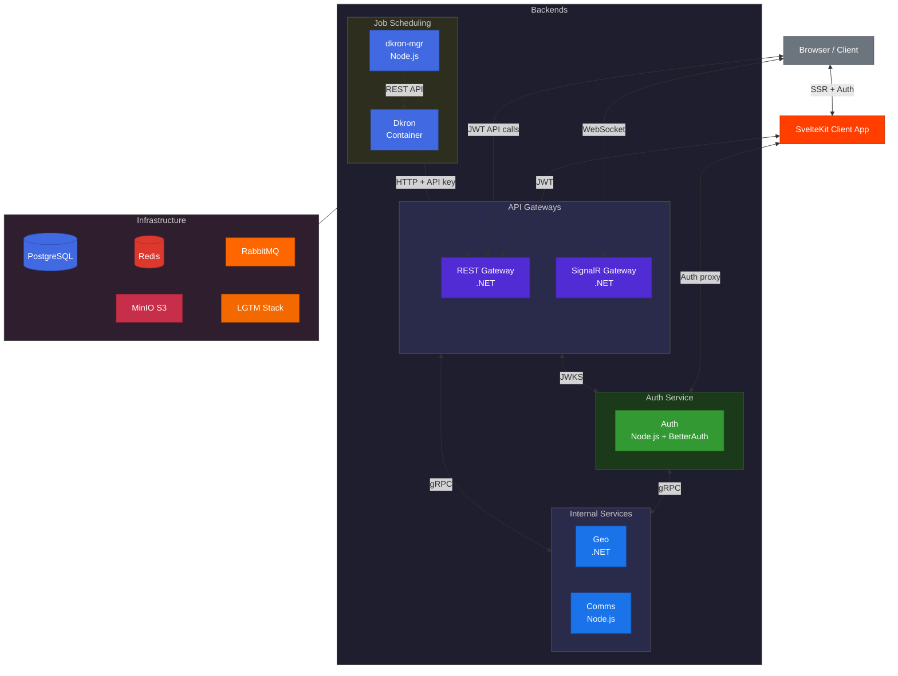

# D²-WORX — Decisive Distributed Application Framework for DCSV WORX

D² is the distributed evolution of the Decisive Commerce Application Framework (DeCAF). The goal of D² is to create a horizontally scalable, developer-friendly microservices framework for building enterprise-ready SaaS products / web applications.

WORX is a SaaS product designed for use by small-to-medium businesses (SMBs) and sole proprietors to manage clients, workflows, invoicing, and communication with their clients. WORX is built on top of the D² framework. A MVP has already been developed using DeCAF v3, and this repository documents the transition to D² (while it remains source available).

## License 📜

This project is protected by the [PolyForm Strict License 1.0.0](https://polyformproject.org/licenses/strict/1.0.0). See [LICENSE.md](LICENSE.md) for more information.

Summary:

✅ Free to view, fork, and run locally for learning and evaluation.

❌ Not permitted for production or commercial use without explicit permission.

## Quickstart Guide 🚀

### Getting started with local dev environment:

1. **Pre-reqs**: to run this project on your machine, you will need the [.NET 10 SDK (10.0.103+)](https://dotnet.microsoft.com/en-us/download/dotnet/10.0), [Aspire 13.1 CLI](https://aspire.dev/get-started/install-cli/), [Node v24.14.0+](https://nodejs.org/en/download), [PNPM 10.30.3+](https://pnpm.io/installation), [Docker Desktop](https://docs.docker.com/desktop/setup/install/windows-install/) and to, obviously, clone this repository.
2. Copy `.env.local.example` to `.env.local` in the project root and fill in your values (credentials for PostgreSQL, Redis, RabbitMQ, MinIO, Grafana, and your IPInfo API token). Env vars use `SECTION_PROPERTY` naming — `D2Env` auto-maps them to .NET configuration paths.
3. Edit any `appsettings.*.json` files as needed.
4. Run the AppHost project either via CLI or IDE of your choice.
5. Once running, access:
   - Aspire dashboard: `http://localhost:15888`
   - Grafana dashboard: `http://localhost:3000`

## Project Status 🚨

**Phase:** Pre-Alpha (Core Infrastructure)

**✅ Completed:**

- General / high-level systems design and architecture
- Aspire-based local development and orchestration
- Initial infrastructure concerns (dependencies) setup and configuration
- Full LGTM observability stack (Loki, Grafana, Tempo, Mimir, Alloy) with dashboards
- Standard result / errors-as-values pattern implementation (D2Result)
- Standard handler pattern (via IHandler, IHandlerContext, BaseHandler)
- Standard extension methods and utilities libraries
- Geography ("Geo") service architecture and design
  - Highly available and fault-tolerant geographic reference data retrieval service(s)
- Geo service domain model layer with immutable entities and content-addressable identities
- Multi-tier caching strategy implementation (PostgreSQL → Redis → Memory → Disk with protobuf serialization)
- Comprehensive unit and integration test coverage using Testcontainers
- Automated testing / validation via GitHub Actions
- [Relatively] thorough technical documentation
- Geo infrastructure layer
  - Caching provider registration
  - EF Core + PostgreSQL repository pattern
  - Raw AMQP + RabbitMQ messaging with Protocol Buffer event contracts
- Geo service application layer
  - CQRS handlers for geographic reference data retrieval and update requests
- Geo service gRPC API layer
- gRPC request/response standardization with implementation of Result.Extensions
- REST API Gateway with request enrichment and rate limiting
- Geo Service: WhoIs, Contact, Location handlers (CQRS + repository + external API integration)
- Geo.Client: Service-owned client library (messages, interfaces, WhoIs cache handler)
- Request enrichment middleware (IP resolution, fingerprinting, WhoIs geolocation lookup)
- Multi-dimensional rate limiting middleware (sliding-window algorithm using abstracted distributed cache)
- 1,528+ .NET tests (unit + integration) passing (730 shared + 798 Geo service)
- Node.js pnpm workspace with shared TypeScript config and Vitest
- ESLint 9 + Prettier monorepo-wide code quality tooling
- TypeScript shared infrastructure (Phase 1 complete — 19 `@d2/*` shared packages, 857 tests):
  - Layer 0: `@d2/result`, `@d2/utilities`, `@d2/protos`, `@d2/testing`, `@d2/messaging`
  - Layer 0-1: `@d2/logging`, `@d2/service-defaults`, `@d2/handler` (BaseHandler + OTel + redaction), `@d2/di` (DI container)
  - Layer 2: `@d2/interfaces`, `@d2/result-extensions`
  - Layer 3: `@d2/cache-memory`, `@d2/cache-redis`, `@d2/batch-pg`, `@d2/errors-pg`
  - Layer 4: `@d2/geo-client` (full .NET Geo.Client parity)
  - Layer 5: `@d2/request-enrichment`, `@d2/ratelimit`, `@d2/idempotency`
  - Data redaction infrastructure (RedactionSpec + interface-level compile-time enforcement)

- Ext-key-only contact API with API key authentication (gRPC metadata `x-api-key`)
- .NET Gateway JWT validation (RS256 via JWKS, fingerprint binding, authorization policies, service key filter)
- Auth service Stage B (Node.js + Hono + BetterAuth) — 874 auth tests passing:
  - Domain model (entities, value objects, business rules)
  - Application layer (CQRS handlers, notification publishers, interfaces)
  - Infrastructure layer (repositories, BetterAuth config + Drizzle adapter, auto-generated migrations)
  - API layer (Hono routes, middleware, composition root)
- Comms service Phase 1 (delivery engine) — 566 comms tests passing:
  - Email delivery via Resend, SMS via Twilio
  - `@d2/comms-client` — thin RabbitMQ publishing client (universal notification shape)
  - RabbitMQ consumer for notification requests, gRPC API layer + Aspire wiring
- E2E cross-service tests (Auth → Geo → Comms pipeline + Dkron job chain, 12 tests)
- Cross-platform parity — `@d2/batch-pg`, `@d2/errors-pg` (Node.js), `Errors.Pg` (.NET), documented in `backends/PARITY.md`
- Production-readiness deep dive sweep — 21-agent cross-cutting audit, P1 fixes applied
- Scheduled jobs (Dkron) — 8 daily data maintenance jobs across Auth (4), Geo (2), and Comms (2):
  - `@d2/dkron-mgr` job reconciler service (declarative job definitions, drift detection, orphan cleanup)
  - Dkron → REST Gateway (service key auth) → gRPC service (API key auth) → handler (distributed lock + batch delete)
  - Full-chain E2E test (Dkron container → Gateway → Geo → PostgreSQL), 64 dkron-mgr tests, 12 E2E tests

**📋 Planned:**

- Auth service Stage C — client libraries (`@d2/auth-bff-client` for SvelteKit BFF, `@d2/auth-client` for backend gRPC)
- SvelteKit auth integration (proxy pattern to Auth Service)
- SignalR Gateway (WebSocket to gRPC routing)
- OTel alerting and notification integration
- Production-readiness sweep deferred items (see Outstanding Items in PLANNING.md)
- Much, much more...

**📝 Internal Planning:**
See [PLANNING.md](PLANNING.md) for detailed architecture decisions, implementation status, and sprint planning.

**NOTE:** this is a **public reference implementation** documenting D²'s evolution from DeCAF's modular monolith architecture into a distributed microservices system. Expect frequent changes and incremental progress.

## Philosophy 🤔

D² was designed from the ground up to maximize developer experience while providing the scalability and modularity of a distributed microservices architecture. Key principles include:

- **Developer Productivity**: prioritize DX with clear patterns, conventions, and abstractions that reduce boilerplate and cognitive load
- **Consistency**: standardized result handling, error propagation, and telemetry across all services
- **Autonomy**: each service owns its data and logic, minimizing coupling and enabling independent deployment
- **Observability**: built-in tracing, metrics, and logging with a unified telemetry stack for easy monitoring and debugging
- **Scalability**: designed for horizontal scaling with stateless services, local and distributed caching, and message-based communication
- **Extensibility**: modular architecture allowing easy addition of new services and features without impacting existing functionality
- **Resilience**: fault-tolerant design with retries and graceful degradation strategies ...even at the implementation level, where applicable, errors are treated as values rather than exceptions

## Architecture Diagram 🏗️

## Additional Documentation 📚

See [BACKENDS.md](backends/BACKENDS.md) for a detailed explanation of the hierarchical structure (TLC→2LC→3LC), category definitions, and architectural decisions used across all back-end services.

> **Orchestration:**
>
> _Aspire-based service orchestration for local development and deployment configuration._
>
> | Component                                                   | Description                                    |
> | ----------------------------------------------------------- | ---------------------------------------------- |
> | [AppHost](backends/dotnet/orchestration/AppHost/APPHOST.md) | Aspire orchestration and service configuration |
>
> **Core Patterns & Contracts:**
>
> _Shared abstractions, patterns, and interfaces used across all services on both platforms. These define the "what" without implementation._
>
> | Concern          | .NET                                                                                  | Node.js                                                                                                          | Description                                     |
> | ---------------- | ------------------------------------------------------------------------------------- | ---------------------------------------------------------------------------------------------------------------- | ----------------------------------------------- |
> | Result           | [Result](backends/dotnet/shared/Result/RESULT.md)                                     | [@d2/result](backends/node/shared/result/RESULT.md)                                                              | Errors-as-values pattern (D2Result)             |
> | Handler          | [Handler](backends/dotnet/shared/Handler/HANDLER.md)                                  | [@d2/handler](backends/node/shared/handler/HANDLER.md)                                                           | BaseHandler with OTel spans, metrics, redaction |
> | Handler Ext.     | [Handler.Extensions](backends/dotnet/shared/Handler.Extensions/HANDLER_EXTENSIONS.md) | —                                                                                                                | DI registration for handler context             |
> | Interfaces       | [Interfaces](backends/dotnet/shared/Interfaces/INTERFACES.md)                         | [@d2/interfaces](backends/node/shared/interfaces/INTERFACES.md)                                                  | Cache + middleware contract interfaces          |
> | Result Ext.      | [Result.Extensions](backends/dotnet/shared/Result.Extensions/RESULT_EXTENSIONS.md)    | [@d2/result-extensions](backends/node/shared/result-extensions/RESULT_EXTENSIONS.md)                             | D2Result ↔ Proto conversions + gRPC wrapper     |
> | Utilities        | [Utilities](backends/dotnet/shared/Utilities/UTILITIES.md)                            | [@d2/utilities](backends/node/shared/utilities/UTILITIES.md)                                                     | Extension methods and helpers                   |
> | Service Defaults | [ServiceDefaults](backends/dotnet/shared/ServiceDefaults/SERVICE_DEFAULT.md)          | [@d2/service-defaults](backends/node/shared/service-defaults/SERVICE_DEFAULTS.md)                                | Telemetry and shared configuration              |
> | Logging          | —                                                                                     | [@d2/logging](backends/node/shared/logging/LOGGING.md)                                                           | ILogger interface with Pino (OTel-instrumented) |
> | Proto Contracts  | [Protos.DotNet](backends/dotnet/shared/protos/_gen/Protos.DotNet/PROTOS_DOTNET.md)    | [@d2/protos](backends/node/shared/protos/PROTOS.md)                                                              | Generated gRPC types from `contracts/protos/`   |
> | Testing          | [Tests](backends/dotnet/shared/Tests/TESTS.md)                                        | [@d2/testing](backends/node/shared/testing/TESTING.md) / [@d2/shared-tests](backends/node/shared/tests/TESTS.md) | Test infrastructure and suites                  |
>
> **Shared Implementations:**
>
> _Reusable, drop-in implementations of contract interfaces. Services consume these via DI without reinventing common functionality like caching, transactions, or middleware._
>
> _Caching:_
>
> | Concern           | .NET                                                                                                                                  | Node.js                                                                                            | Description                   |
> | ----------------- | ------------------------------------------------------------------------------------------------------------------------------------- | -------------------------------------------------------------------------------------------------- | ----------------------------- |
> | In-Memory Cache   | [InMemoryCache.Default](backends/dotnet/shared/Implementations/Caching/InMemory/InMemoryCache.Default/INMEMORYCACHE_DEFAULT.md)       | [@d2/cache-memory](backends/node/shared/implementations/caching/in-memory/default/CACHE_MEMORY.md) | Local cache with LRU eviction |
> | Distributed Cache | [DistributedCache.Redis](backends/dotnet/shared/Implementations/Caching/Distributed/DistributedCache.Redis/DISTRIBUTEDCACHE_REDIS.md) | [@d2/cache-redis](backends/node/shared/implementations/caching/distributed/redis/CACHE_REDIS.md)   | Redis caching                 |
>
> _Repository:_
>
> | Concern       | .NET                                                                                                                 | Node.js                                                                                 | Description                                |
> | ------------- | -------------------------------------------------------------------------------------------------------------------- | --------------------------------------------------------------------------------------- | ------------------------------------------ |
> | Batch Query   | [Batch.Pg](backends/dotnet/shared/Implementations/Repository/Batch/Batch.Pg/BATCH_PG.md)                             | [@d2/batch-pg](backends/node/shared/implementations/repository/pg/batch/BATCH_PG.md)    | Reusable batched query utilities           |
> | Transactions  | [Transactions.Pg](backends/dotnet/shared/Implementations/Repository/Transactions/Transactions.Pg/TRANSACTIONS_PG.md) | —                                                                                       | PostgreSQL transaction management handlers |
> | Error Helpers | [Errors.Pg](backends/dotnet/shared/Implementations/Repository/Errors/Errors.Pg/ERRORS_PG.md)                         | [@d2/errors-pg](backends/node/shared/implementations/repository/pg/errors/ERRORS_PG.md) | PostgreSQL constraint error detection      |
>
> _Middleware:_
>
> | Concern            | .NET                                                                                                                           | Node.js                                                                                                                    | Description                                          |
> | ------------------ | ------------------------------------------------------------------------------------------------------------------------------ | -------------------------------------------------------------------------------------------------------------------------- | ---------------------------------------------------- |
> | Request Enrichment | [RequestEnrichment.Default](backends/dotnet/shared/Implementations/Middleware/RequestEnrichment.Default/REQUEST_ENRICHMENT.md) | [@d2/request-enrichment](backends/node/shared/implementations/middleware/request-enrichment/default/REQUEST_ENRICHMENT.md) | IP resolution, fingerprinting, and WhoIs geolocation |
> | Rate Limiting      | [RateLimit.Default](backends/dotnet/shared/Implementations/Middleware/RateLimit.Default/RATE_LIMIT.md)                         | [@d2/ratelimit](backends/node/shared/implementations/middleware/ratelimit/default/RATELIMIT.md)                            | Multi-dimensional sliding-window rate limiting       |
> | Idempotency        | [Idempotency.Default](backends/dotnet/shared/Implementations/Middleware/Idempotency.Default/IDEMPOTENCY.md)                    | [@d2/idempotency](backends/node/shared/implementations/middleware/idempotency/default/IDEMPOTENCY.md)                      | Idempotency-Key header middleware (Redis-backed)     |
>
> _Messaging:_
>
> | Component                                                    | Description                                            |
> | ------------------------------------------------------------ | ------------------------------------------------------ |
> | [@d2/messaging](backends/node/shared/messaging/MESSAGING.md) | RabbitMQ pub/sub (thin wrapper around rabbitmq-client) |
>
> **Services:**
>
> _Domain-specific microservices implementing business logic. Each service owns its data and communicates via gRPC (sync) or RabbitMQ (async)._
>
> | Service                                            | Platform | Status      | Description                                                                               |
> | -------------------------------------------------- | -------- | ----------- | ----------------------------------------------------------------------------------------- |
> | [Geo](backends/dotnet/services/Geo/GEO_SERVICE.md) | .NET     | ✅ Done     | Geographic reference data, locations, contacts, and WHOIS with multi-tier caching         |
> | [Auth](backends/node/services/auth/AUTH.md)                | Node.js  | 🚧 Stage B+ | Standalone Hono + BetterAuth + Drizzle — DDD layers + scheduled jobs done (874 tests) |
> | [Comms](backends/node/services/comms/COMMS.md)             | Node.js  | 🚧 Phase 1  | Delivery engine — email/SMS, RabbitMQ consumer, gRPC API, scheduled jobs (566 tests)  |
> | [dkron-mgr](backends/node/services/dkron-mgr/DKRON_MGR.md) | Node.js  | ✅ Done      | Declarative Dkron job reconciler — drift detection, orphan cleanup (64 tests)         |
>
> **Client Libraries:**
>
> _Service-owned client libraries for consumers. Each service publishes a client package so consumers don't need to know gRPC details._
>
> | Client       | .NET                                                                | Node.js                                                                 | Description                     |
> | ------------ | ------------------------------------------------------------------- | ----------------------------------------------------------------------- | ------------------------------- |
> | Geo Client   | [Geo.Client](backends/dotnet/services/Geo/Geo.Client/GEO_CLIENT.md) | [@d2/geo-client](backends/node/services/geo/geo-client/GEO_CLIENT.md)   | Service-owned consumer library  |
> | Comms Client | —                                                                   | [@d2/comms-client](backends/node/services/comms/client/COMMS_CLIENT.md) | RabbitMQ notification publisher |
>
> **Gateways:**
>
> _API gateways translating external requests into gRPC calls to back-end services._
>
> | Gateway                                               | Platform | Status     | Description                      |
> | ----------------------------------------------------- | -------- | ---------- | -------------------------------- |
> | [REST Gateway](backends/dotnet/gateways/REST/REST.md) | .NET     | ✅ Done    | HTTP/REST → gRPC routing gateway |
> | SignalR Gateway                                       | .NET     | 📋 Planned | WebSocket → gRPC routing gateway |

### Front-End Clients

Coming soon...

## Story & Background 🌙

### DCSV

DCSV (or "Decisive") is a technology startup founded by [@Tr-st-n](http://github.com/tr-st-n) to create software for SMBs.

### DeCAF

DeCAF (Decisive Commerce Application Framework) is [@Tr-st-n](http://github.com/tr-st-n)'s Nth attempt at building a modular monolithic web application that can serve as a base for various products. Its third iteration features a .NET 9 back end and a SvelteKit front end, backed by PostgreSQL, Redis, and other dependencies.

DeCAF uses interfaces and settings to decouple "features" (modules) and "providers", allowing cross-communication without a fully distributed architecture. While still deployed with CI/CD and Docker, this simplified design is ideal for small-to-medium traffic apps, saving significant dev time and improving DX compared to traditional N-tier and distributed approaches.

DeCAF v1 and v2 are in production use by thousands of users (closed source). Out of the box, DeCAF provides authentication, authorization, multi-tenant organization management, invoicing, billing, payments, payouts, products, categories, tagging, checkout, payment methods, account credits, administration, and affiliate dashboards, among other features.

### D²

D² (Decisive Distributed Application Framework) is the distributed evolution of DeCAF v3. It is built with Aspire (.NET 10 / C# 14), retains a SvelteKit front end, and uses PostgreSQL as its core relational database. The goal of D² is to provide a **horizontally scalable successor** to DeCAF while keeping the strong developer experience.

### WORX

WORX (pronounced "works") is a SaaS product [@Tr-st-n](http://github.com/tr-st-n) is developing for SMBs, including sole proprietors running time-and-materials businesses. Its focus is **workflow automation, client management, invoicing, and communication** — all powered by the evolving D² framework.

While WORX itself will be a commercial product, this repository exists (for now, publicly) as a **reference implementation of D²**. It shows how the framework builds on DeCAF and adapts it into a distributed system while maintaining the same empowering DX.

## Technology Stack 🛠️

#### .NET Backend

#### Node.js Backend

#### Shared Infrastructure

#### Infrastructure & Orchestration

#### Frontend

#### Communication & Serialization

#### Observability

#### Testing & Quality

#### CI/CD & Code Quality

#### Documentation

#### Architecture & License

## Contributing 🤝

See [CONTRIBUTING.md](CONTRIBUTING.md) for guidelines on submitting issues and pull requests.
