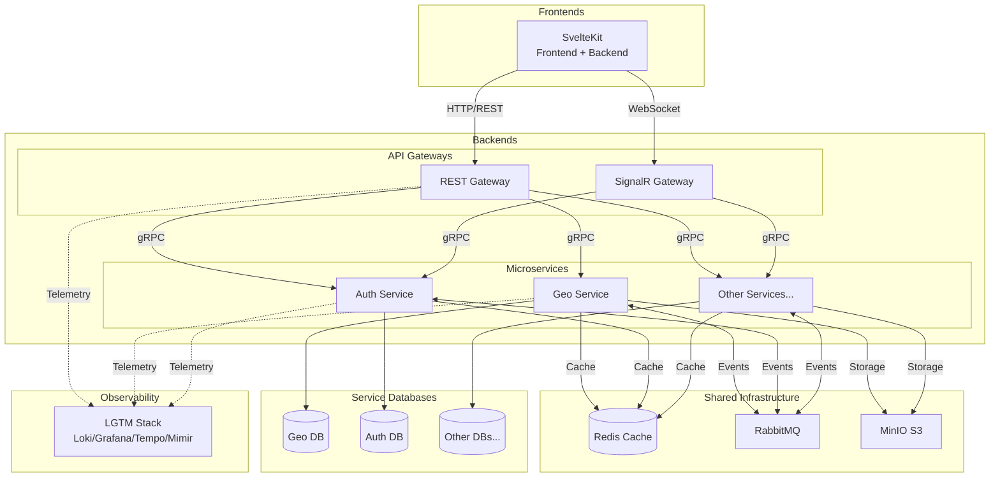

# D²-WORX — Decisive Distributed Application Framework for DCSV WORX

D² is the distributed evolution of the Decisive Commerce Application Framework (DeCAF). The goal of D² is to create a horizontally scalable, developer-friendly microservices framework for building enterprise-ready SaaS products / web applications.

WORX is a SaaS product designed for use by small-to-medium businesses (SMBs) and sole proprietors to manage clients, workflows, invoicing, and communication with their clients. WORX is built on top of the D² framework. A MVP has already been developed using DeCAF v3, and this repository documents the transition to D² (while it remains source available).

## License 📜

This project is protected by the [PolyForm Strict License 1.0.0](https://polyformproject.org/licenses/strict/1.0.0). See [LICENSE.md](LICENSE.md) for more information.

Summary:

✅ Free to view, fork, and run locally for learning and evaluation.

❌ Not permitted for production or commercial use without explicit permission.

## Quickstart Guide 🚀

### Getting started with local dev environment:

1. **Pre-reqs**: to run this project on your machine, you will need the [.NET 10 SDK](https://dotnet.microsoft.com/en-us/download/dotnet/10.0), [Aspire 13.0 CLI](https://aspire.dev/get-started/install-cli/), [Node v24.7.0+](https://nodejs.org/en/download), [PNPM 10.15.1+](https://pnpm.io/installation), [Docker Desktop](https://docs.docker.com/desktop/setup/install/windows-install/) and to, obviously, clone this repository.
2. Copy `.env.local.example` to `.env.local` in the project root and fill in your values (credentials for PostgreSQL, Redis, RabbitMQ, MinIO, Grafana, and your IPInfo API token). Env vars use `SECTION_PROPERTY` naming — `D2Env` auto-maps them to .NET configuration paths.
3. Edit any `appsettings.*.json` files as needed.
4. Run the AppHost project either via CLI or IDE of your choice.
5. Once running, access:
   - Aspire dashboard: `http://localhost:15888`
   - Grafana dashboard: `http://localhost:3000`

## Project Status 🚨

**Phase:** Pre-Alpha (Core Infrastructure)

**✅ Completed:**

- General / high-level systems design and architecture
- Aspire-based local development and orchestration
- Initial infrastructure concerns (dependencies) setup and configuration
- Full LGTM observability stack (Loki, Grafana, Tempo, Mimir, Alloy) with dashboards
- Standard result / errors-as-values pattern implementation (D2Result)
- Standard handler pattern (via IHandler, IHandlerContext, BaseHandler)
- Standard extension methods and utilities libraries
- Geography ("Geo") service architecture and design
  - Highly available and fault-tolerant geographic reference data retrieval service(s)
- Geo service domain model layer with immutable entities and content-addressable identities
- Multi-tier caching strategy implementation (PostgreSQL → Redis → Memory → Disk with protobuf serialization)
- Comprehensive unit and integration test coverage using Testcontainers
- Automated testing / validation via GitHub Actions
- [Relatively] thorough technical documentation
- Geo infrastructure layer
  - Caching provider registration
  - EF Core + PostgreSQL repository pattern
  - MassTransit + RabbitMQ messaging integration
- Geo service application layer
  - CQRS handlers for geographic reference data retrieval and update requests
- Geo service gRPC API layer
- gRPC request/response standardization with implementation of Result.Extensions
- REST API Gateway with request enrichment and rate limiting
- Geo Service: WhoIs, Contact, Location handlers (CQRS + repository + external API integration)
- Geo.Client: Service-owned client library (messages, interfaces, WhoIs cache handler)
- Request enrichment middleware (IP resolution, fingerprinting, WhoIs geolocation lookup)
- Multi-dimensional rate limiting middleware (sliding-window algorithm using abstracted distributed cache)
- 600+ .NET tests (unit + integration) passing
- Node.js pnpm workspace with shared TypeScript config and Vitest
- ESLint 9 + Prettier monorepo-wide code quality tooling
- Shared TypeScript packages: `@d2/result`, `@d2/utilities`, `@d2/protos`, `@d2/testing` with 161 tests

**🚧 In Progress:**

- TypeScript shared infrastructure packages (`@d2/result`, `@d2/utilities`, `@d2/protos`, `@d2/testing` done; `@d2/handler` next)
- Auth service architecture (Node.js + Hono + BetterAuth)

**📋 Planned:**

- SignalR Gateway (WebSocket to gRPC routing)
- Auth service implementation (standalone Node.js service at `backends/node/services/auth/`)
- SvelteKit auth integration (proxy pattern to Auth Service)
- Node.js rate limiting package (`@d2/ratelimit`) — same algorithm as .NET middleware
- Node.js geo cache package (`@d2/geo-cache`) — local WhoIs cache with gRPC fallback
- OTEL alerting and notification integration
- Kestra for scheduled task management
- Much, much more...

**📝 Internal Planning:**
See [PLANNING.md](PLANNING.md) for detailed architecture decisions, implementation status, and sprint planning.

**NOTE:** this is a **public reference implementation** documenting D²'s evolution from DeCAF's modular monolith architecture into a distributed microservices system. Expect frequent changes and incremental progress.

## Philosophy 🤔

D² was designed from the ground up to maximize developer experience while providing the scalability and modularity of a distributed microservices architecture. Key principles include:

- **Developer Productivity**: prioritize DX with clear patterns, conventions, and abstractions that reduce boilerplate and cognitive load
- **Consistency**: standardized result handling, error propagation, and telemetry across all services
- **Autonomy**: each service owns its data and logic, minimizing coupling and enabling independent deployment
- **Observability**: built-in tracing, metrics, and logging with a unified telemetry stack for easy monitoring and debugging
- **Scalability**: designed for horizontal scaling with stateless services, local and distributed caching, and message-based communication
- **Extensibility**: modular architecture allowing easy addition of new services and features without impacting existing functionality
- **Resilience**: fault-tolerant design with retries and graceful degradation strategies ...even at the implementation level, where applicable, errors are treated as values rather than exceptions

## Architecture Diagram 🏗️

## Additional Documentation 📚

### Back-End Services

See [BACKENDS.md](backends/BACKENDS.md) for a detailed explanation of the hierarchical structure, category definitions, and architectural decisions used in D²'s back end services.

> **Orchestration:**
>
> _Aspire-based service orchestration for local development and deployment configuration._
>
> | Component                                                   | Description                                    |
> | ----------------------------------------------------------- | ---------------------------------------------- |
> | [AppHost](backends/dotnet/orchestration/AppHost/APPHOST.md) | Aspire orchestration and service configuration |
>
> **Contracts:**
>
> _Core abstractions, patterns, and interfaces shared across all services. These define the "what" without implementation._
>
> | Component                                                                             | Description                                         |
> | ------------------------------------------------------------------------------------- | --------------------------------------------------- |
> | [Handler](backends/dotnet/shared/Handler/HANDLER.md)                                  | Base handler patterns with logging and tracing      |
> | [Handler.Extensions](backends/dotnet/shared/Handler.Extensions/HANDLER_EXTENSIONS.md) | DI registration for handler context services        |
> | [Interfaces](backends/dotnet/shared/Interfaces/INTERFACES.md)                         | Shared contract interfaces                          |
> | [Result](backends/dotnet/shared/Result/RESULT.md)                                     | D2Result pattern for consistent error handling      |
> | [Result.Extensions](backends/dotnet/shared/Result.Extensions/RESULT_EXTENSIONS.md)    | D2Result to/from proto conversion and gRPC handling |
> | [ServiceDefaults](backends/dotnet/shared/ServiceDefaults/SERVICE_DEFAULT.md)          | Shared service configuration and telemetry          |
> | [Tests](backends/dotnet/shared/Tests/TESTS.md)                                        | Shared testing infrastructure and base classes      |
> | [Utilities](backends/dotnet/shared/Utilities/UTILITIES.md)                            | Shared utility extensions and helpers               |
>
> **Shared Implementations:**
>
> _Reusable, drop-in implementations of contract interfaces. Services consume these via DI without reinventing common functionality like caching, transactions, or batch query utilities._
>
> _Caching:_
>
> | Component                                                                                                                             | Description                              |
> | ------------------------------------------------------------------------------------------------------------------------------------- | ---------------------------------------- |
> | [DistributedCache.Redis](backends/dotnet/shared/Implementations/Caching/Distributed/DistributedCache.Redis/DISTRIBUTEDCACHE_REDIS.md) | Redis distributed caching implementation |
> | [InMemoryCache.Default](backends/dotnet/shared/Implementations/Caching/InMemory/InMemoryCache.Default/INMEMORYCACHE_DEFAULT.md)       | In-memory caching implementation         |
>
> _Repository:_
>
> | Component                                                                                                            | Description                                |
> | -------------------------------------------------------------------------------------------------------------------- | ------------------------------------------ |
> | [Batch.Pg](backends/dotnet/shared/Implementations/Repository/Batch/Batch.Pg/BATCH_PG.md)                             | Reusable batched query utilities           |
> | [Transactions.Pg](backends/dotnet/shared/Implementations/Repository/Transactions/Transactions.Pg/TRANSACTIONS_PG.md) | PostgreSQL transaction management handlers |
>
> _Middleware:_
>
> | Component                                                                                                                      | Description                                          |
> | ------------------------------------------------------------------------------------------------------------------------------ | ---------------------------------------------------- |
> | [RequestEnrichment.Default](backends/dotnet/shared/Implementations/Middleware/RequestEnrichment.Default/REQUEST_ENRICHMENT.md) | IP resolution, fingerprinting, and WhoIs geolocation |
> | [RateLimit.Default](backends/dotnet/shared/Implementations/Middleware/RateLimit.Default/RATE_LIMIT.md)                         | Multi-dimensional sliding-window rate limiting       |
>
> **Services:**
>
> _Domain-specific microservices implementing business logic. Each service owns its data and communicates via gRPC (sync) or RabbitMQ (async). Each service owns a client library for consumers._
>
> | Component                                                                          | Description                                                                       |
> | ---------------------------------------------------------------------------------- | --------------------------------------------------------------------------------- |
> | [Protos.DotNet](backends/dotnet/shared/protos/_gen/Protos.DotNet/PROTOS_DOTNET.md) | Generated gRPC service contracts                                                  |
> | [Geo](backends/dotnet/services/Geo/GEO_SERVICE.md)                                 | Geographic reference data, locations, contacts, and WHOIS with multi-tier caching |
> | [Geo.Client](backends/dotnet/services/Geo/Geo.Client/GEO_CLIENT.md)                | Geo service client library for consumer services                                  |
>
> **Gateways:**
>
> _REST and SignalR API gateways translating external requests into gRPC calls to back end services._
>
> | Component                                     | Description                       |
> | --------------------------------------------- | --------------------------------- |
> | [REST](backends/dotnet/gateways/REST/REST.md) | HTTP/REST to gRPC routing gateway |

### Front-End Services

Coming soon...

## Story & Background 🌙

### DCSV

DCSV (or "Decisive") is a technology startup founded by [@Tr-st-n](http://github.com/tr-st-n) to create software for SMBs.

### DeCAF

DeCAF (Decisive Commerce Application Framework) is [@Tr-st-n](http://github.com/tr-st-n)'s Nth attempt at building a modular monolithic web application that can serve as a base for various products. Its third iteration features a .NET 9 back end and a SvelteKit front end, backed by PostgreSQL, Redis, and other dependencies.

DeCAF uses interfaces and settings to decouple "features" (modules) and "providers", allowing cross-communication without a fully distributed architecture. While still deployed with CI/CD and Docker, this simplified design is ideal for small-to-medium traffic apps, saving significant dev time and improving DX compared to traditional N-tier and distributed approaches.

DeCAF v1 and v2 are in production use by thousands of users (closed source). Out of the box, DeCAF provides authentication, authorization, multi-tenant organization management, invoicing, billing, payments, payouts, products, categories, tagging, checkout, payment methods, account credits, administration, and affiliate dashboards, among other features.

### D²

D² (Decisive Distributed Application Framework) is the distributed evolution of DeCAF v3. It is built with Aspire (.NET 10 / C# 14), retains a SvelteKit front end, and uses PostgreSQL as its core relational database. The goal of D² is to provide a **horizontally scalable successor** to DeCAF while keeping the strong developer experience.

### WORX

WORX (pronounced "works") is a SaaS product [@Tr-st-n](http://github.com/tr-st-n) is developing for SMBs, including sole proprietors running time-and-materials businesses. Its focus is **workflow automation, client management, invoicing, and communication** — all powered by the evolving D² framework.

While WORX itself will be a commercial product, this repository exists (for now, publicly) as a **reference implementation of D²**. It shows how the framework builds on DeCAF and adapts it into a distributed system while maintaining the same empowering DX.

## Technology Stack 🛠️

#### Backend Stack

#### Infrastructure & Orchestration

#### Frontend Stack

#### Communication & Serialization

#### Observability (LGTM Stack)

#### Testing & Quality

#### CI/CD & Code Quality

#### Documentation

#### Architecture & License

## Contributing 🤝

See [CONTRIBUTING.md](CONTRIBUTING.md) for guidelines on submitting issues and pull requests.
