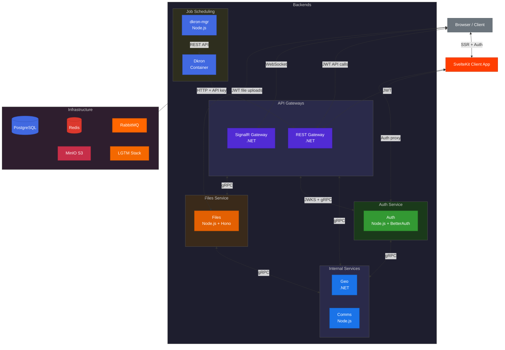

# D²-WORX — Decisive Distributed Application Framework for DCSV WORX

D² is the distributed evolution of the Decisive Commerce Application Framework (DeCAF). The goal of D² is to create a horizontally scalable, developer-friendly microservices framework for building enterprise-ready SaaS products / web applications.

WORX is a SaaS product designed for use by small-to-medium businesses (SMBs) and sole proprietors to manage clients, workflows, invoicing, and communication with their clients. WORX is built on top of the D² framework. A MVP has already been developed using DeCAF v3, and this repository documents the transition to D² (while it remains source available).

---

## Table of Contents

1. [Quickstart Guide](#quickstart-guide-)
2. [Project Status](#project-status-)
3. [Architecture Diagram](#architecture-diagram-%EF%B8%8F)
4. [Philosophy](#philosophy-)
5. [Technology Stack](#technology-stack-%EF%B8%8F)
6. [Documentation](#documentation-)
7. [Story & Background](#story--background-)
8. [License](#license-)
9. [Contributing](#contributing-)

---

## Quickstart Guide 🚀

### Getting started with local dev environment:

1. **Pre-reqs**: to run this project on your machine, you will need the [.NET 10 SDK (10.0.103+)](https://dotnet.microsoft.com/en-us/download/dotnet/10.0), [Node v24.14.0+](https://nodejs.org/en/download), [PNPM 10.30.3+](https://pnpm.io/installation), [Docker Desktop](https://docs.docker.com/desktop/setup/install/windows-install/) and to, obviously, clone this repository.
2. Copy `.env.local.example` to `.env.local` in the project root and fill in your values (credentials for PostgreSQL, Redis, RabbitMQ, MinIO, Grafana, and your IPInfo API token). Env vars use `SECTION_PROPERTY` naming — `D2Env` auto-maps them to .NET configuration paths.
3. Edit any `appsettings.*.json` files as needed.
4. Start all services: `docker compose --env-file .env.local up -d`
5. Once running, access:
   - Grafana dashboard: `http://localhost:3000`
   - Portainer (container management): `https://localhost:9443`
   - Alloy telemetry UI: `http://localhost:12345`

## Project Status 🚨

**Phase:** Pre-Alpha (Core Infrastructure + Auth + SvelteKit)

| Area                          | Status     | Tests         |
| ----------------------------- | ---------- | ------------- |
| .NET shared infrastructure    | ✅ Done    | 1,585 passing |
| Node.js shared infrastructure | ✅ Done    | 1,127 passing |
| Geo service (.NET)            | ✅ Done    | 798 passing   |
| .NET REST gateway             | ✅ Done    | —             |
| Auth service (Node.js)        | 🚧 Stage C | 969 passing   |
| Comms service (Node.js)       | 🚧 Stage B | 575 passing   |
| Scheduled jobs (Dkron)        | ✅ Done    | 64 passing    |
| E2E cross-service tests       | ✅ Done    | 31 passing    |
| SvelteKit web client          | 🚧 Stage B | 706 passing   |

**Current focus:** SvelteKit web client — design system, routing, auth BFF proxy, API gateway client, forms, auth pages, device fingerprinting, client telemetry (Grafana Faro), and three-tier Playwright test architecture done. Onboarding flow next. See [PLANNING.md](PLANNING.md) for architecture decisions, detailed status, and roadmap.

**NOTE:** this is a **public reference implementation** documenting D²'s evolution from DeCAF's modular monolith architecture into a distributed microservices system. Expect frequent changes and incremental progress.

## Architecture Diagram 🏗️

```mermaid
graph TB
    BROWSER[Browser / Client]

    SK[SvelteKit Client App]

    subgraph Backends
        subgraph Gateways["API Gateways"]
            REST[REST Gateway<br/>.NET]
            SR[SignalR Gateway<br/>.NET]
        end

        subgraph AuthSvc["Auth Service"]
            AUTH[Auth<br/>Node.js + BetterAuth]
        end

        subgraph FilesSvc["Files Service"]
            FILES[Files<br/>Node.js + Hono]
        end

        subgraph Services["Internal Services"]
            GEO[Geo<br/>.NET]
            COMMS[Comms<br/>Node.js]
        end

        subgraph Jobs["Job Scheduling"]
            DKRON[Dkron<br/>Container]
            DKRONMGR[dkron-mgr<br/>Node.js]
        end

        Gateways <-->|gRPC| Services
        Gateways <-->|JWKS + gRPC| AuthSvc
        Gateways <-->|gRPC| FilesSvc
        AuthSvc <-->|gRPC| Services
        FilesSvc <-->|gRPC| Services
        DKRONMGR -->|REST API| DKRON
        DKRON -->|HTTP + API key| REST
    end

    subgraph Infra["Infrastructure"]
        PG[(PostgreSQL)] ~~~ REDIS[(Redis)] ~~~ RMQ[RabbitMQ]
        MINIO[MinIO S3] ~~~ LGTM[LGTM Stack]
    end

    %% External connections
    BROWSER <-->|SSR + Auth| SK
    BROWSER <-->|JWT API calls| REST
    BROWSER <-->|WebSocket| SR
    SK <-->|JWT| REST
    SK <-->|Auth proxy| AuthSvc
    BROWSER <-->|JWT file uploads| FILES

    %% Infra connection
    Backends --- Infra

    %% Node colors
    classDef browser fill:#6c757d,stroke:#495057,color:#fff
    classDef svelte fill:#FF3E00,stroke:#c73100,color:#fff
    classDef gateway fill:#512BD4,stroke:#3d1f9e,color:#fff
    classDef auth fill:#339933,stroke:#267326,color:#fff
    classDef files fill:#E36002,stroke:#b34d01,color:#fff
    classDef service fill:#1a73e8,stroke:#1557b0,color:#fff
    classDef infra fill:#4169E1,stroke:#2f4fb3,color:#fff
    classDef redis fill:#DC382D,stroke:#b02d24,color:#fff
    classDef rabbitmq fill:#FF6600,stroke:#cc5200,color:#fff
    classDef minio fill:#C72E49,stroke:#9e243a,color:#fff
    classDef grafana fill:#F46800,stroke:#c35300,color:#fff

    class BROWSER browser
    class SK svelte
    class REST,SR gateway
    class AUTH auth
    class GEO,COMMS service
    class FILES files
    class DKRON,DKRONMGR infra
    class PG infra
    class REDIS redis
    class RMQ rabbitmq
    class MINIO minio
    class LGTM grafana

    %% Subgraph colors
    style Backends fill:#1e1e2e,stroke:#444,color:#ccc
    style Gateways fill:#2a2a4a,stroke:#555,color:#ccc
    style AuthSvc fill:#1a3a1a,stroke:#555,color:#ccc
    style FilesSvc fill:#3a2a1a,stroke:#555,color:#ccc
    style Services fill:#2a2a4a,stroke:#555,color:#ccc
    style Jobs fill:#2e2e1e,stroke:#555,color:#ccc
    style Infra fill:#2e1e2e,stroke:#444,color:#ccc
```

## Philosophy 🤔

D² was designed from the ground up to maximize developer experience while providing the scalability and modularity of a distributed microservices architecture. Key principles include:

- **Developer Productivity**: prioritize DX with clear patterns, conventions, and abstractions that reduce boilerplate and cognitive load
- **Consistency**: standardized result handling, error propagation, and telemetry across all services
- **Autonomy**: each service owns its data and logic, minimizing coupling and enabling independent deployment
- **Observability**: built-in tracing, metrics, and logging with a unified telemetry stack for easy monitoring and debugging
- **Scalability**: designed for horizontal scaling with stateless services, local and distributed caching, and message-based communication
- **Extensibility**: modular architecture allowing easy addition of new services and features without impacting existing functionality
- **Resilience**: fault-tolerant design with retries and graceful degradation strategies ...even at the implementation level, where applicable, errors are treated as values rather than exceptions

## Technology Stack 🛠️

#### .NET Backend

#### Node.js Backend

#### Shared Infrastructure

#### Infrastructure & Orchestration

#### Frontend

#### Communication & Serialization

#### Observability

#### Testing & Quality

#### CI/CD & Code Quality

#### Documentation

#### Architecture & License

## Documentation 📚

### Project-Level

| Document                                               | Description                                                        |
| ------------------------------------------------------ | ------------------------------------------------------------------ |
| [PLANNING.md](PLANNING.md)                             | Roadmap, ADRs, implementation status, issues, work in progress     |
| [CLAUDE.md](CLAUDE.md)                                 | Development guide — workflow, commands, patterns, code conventions |
| [CONTRIBUTING.md](CONTRIBUTING.md)                     | Branch naming, conventional commits, PR process                    |
| [OPERATIONAL-GUARANTEES.md](OPERATIONAL-GUARANTEES.md) | SLA and operational guarantees                                     |

### Backend Architecture

| Document                              | Description                                                            |
| ------------------------------------- | ---------------------------------------------------------------------- |
| [BACKENDS.md](backends/BACKENDS.md)   | TLC/2LC/3LC folder convention, handler categories, DI, package graph   |
| [MESSAGING.md](backends/MESSAGING.md) | Cross-service messaging patterns (RabbitMQ exchanges, event contracts) |
| [PARITY.md](backends/PARITY.md)       | .NET ↔ Node.js cross-platform parity tracking                          |

### Core Patterns & Contracts

_Shared abstractions used across all services on both platforms._

| Concern          | .NET                                                                                  | Node.js                                                                                                          | Description                                      |
| ---------------- | ------------------------------------------------------------------------------------- | ---------------------------------------------------------------------------------------------------------------- | ------------------------------------------------ |
| Result           | [Result](backends/dotnet/shared/Result/RESULT.md)                                     | [@d2/result](backends/node/shared/result/RESULT.md)                                                              | Errors-as-values pattern (D2Result)              |
| Handler          | [Handler](backends/dotnet/shared/Handler/HANDLER.md)                                  | [@d2/handler](backends/node/shared/handler/HANDLER.md)                                                           | BaseHandler with OTel spans, metrics, redaction  |
| Handler Ext.     | [Handler.Extensions](backends/dotnet/shared/Handler.Extensions/HANDLER_EXTENSIONS.md) | —                                                                                                                | DI registration for handler context              |
| Interfaces       | [Interfaces](backends/dotnet/shared/Interfaces/INTERFACES.md)                         | [@d2/interfaces](backends/node/shared/interfaces/INTERFACES.md)                                                  | Cache + middleware contract interfaces           |
| Result Ext.      | [Result.Extensions](backends/dotnet/shared/Result.Extensions/RESULT_EXTENSIONS.md)    | [@d2/result-extensions](backends/node/shared/result-extensions/RESULT_EXTENSIONS.md)                             | D2Result ↔ Proto conversions + gRPC wrapper      |
| Utilities        | [Utilities](backends/dotnet/shared/Utilities/UTILITIES.md)                            | [@d2/utilities](backends/node/shared/utilities/UTILITIES.md)                                                     | Extension methods and helpers                    |
| Service Defaults | [ServiceDefaults](backends/dotnet/shared/ServiceDefaults/SERVICE_DEFAULT.md)          | [@d2/service-defaults](backends/node/shared/service-defaults/SERVICE_DEFAULTS.md)                                | Telemetry and shared configuration               |
| DI Container     | —                                                                                     | [@d2/di](backends/node/shared/di/DI.md)                                                                          | Lightweight DI (mirrors .NET IServiceCollection) |
| Logging          | —                                                                                     | [@d2/logging](backends/node/shared/logging/LOGGING.md)                                                           | ILogger interface with Pino (OTel-instrumented)  |
| i18n             | [I18n](backends/dotnet/shared/I18n/)                                                  | [@d2/i18n](backends/node/shared/i18n/I18N.md)                                                                    | Translator + TK constants (contracts/messages/)  |
| Proto Contracts  | [Protos.DotNet](backends/dotnet/shared/protos/_gen/Protos.DotNet/PROTOS_DOTNET.md)    | [@d2/protos](backends/node/shared/protos/PROTOS.md)                                                              | Generated gRPC types from `contracts/protos/`    |
| Testing          | [Tests](backends/dotnet/shared/Tests/TESTS.md)                                        | [@d2/testing](backends/node/shared/testing/TESTING.md) / [@d2/shared-tests](backends/node/shared/tests/TESTS.md) | Test infrastructure and suites                   |

> **Platform-exclusive packages:** Handler Ext. is .NET-only (JWT claim extraction — Node.js uses BetterAuth directly). DI Container is Node-only (no dedicated .NET package — .NET has built-in `Microsoft.Extensions.DI`). Logging is Node-only (no dedicated .NET package — .NET has built-in `ILogger<T>`). CSRF is Node-only (.NET uses CORS for CSRF protection).

### Shared Implementations

_Reusable, drop-in implementations of contract interfaces consumed via DI._

_Caching:_

| Concern           | .NET                                                                                                                                  | Node.js                                                                                            | Description                   |
| ----------------- | ------------------------------------------------------------------------------------------------------------------------------------- | -------------------------------------------------------------------------------------------------- | ----------------------------- |
| In-Memory Cache   | [InMemoryCache.Default](backends/dotnet/shared/Implementations/Caching/InMemory/InMemoryCache.Default/INMEMORYCACHE_DEFAULT.md)       | [@d2/cache-memory](backends/node/shared/implementations/caching/in-memory/default/CACHE_MEMORY.md) | Local cache with LRU eviction |
| Distributed Cache | [DistributedCache.Redis](backends/dotnet/shared/Implementations/Caching/Distributed/DistributedCache.Redis/DISTRIBUTEDCACHE_REDIS.md) | [@d2/cache-redis](backends/node/shared/implementations/caching/distributed/redis/CACHE_REDIS.md)   | Redis caching                 |

_Repository:_

| Concern       | .NET                                                                                                                 | Node.js                                                                                 | Description                                |
| ------------- | -------------------------------------------------------------------------------------------------------------------- | --------------------------------------------------------------------------------------- | ------------------------------------------ |
| Batch Query   | [Batch.Pg](backends/dotnet/shared/Implementations/Repository/Batch/Batch.Pg/BATCH_PG.md)                             | [@d2/batch-pg](backends/node/shared/implementations/repository/batch/pg/BATCH_PG.md)    | Reusable batched query utilities           |
| Transactions  | [Transactions.Pg](backends/dotnet/shared/Implementations/Repository/Transactions/Transactions.Pg/TRANSACTIONS_PG.md) | —                                                                                       | PostgreSQL transaction management handlers |
| Error Helpers | [Errors.Pg](backends/dotnet/shared/Implementations/Repository/Errors/Errors.Pg/ERRORS_PG.md)                         | [@d2/errors-pg](backends/node/shared/implementations/repository/errors/pg/ERRORS_PG.md) | PostgreSQL constraint error detection      |

> **Transactions** are .NET-only. EF Core's scoped `DbContext` enables ambient transactions across multiple handler calls within a request. Drizzle lacks this — `db.transaction(cb)` forces all operations into a single callback with no cross-handler support.

_Middleware:_

| Concern            | .NET                                                                                                                           | Node.js                                                                                                                                                                                           | Description                                           |
| ------------------ | ------------------------------------------------------------------------------------------------------------------------------ | ------------------------------------------------------------------------------------------------------------------------------------------------------------------------------------------------- | ----------------------------------------------------- |
| Request Enrichment | [RequestEnrichment.Default](backends/dotnet/shared/Implementations/Middleware/RequestEnrichment.Default/REQUEST_ENRICHMENT.md) | [@d2/request-enrichment](backends/node/shared/implementations/middleware/request-enrichment/default/REQUEST_ENRICHMENT.md)                                                                        | IP resolution, fingerprinting, and WhoIs geolocation  |
| Rate Limiting      | [RateLimit.Default](backends/dotnet/shared/Implementations/Middleware/RateLimit.Default/RATE_LIMIT.md)                         | [@d2/ratelimit](backends/node/shared/implementations/middleware/ratelimit/default/RATELIMIT.md)                                                                                                   | Multi-dimensional sliding-window rate limiting        |
| Idempotency        | [Idempotency.Default](backends/dotnet/shared/Implementations/Middleware/Idempotency.Default/IDEMPOTENCY.md)                    | [@d2/idempotency](backends/node/shared/implementations/middleware/idempotency/default/IDEMPOTENCY.md)                                                                                             | Idempotency-Key header middleware (Redis-backed)      |
| Auth               | [Auth.Default](backends/dotnet/shared/Implementations/Middleware/Auth.Default/)                                                | [@d2/service-key](backends/node/shared/implementations/middleware/service-key/default/) + [@d2/session-fingerprint](backends/node/shared/implementations/middleware/session-fingerprint/default/) | JWT auth, service key validation, fingerprint binding |
| Translation        | [Translation.Default](backends/dotnet/shared/Implementations/Middleware/Translation.Default/)                                  | [@d2/translation](backends/node/shared/implementations/middleware/translation/default/)                                                                                                           | Gateway-edge D2Result message/inputError translation  |
| CSRF               | —                                                                                                                              | [@d2/csrf](backends/node/shared/implementations/middleware/csrf/default/)                                                                                                                         | CSRF protection (Origin + Content-Type validation)    |

_Messaging:_

| Component                                                                                                       | Description                                            |
| --------------------------------------------------------------------------------------------------------------- | ------------------------------------------------------ |
| [Messaging.RabbitMQ](backends/dotnet/shared/Implementations/Messaging/Messaging.RabbitMQ/MESSAGING_RABBITMQ.md) | .NET RabbitMQ integration                              |
| [@d2/messaging](backends/node/shared/messaging/MESSAGING.md)                                                    | RabbitMQ pub/sub (thin wrapper around rabbitmq-client) |

### Services

_Domain-specific microservices. Each service owns its data and communicates via gRPC (sync) or RabbitMQ (async)._

| Service                                                    | Platform | Status     | Description                                                                       |
| ---------------------------------------------------------- | -------- | ---------- | --------------------------------------------------------------------------------- |
| [Geo](backends/dotnet/services/Geo/GEO_SERVICE.md)         | .NET     | ✅ Done    | Geographic reference data, locations, contacts, and WHOIS with multi-tier caching |
| [Auth](backends/node/services/auth/AUTH.md)                | Node.js  | 🚧 Stage C | Standalone Hono + BetterAuth + Drizzle — Stages A-B done, BFF client done         |
| [Comms](backends/node/services/comms/COMMS.md)             | Node.js  | 🚧 Stage B | Stage A done (delivery engine). Stage B next (in-app notifications, SignalR)      |
| Files                                                      | Node.js  | 📋 Planned | File uploads, image processing, MinIO storage — event-driven (ADR-026)            |
| [dkron-mgr](backends/node/services/dkron-mgr/DKRON_MGR.md) | Node.js  | ✅ Done    | Declarative Dkron job reconciler — drift detection, orphan cleanup                |

_Service internals (DDD layers):_

| Service   | Domain                                                          | App                                                    | Infra                                                        | API                                                    | Tests                                                              |
| --------- | --------------------------------------------------------------- | ------------------------------------------------------ | ------------------------------------------------------------ | ------------------------------------------------------ | ------------------------------------------------------------------ |
| Geo       | [Domain](backends/dotnet/services/Geo/Geo.Domain/GEO_DOMAIN.md) | [App](backends/dotnet/services/Geo/Geo.App/GEO_APP.md) | [Infra](backends/dotnet/services/Geo/Geo.Infra/GEO_INFRA.md) | [API](backends/dotnet/services/Geo/Geo.API/GEO_API.md) | [Tests](backends/dotnet/services/Geo/Geo.Tests/GEO_TESTS.md)       |
| Auth      | [Domain](backends/node/services/auth/domain/AUTH_DOMAIN.md)     | [App](backends/node/services/auth/app/AUTH_APP.md)     | [Infra](backends/node/services/auth/infra/AUTH_INFRA.md)     | [API](backends/node/services/auth/api/AUTH_API.md)     | [Tests](backends/node/services/auth/tests/AUTH_TESTS.md)           |
| Comms     | [Domain](backends/node/services/comms/domain/COMMS_DOMAIN.md)   | [App](backends/node/services/comms/app/COMMS_APP.md)   | [Infra](backends/node/services/comms/infra/COMMS_INFRA.md)   | [API](backends/node/services/comms/api/COMMS_API.md)   | [Tests](backends/node/services/comms/tests/COMMS_TESTS.md)         |
| Files     | —                                                               | —                                                      | —                                                            | —                                                      | —                                                                  |
| dkron-mgr | —                                                               | —                                                      | —                                                            | —                                                      | [Tests](backends/node/services/dkron-mgr/tests/DKRON_MGR_TESTS.md) |

### Client Libraries

_Service-owned client libraries for consumers._

| Client       | .NET                                                                | Node.js                                                                          | Description                        |
| ------------ | ------------------------------------------------------------------- | -------------------------------------------------------------------------------- | ---------------------------------- |
| Geo Client   | [Geo.Client](backends/dotnet/services/Geo/Geo.Client/GEO_CLIENT.md) | [@d2/geo-client](backends/node/services/geo/geo-client/GEO_CLIENT.md)            | Service-owned consumer library     |
| Comms Client | —                                                                   | [@d2/comms-client](backends/node/services/comms/client/COMMS_CLIENT.md)          | RabbitMQ notification publisher    |
| Auth BFF     | —                                                                   | [@d2/auth-bff-client](backends/node/services/auth/bff-client/AUTH_BFF_CLIENT.md) | SvelteKit auth proxy + JWT manager |

> **Comms Client** has no .NET equivalent — .NET services don't publish to the Comms notification exchange (Comms is a Node.js service). **Auth BFF** has no .NET equivalent — the .NET gateway validates JWTs directly via JWKS instead of proxying through BetterAuth.

### Gateways

| Gateway                                               | Platform | Status     | Description                                |
| ----------------------------------------------------- | -------- | ---------- | ------------------------------------------ |
| [REST Gateway](backends/dotnet/gateways/REST/REST.md) | .NET     | ✅ Done    | HTTP/REST → gRPC routing gateway           |
| SignalR Gateway                                       | .NET     | 📋 Planned | Real-time WebSocket push gateway (ADR-028) |

_Gateway internals:_

| Gateway         | Docs                                             | Description                                                                 |
| --------------- | ------------------------------------------------ | --------------------------------------------------------------------------- |
| REST Gateway    | [REST.md](backends/dotnet/gateways/REST/REST.md) | JWT auth, gRPC routing, rate limiting, idempotency, request enrichment      |
| SignalR Gateway | —                                                | JWT-authed WebSocket connections, gRPC push interface for internal services |

### Orchestration

| Component                                | Description                                            |
| ---------------------------------------- | ------------------------------------------------------ |
| [docker-compose.yml](docker-compose.yml) | Docker Compose dev environment (replaces .NET Aspire)  |
| [Makefile](Makefile)                     | DX shortcuts (`make up`, `make down`, `make logs s=X`) |

### Frontends

| Client                                 | Status     | Documents                                                                                                                  | Description                                                               |
| -------------------------------------- | ---------- | -------------------------------------------------------------------------------------------------------------------------- | ------------------------------------------------------------------------- |
| [SvelteKit Web](clients/web/README.md) | 🚧 Stage B | [README](clients/web/README.md), [Strategy](clients/web/SVELTEKIT_STRATEGY.md), [Plan](clients/web/IMPLEMENTATION_PLAN.md) | Architecture, routing, auth BFF, middleware, testing, implementation plan |

### Cross-Service Testing

| Document                                             | Description                                                             |
| ---------------------------------------------------- | ----------------------------------------------------------------------- |
| [E2E Tests](backends/node/services/e2e/E2E_TESTS.md) | Cross-service E2E tests — Testcontainers, .NET child processes, browser |

## Story & Background 🌙

### DCSV

DCSV (or "Decisive") is a technology startup founded by [@Tr-st-n](http://github.com/tr-st-n) to create software for SMBs.

### DeCAF

DeCAF (Decisive Commerce Application Framework) is [@Tr-st-n](http://github.com/tr-st-n)'s Nth attempt at building a modular monolithic web application that can serve as a base for various products. Its third iteration features a .NET 9 back end and a SvelteKit front end, backed by PostgreSQL, Redis, and other dependencies.

DeCAF uses interfaces and settings to decouple "features" (modules) and "providers", allowing cross-communication without a fully distributed architecture. While still deployed with CI/CD and Docker, this simplified design is ideal for small-to-medium traffic apps, saving significant dev time and improving DX compared to traditional N-tier and distributed approaches.

DeCAF v1 and v2 are in production use by thousands of users (closed source). Out of the box, DeCAF provides authentication, authorization, multi-tenant organization management, invoicing, billing, payments, payouts, products, categories, tagging, checkout, payment methods, account credits, administration, and affiliate dashboards, among other features.

### D²

D² (Decisive Distributed Application Framework) is the distributed evolution of DeCAF v3. It is built with .NET 10 / C# 14 and Docker Compose, retains a SvelteKit front end, and uses PostgreSQL as its core relational database. The goal of D² is to provide a **horizontally scalable successor** to DeCAF while keeping the strong developer experience.

### WORX

WORX (pronounced "works") is a SaaS product [@Tr-st-n](http://github.com/tr-st-n) is developing for SMBs, including sole proprietors running time-and-materials businesses. Its focus is **workflow automation, client management, invoicing, and communication** — all powered by the evolving D² framework.

While WORX itself will be a commercial product, this repository exists (for now, publicly) as a **reference implementation of D²**. It shows how the framework builds on DeCAF and adapts it into a distributed system while maintaining the same empowering DX.

## License 📜

This project is protected by the [PolyForm Strict License 1.0.0](https://polyformproject.org/licenses/strict/1.0.0). See [LICENSE.md](LICENSE.md) for more information.

Summary:

✅ Free to view, fork, and run locally for learning and evaluation.

❌ Not permitted for production or commercial use without explicit permission.

## Contributing 🤝

See [CONTRIBUTING.md](CONTRIBUTING.md) for guidelines on submitting issues and pull requests.
