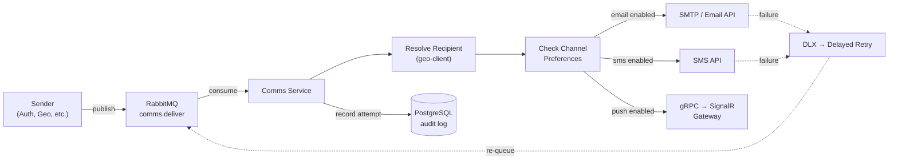
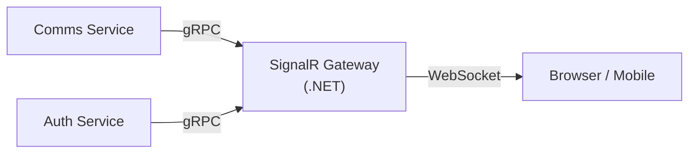
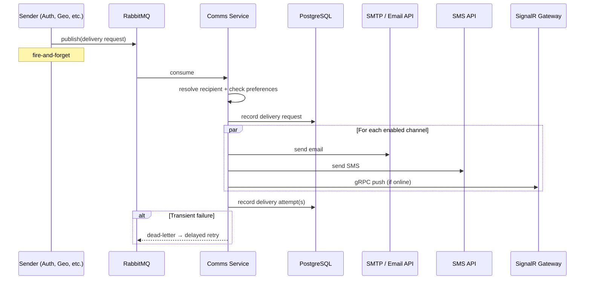
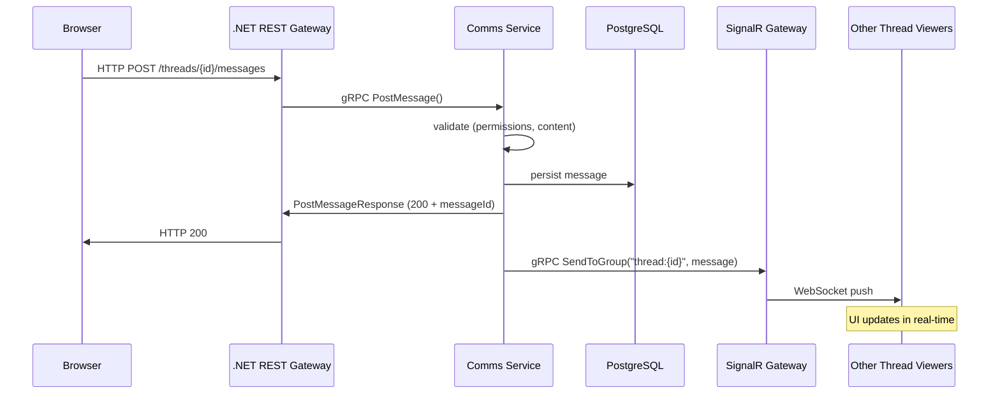
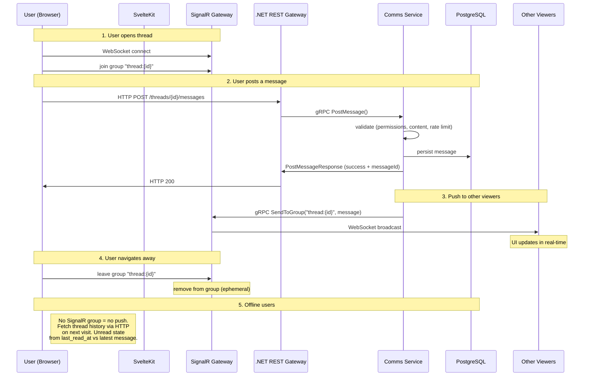

# Comms Service

## Overview

The **Comms** (Communications) service is a standalone Node.js service that handles all outbound and conversational communication for D2-WORX. It is a **delivery engine** — other services feed it requests via RabbitMQ, and it composes, formats, and delivers messages through the appropriate channels.

**Runtime:** Node.js (gRPC server + RabbitMQ consumer — no HTTP framework)
**Database:** PostgreSQL (own schema, Drizzle ORM)
**Inbound:** RabbitMQ (transactional delivery) + gRPC server (conversational messaging + queries from .NET gateway)
**Outbound:** Email (SMTP/API), SMS (provider TBD), Push (gRPC client → SignalR gateway)

> **No Hono / no HTTP.** Auth uses Hono because BetterAuth requires it. Comms has no direct HTTP surface — all client-facing HTTP is handled by the .NET REST gateway, which calls Comms via gRPC. Comms only exposes RabbitMQ consumers and a gRPC server.

---

## Design Principles

1. **Senders send content, Comms handles presentation** — Senders provide a title + body (plain text / simple markdown). Comms wraps it in a consistent, branded template per channel (HTML email layout, SMS truncation, push title+body). This keeps the consumer side simple.

2. **Fire-and-forget from the sender's perspective** — Senders publish a RabbitMQ message and move on. Comms tracks delivery internally (success/failure/retry). Senders do NOT poll for delivery status.

3. **Async delivery feedback via SignalR gateway** — When delivery outcomes matter to the UX (e.g., "your forum post was sent" or "message delivery failed"), Comms pushes status updates to the SignalR gateway via gRPC, which relays them to the connected client over WebSocket.

4. **Channel-agnostic at the sender API** — Senders specify WHAT to send and WHO to send it to, not HOW. Comms resolves the recipient's channel preferences and fans out accordingly.

5. **Non-user recipients supported** — Can deliver to users (by userId), contacts (by contactId), or direct addresses (raw email/phone for anonymous or external recipients).

6. **RabbitMQ is the queue, PG is the audit log** — Unlike DeCAF v3 which polled PG for retries, D2 uses RabbitMQ dead-letter exchanges for retry scheduling. PG stores delivery history for audit, analytics, and queryability.

---

## Sub-Domains

### 1. Delivery Engine (transactional notifications)

System-to-person messages triggered by application events. Examples:
- Email verification, password reset, invitation emails (from Auth)
- Order confirmation, shipping updates (from future services)
- System alerts, maintenance notices (from ops)

**Flow:**



### 2. In-App Notifications

Lightweight notifications that appear in the app UI (bell icon). Not email/SMS — just stored records the client fetches or receives via push.

- Title + description + read/unread state
- Linked to userId (no anonymous in-app notifs)
- Pushed to connected clients via SignalR gateway
- Paginated query API for notification history

### 3. Conversational Messaging (threads, live chat, forums)

Person-to-person or group conversations. Participants can be users OR contacts (non-users). Reached via the .NET REST gateway → gRPC (NOT RabbitMQ — user actions need synchronous responses).

- **Thread** — a conversation container (type: `chat`, `support`, `forum`, etc.)
- **Participants** — users and/or contacts, each with a role and mute toggle
- **Messages** — markdown-formatted text within a thread, with file attachments and emoji reactions
- **Real-time** — when a thread is actively viewed, new messages / edits / reactions push instantly to all viewers via SignalR gateway. Comms persists first, then pushes via gRPC.
- **Offline** — no push. Users fetch thread history via paginated query when they open it. Unread state tracked via last-read timestamp per participant.

---

## Entity Model

### Delivery Engine Tables

```
delivery_request
├── id                  UUIDv7 PK
├── correlation_id      UUIDv7 (sender's idempotency / tracing key)
├── sender_service      text (e.g., "auth", "geo", "billing")
├── recipient_user_id   UUID? (resolve email/phone via user record)
├── recipient_contact_id UUID? (resolve via geo-client)
├── recipient_email     text? (direct address — for non-users)
├── recipient_phone     text? (direct address — for non-users)
├── title               text
├── body                text (plain text or simple markdown)
├── sensitivity         text ("normal", "sensitive", "critical")
├── channels            text[] (requested: ["email", "sms", "push"] — null = use preferences)
├── callback_topic      text? (RabbitMQ topic for delivery outcome, if sender wants feedback)
├── metadata            jsonb? (sender-specific context, opaque to comms)
├── created_at          timestamptz
└── processed_at        timestamptz?

delivery_attempt
├── id                  UUIDv7 PK
├── request_id          UUID FK → delivery_request
├── channel             text ("email", "sms", "push", "in_app")
├── status              text ("pending", "sent", "failed", "retried")
├── provider_message_id text? (e.g., SES message ID, Twilio SID)
├── error               text?
├── attempt_number      int
├── created_at          timestamptz
└── next_retry_at       timestamptz?
```

### Channel Preferences Table

```
channel_preference
├── id                  UUIDv7 PK
├── user_id             UUID? (one of user_id or contact_id required)
├── contact_id          UUID?
├── email_enabled       boolean (default true)
├── sms_enabled         boolean (default true)
├── push_enabled        boolean (default true)
├── quiet_hours_start   time? (local time — no notifications during quiet hours)
├── quiet_hours_end     time?
├── quiet_hours_tz      text? (IANA timezone, e.g., "America/New_York")
├── created_at          timestamptz
└── updated_at          timestamptz
```

### Template Table

```
template_wrapper
├── id                  UUIDv7 PK
├── name                text UNIQUE (e.g., "default", "transactional", "marketing")
├── channel             text ("email", "sms", "push")
├── subject_template    text? (for email — Handlebars/Mustache with {{title}})
├── body_template       text (wraps {{body}} — email: full HTML, SMS: text, push: body)
├── active              boolean
├── created_at          timestamptz
└── updated_at          timestamptz
```

### In-App Notification Table

```
notification
├── id                  UUIDv7 PK
├── user_id             UUID (NOT NULL — in-app is always for authenticated users)
├── title               text
├── body                text
├── read                boolean (default false)
├── link                text? (deep link to relevant page/resource)
├── metadata            jsonb? (icon, category, action, etc.)
├── request_id          UUID? FK → delivery_request (if triggered by a delivery)
├── created_at          timestamptz
└── read_at             timestamptz?
```

### Conversational Messaging Tables

```
thread
├── id                  UUIDv7 PK
├── type                text ("chat", "support", "forum", "system")
├── state               text ("active", "archived", "closed")
├── title               text?
├── org_id              UUID? (owning organization)
├── created_by_user_id  UUID?
├── created_at          timestamptz
└── updated_at          timestamptz

thread_participant
├── thread_id           UUID FK → thread (composite PK with participant identifier)
├── user_id             UUID? (one of user_id or contact_id required)
├── contact_id          UUID?
├── role                text ("owner", "admin", "member", "viewer")
├── notifications_muted boolean (default false)
├── last_read_at        timestamptz? (for unread indicators — null = never read)
├── joined_at           timestamptz
├── left_at             timestamptz?
└── updated_at          timestamptz

message
├── id                  UUIDv7 PK
├── thread_id           UUID FK → thread
├── sender_user_id      UUID?
├── sender_contact_id   UUID?
├── content             text (raw markdown — rendered client-side)
├── content_format      text (default "markdown" — future: "plain", "html")
├── edited_at           timestamptz?
├── deleted_at          timestamptz? (soft delete)
├── created_at          timestamptz
└── updated_at          timestamptz

message_attachment
├── id                  UUIDv7 PK
├── message_id          UUID FK → message
├── file_url            text (MinIO/S3 URL)
├── file_name           text
├── file_type           text (MIME type)
├── file_size           bigint (bytes)
├── created_at          timestamptz
└── updated_at          timestamptz

message_reaction
├── id                  UUIDv7 PK
├── message_id          UUID FK → message
├── user_id             UUID (only authenticated users can react)
├── reaction            text (emoji code or shortcode)
├── created_at          timestamptz
├── UNIQUE(message_id, user_id, reaction)
```

---

## Channels & Providers

| Channel   | Protocol         | Provider                   | Notes                                          |
|-----------|------------------|----------------------------|-------------------------------------------------|
| Email     | HTTP API         | **Resend**                 | HTML wrapper around sender's body               |
| SMS       | HTTP API         | **Twilio**                 | Truncated body, no HTML                         |
| Push      | gRPC → SignalR   | SignalR gateway (.NET)     | Title + body, delivered to connected clients    |
| In-App    | DB + Push        | Local PG + SignalR gateway | Stored in `notification` table, pushed if online|

### SignalR Gateway

A **separate .NET service** that owns all WebSocket/SignalR connections. Comms (and other services) talk to it via gRPC to push real-time updates to connected clients.



The gateway is a **dumb connection manager** — it maps "send to user X" or "send to group Y" to the right WebSocket connections. No business logic. Comms owns what to send; the gateway owns how to deliver it in real-time.

**Gateway gRPC API** (tiny surface):

| RPC                    | Purpose                                       |
|------------------------|-----------------------------------------------|
| `SendToUser`           | Push to all of a user's active connections    |
| `SendToConnection`     | Push to a specific anonymous connection       |
| `SendToGroup`          | Push to all connections in a room/group       |

Group join/leave is handled client-side — when a user opens a thread, their SignalR client joins group `thread:{threadId}`. When they navigate away, they leave. The gateway manages group membership directly from client subscribe/unsubscribe events. Comms never manages connection state.

---

## RabbitMQ Topology

### Exchanges

| Exchange                  | Type   | Purpose                                        |
|---------------------------|--------|------------------------------------------------|
| `comms.deliver`           | topic  | Inbound delivery requests from any service     |
| `comms.deliver.dlx`       | topic  | Dead-letter exchange for failed deliveries     |
| `comms.deliver.retry`     | topic  | Delayed retry (TTL per-message)                |
| `comms.outcome`           | topic  | Delivery outcome callbacks (optional)          |

**Note:** Thread/conversational messaging does NOT use RabbitMQ. Thread operations go through gRPC (synchronous, user-initiated). RabbitMQ is only for transactional delivery (fire-and-forget side effects).

### Routing Keys

```
comms.deliver.email-verification    (from auth)
comms.deliver.password-reset        (from auth)
comms.deliver.invitation            (from auth)
comms.deliver.generic               (catch-all for simple title+body)
comms.outcome.{sender_service}      (delivery result callback)
```

### Retry Strategy

1. First delivery attempt: immediate
2. On transient failure: dead-letter to `comms.deliver.dlx`
3. DLX routes to `comms.deliver.retry` with per-message TTL (exponential: 5s → 10s → 30s → 60s → 5min)
4. After TTL expires, message re-queued to `comms.deliver` for retry
5. After max attempts (configurable, default 10): mark as permanently failed, record in `delivery_attempt`, optionally publish to `comms.outcome.{sender_service}`

---

## Real-Time Architecture

### Two Paths — Transactional vs Conversational

Comms handles two fundamentally different communication patterns with different latency requirements and transport mechanisms:

#### Path 1: Transactional Delivery (side effects, seconds OK)

Examples: email verification, password reset, system alerts. Sender publishes to RabbitMQ and moves on. Fire-and-forget.



#### Path 2: Conversational Messaging (user actions, must feel instant)

Examples: forum post, chat message, support thread reply. Client gets synchronous response. All viewers get real-time push.



**Key distinction:** Transactional delivery goes through **RabbitMQ** (no gateway, no HTTP — it's a side effect of a service event). Conversational messaging goes through the **.NET REST gateway via gRPC** (user-initiated action that needs an immediate response).

### Comms Service Interfaces

Because of the two paths, the Comms service exposes **both**:

| Interface        | Transport  | Purpose                                               |
|------------------|------------|-------------------------------------------------------|
| RabbitMQ consumer| AMQP       | Consumes transactional delivery requests               |
| gRPC server      | HTTP/2     | Serves conversational messaging RPCs from the gateway |
| gRPC client      | HTTP/2     | Pushes real-time updates TO the SignalR gateway       |

### Thread Messaging Flow (detailed)



### Message Format

All thread messages use **Markdown** for formatting:

- **Storage:** Raw markdown in `message.content` (PG text column)
- **Rendering:** Client-side in SvelteKit (e.g., `marked` or `markdown-it`)
- **Files:** Uploaded to MinIO, referenced as `` in markdown
- **Sanitization:** Server-side on ingest (strip dangerous HTML), client-side on render (DOMPurify)
- **Benefits:** Simple storage (just text), flexible rendering, no rich-text editor complexity, file references are just URLs

This applies to forum posts, chat messages, support threads — all the same format. Keeps both the sender experience and the rendering pipeline uniform.

### Delivery Outcome Feedback

For transactional delivery, senders are fire-and-forget. But when outcomes matter to the UX:

1. Sender includes `callbackTopic` in the delivery request (e.g., `"auth.delivery-outcome"`)
2. After delivery succeeds or permanently fails, Comms publishes an outcome event to `comms.outcome.{sender_service}` via RabbitMQ
3. The sending service can optionally consume this to update its own state
4. For connected users, Comms can also push delivery status via SignalR (e.g., "your invitation email was sent successfully")

---

## Client Libraries

### `@d2/comms-client` (Node.js)

Used by Node.js services (Auth, future services) to publish delivery requests.

```typescript
import { createCommsClient } from "@d2/comms-client";

const comms = createCommsClient(messageBus);

// Simple: send to a user, let comms resolve channels
await comms.notify({
  userId: "...",
  title: "Email Verified",
  body: "Your email has been verified successfully.",
  sensitivity: "normal",
});

// Direct: send to a raw email (non-user)
await comms.notify({
  email: "external@example.com",
  title: "You've been invited",
  body: "Click here to join...",
  channels: ["email"],
});

// With callback: get notified of delivery outcome
await comms.notify({
  userId: "...",
  title: "Important Update",
  body: "...",
  callbackTopic: "auth.delivery-outcome",
});
```

### `D2.Comms.Client` (.NET)

Same pattern for .NET services, publishing delivery requests via raw AMQP with Protocol Buffer contracts.

---

## DDD Layer Structure

```
backends/node/services/comms/
├── COMMS.md              ← this file
├── domain/               ← @d2/comms-domain
│   └── src/
│       ├── entities/      (DeliveryRequest, DeliveryAttempt, Notification, Thread, Message, etc.)
│       ├── enums/         (Channel, DeliveryStatus, ThreadType, ThreadState, Sensitivity, etc.)
│       ├── rules/         (channel resolution, quiet hours, retry policy)
│       └── index.ts
├── app/                  ← @d2/comms-app
│   └── src/
│       ├── interfaces/    (repository handlers, provider interfaces)
│       ├── implementations/
│       │   ├── cqrs/handlers/   (c/ q/ x/)
│       │   └── messaging/handlers/ (sub/ pub/)
│       ├── messages/      (RabbitMQ message contracts)
│       └── index.ts
├── infra/                ← @d2/comms-infra
│   └── src/
│       ├── repository/    (Drizzle schema, migrations, repo handlers)
│       ├── providers/     (email provider, SMS provider, push via gRPC)
│       ├── messaging/     (RabbitMQ consumer/publisher wiring)
│       └── index.ts
├── api/                  ← @d2/comms-api (gRPC server — NO HTTP)
│   └── src/
│       ├── services/      (gRPC service implementations — delivery, threads, notifications)
│       └── index.ts
└── tests/                ← comms-tests (separate, mirrors auth-tests)
    └── src/
        ├── unit/
        └── integration/
```

---

## Phasing

### Phase 1: Delivery Engine (unblocks Auth sign-up flow)

- [ ] Domain entities: DeliveryRequest, DeliveryAttempt, ChannelPreference, TemplateWrapper
- [ ] Domain rules: channel resolution, sensitivity handling
- [ ] App layer: Deliver handler (orchestrator), per-channel send handlers
- [ ] Infra: Drizzle schema + migrations, RabbitMQ consumer for `comms.deliver.*`
- [ ] Infra: Email provider (initial — likely Resend or SES)
- [ ] Client: `@d2/comms-client` (Node.js) — `notify()` publishes to RabbitMQ
- [ ] Wire Auth's `PublishVerificationEmail`, `PublishPasswordReset`, `PublishInvitationEmail` to use comms-client
- [ ] Template wrapper: default email HTML template (branded, wraps title+body)
- [ ] Tests

### Phase 2: In-App Notifications + Push

- [ ] Notification entity + CRUD handlers
- [ ] Push via gRPC to SignalR gateway (requires gateway to exist)
- [ ] Notification history query API
- [ ] Mark as read / bulk mark as read

### Phase 3: Conversational Messaging

- [ ] Thread, ThreadParticipant, Message, MessageAttachment, MessageReaction entities
- [ ] Thread CRUD + participant management
- [ ] Message send/edit/delete
- [ ] Reactions
- [ ] Real-time thread updates via SignalR gateway
- [ ] File upload integration (MinIO)

### Phase 4: Advanced

- [ ] SMS provider integration
- [ ] Quiet hours enforcement
- [ ] Delivery analytics / dashboards
- [ ] Template management UI
- [ ] Message search (full-text)

---

## Resolved Decisions

- **Email provider**: **Resend** — best DX (clean TS SDK, `{ data, error }` pattern), 100/day free tier (never expires), $20/mo for 50K. Shared IP pool is well-managed. No dedicated IP needed at low volumes (would hurt deliverability). Trial mode for development.
- **SMS provider**: **Twilio** — best docs/SDK in SMS space, $15 trial credit (~1,900 msgs), field service dispatch is their core vertical. Two-way SMS for worker replies. Trial mode (verified numbers only) until 10DLC registration. 10DLC requires EIN (free from IRS, no LLC needed) — deferred until closer to beta launch (~3 week lead time for carrier approval).
- **Trial runway**: Both providers cover all development, integration testing, and small alpha (verified numbers) at $0 cost. First real spend: 10DLC registration (~$21 one-time + $2/mo) when sending SMS to unverified users.

## Open Questions

- **Template format**: Handlebars/Mustache for simple interpolation, or React Email / MJML for richer templates?
- **SignalR gateway**: Does it already exist in the Aspire stack, or is it a new service to build?
- **File storage for attachments**: MinIO is in the Aspire stack — confirm it's the right choice for message attachments.
- **Rate limiting on comms**: Should the delivery engine rate-limit itself per-provider (e.g., Resend has 100/day on free tier)?
- **Unsubscribe / CAN-SPAM compliance**: Marketing emails need unsubscribe links. Transactional emails don't. How do we classify?

---

## Evolution from DeCAF v3

| Aspect                 | DeCAF v3                                 | D2 Comms                                         |
|------------------------|------------------------------------------|---------------------------------------------------|
| Queue mechanism        | PG polling via Quartz cron               | RabbitMQ with dead-letter retry                   |
| Retry scheduling       | `NextSendAttempt` column + cron          | Per-message TTL on DLX → retry exchange           |
| Template compilation   | Provider interface (ITemplatingProvider) | Comms-owned wrapper templates (Handlebars/MJML)   |
| Sender API             | `Context.Messaging.Commands.Notify`      | RabbitMQ message via `@d2/comms-client`           |
| Recipient resolution   | Inline DB lookup in Notify handler       | geo-client lib for contact/user lookup            |
| Channel preferences    | PG NotificationSettings per user/contact | Same concept, enhanced with quiet hours + timezone|
| In-app notifications   | PG Notification table                    | Same + real-time push via SignalR gateway         |
| Threads / chat         | PG Thread + Message model                | Same concept, org-scoped, real-time via SignalR   |
| Non-user recipients    | Only via contactId                       | contactId, direct email/phone, or anonymous push  |
| Real-time              | Not implemented                          | gRPC → SignalR gateway for all push               |
| Service boundary       | Feature in monolith                      | Standalone Node.js microservice                   |
