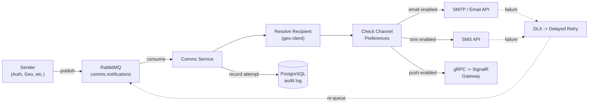
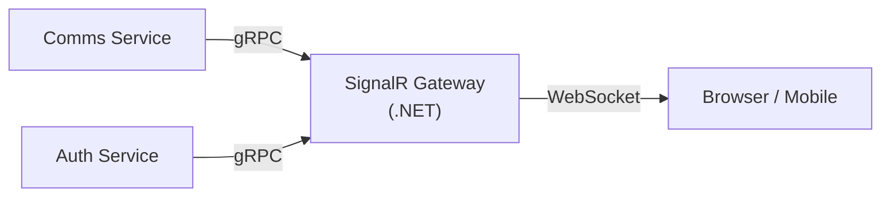
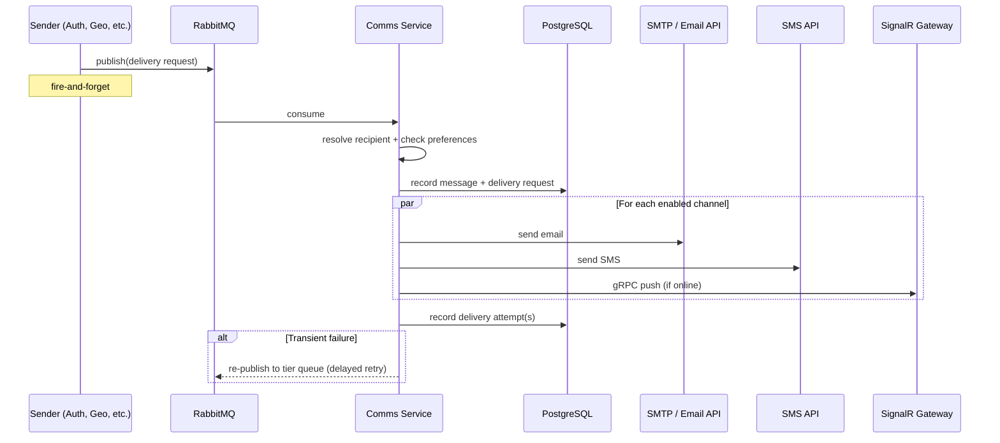
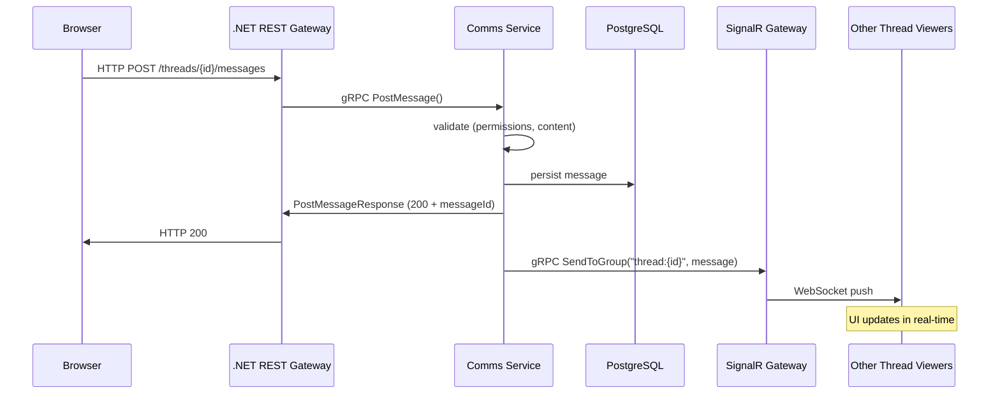
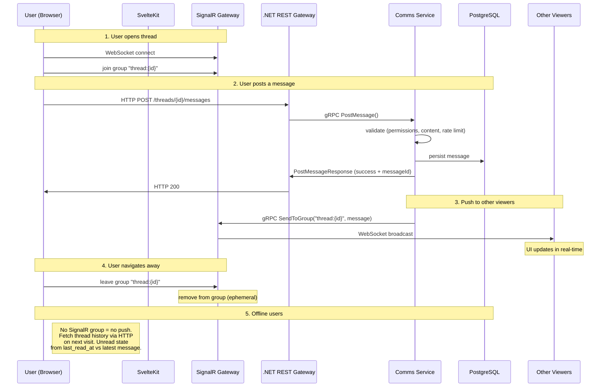

# Comms Service

## Overview

The **Comms** (Communications) service is a standalone Node.js service that handles all outbound and conversational communication for D2-WORX. It is a **delivery engine** -- other services feed it requests via RabbitMQ, and it composes, formats, and delivers messages through the appropriate channels.

**Runtime:** Node.js (gRPC server + RabbitMQ consumer -- no HTTP framework)
**Database:** PostgreSQL (own schema, Drizzle ORM)
**Inbound:** RabbitMQ (transactional delivery) + gRPC server (conversational messaging + queries from .NET gateway)
**Outbound:** Email (SMTP/API), SMS (provider TBD), Push (gRPC client -> SignalR gateway)

> **No Hono / no HTTP.** Auth uses Hono because BetterAuth requires it. Comms has no direct HTTP surface -- all client-facing HTTP is handled by the .NET REST gateway, which calls Comms via gRPC. Comms only exposes RabbitMQ consumers and a gRPC server.

---

## Design Principles

1. **Senders send content, Comms handles presentation** -- Senders provide a universal notification shape: title + content (markdown) + plaintext (plain text fallback). Comms handles channel-specific presentation (HTML email wrapping via `marked` + `isomorphic-dompurify`, SMS truncation, push title+body). No per-event templates -- all notifications use the same shape.

2. **Fire-and-forget from the sender's perspective** -- Senders publish a RabbitMQ message and move on. Comms tracks delivery internally (success/failure/retry). Senders do NOT poll for delivery status.

3. **Async delivery feedback via SignalR gateway** -- When delivery outcomes matter to the UX (e.g., "your forum post was sent" or "message delivery failed"), Comms pushes status updates to the SignalR gateway via gRPC, which relays them to the connected client over WebSocket.

4. **Channel-agnostic at the sender API** -- Senders specify WHAT to send and WHO to send it to, not HOW. Comms resolves the recipient's channel preferences and fans out accordingly.

5. **Contacts-only recipient resolution** -- Recipients are resolved exclusively via contactId (Geo contact lookup). No userId-based resolution, no direct email/phone addresses. Callers must provide a contactId.

6. **RabbitMQ is the queue, PG is the audit log** -- Unlike DeCAF v3 which polled PG for retries, D2 uses RabbitMQ dead-letter exchanges for retry scheduling. PG stores delivery history for audit, analytics, and queryability.

---

## Sub-Domains

### 1. Delivery Engine (transactional notifications)

System-to-person messages triggered by application events. Examples:

- Email verification, password reset, invitation emails (from Auth)
- Order confirmation, shipping updates (from future services)
- System alerts, maintenance notices (from ops)

**Flow:**



### 2. In-App Notifications

Lightweight notifications that appear in the app UI (bell icon). Not email/SMS -- just stored records the client fetches or receives via push.

- Title + description + read/unread state
- Linked to userId (no anonymous in-app notifs)
- Pushed to connected clients via SignalR gateway
- Paginated query API for notification history

### 3. Conversational Messaging (threads, live chat, forums)

Person-to-person or group conversations. Participants can be users OR contacts (non-users). Reached via the .NET REST gateway -> gRPC (NOT RabbitMQ -- user actions need synchronous responses).

- **Thread** -- a conversation container (type: `chat`, `support`, `forum`, etc.)
- **Participants** -- users and/or contacts, each with a role and mute toggle
- **Messages** -- markdown-formatted text within a thread, with file attachments and emoji reactions
- **Real-time** -- when a thread is actively viewed, new messages / edits / reactions push instantly to all viewers via SignalR gateway. Comms persists first, then pushes via gRPC.
- **Offline** -- no push. Users fetch thread history via paginated query when they open it. Unread state tracked via last-read timestamp per participant.

---

## Entity Model

### Delivery Engine Tables

```
message
+-- id                  UUIDv7 PK
+-- thread_id           UUID? (null for standalone transactional messages)
+-- parent_message_id   UUID? (reply threading)
+-- sender_user_id      UUID?
+-- sender_contact_id   UUID?
+-- sender_service      text? (e.g., "auth", "geo", "billing")
+-- title               varchar(255)?
+-- content             text NOT NULL (markdown -- rendered to HTML for email)
+-- plain_text_content  text NOT NULL (plain text -- SMS body, email fallback)
+-- content_format      varchar(20) DEFAULT "markdown"
+-- sensitive           boolean DEFAULT false
+-- urgency             varchar(20) DEFAULT "normal" ("normal" | "urgent")
+-- related_entity_id   UUID?
+-- related_entity_type varchar(100)?
+-- metadata            jsonb?
+-- edited_at           timestamptz?
+-- deleted_at          timestamptz? (soft delete)
+-- created_at          timestamptz
+-- updated_at          timestamptz

delivery_request
+-- id                  UUIDv7 PK
+-- message_id          UUID FK -> message
+-- correlation_id      UUID UNIQUE (sender's idempotency / tracing key)
+-- recipient_contact_id UUID NOT NULL (resolve via geo-client)
+-- callback_topic      varchar(255)? (RabbitMQ topic for delivery outcome)
+-- created_at          timestamptz
+-- processed_at        timestamptz?

delivery_attempt
+-- id                  UUIDv7 PK
+-- request_id          UUID FK -> delivery_request
+-- channel             varchar(20) ("email", "sms")
+-- recipient_address   varchar(320) NOT NULL (resolved email or phone)
+-- status              varchar(20) DEFAULT "pending" ("pending", "sent", "failed", "retried")
+-- provider_message_id varchar(255)? (e.g., Resend ID, Twilio SID)
+-- error               text?
+-- attempt_number      int NOT NULL
+-- created_at          timestamptz
+-- next_retry_at       timestamptz?
```

### Channel Preferences Table

```
channel_preference
+-- id                  UUIDv7 PK
+-- contact_id          UUID UNIQUE (Geo contact -- one preference record per contact)
+-- email_enabled       boolean DEFAULT true
+-- sms_enabled         boolean DEFAULT true
+-- created_at          timestamptz
+-- updated_at          timestamptz
```

### In-App Notification Table

```
notification
+-- id                  UUIDv7 PK
+-- user_id             UUID (NOT NULL -- in-app is always for authenticated users)
+-- title               text
+-- body                text
+-- read                boolean (default false)
+-- link                text? (deep link to relevant page/resource)
+-- metadata            jsonb? (icon, category, action, etc.)
+-- request_id          UUID? FK -> delivery_request (if triggered by a delivery)
+-- created_at          timestamptz
+-- read_at             timestamptz?
```

### Conversational Messaging Tables

```
thread
+-- id                  UUIDv7 PK
+-- type                text ("chat", "support", "forum", "system")
+-- state               text ("active", "archived", "closed")
+-- title               text?
+-- org_id              UUID? (owning organization)
+-- created_by_user_id  UUID?
+-- created_at          timestamptz
+-- updated_at          timestamptz

thread_participant
+-- thread_id           UUID FK -> thread (composite PK with participant identifier)
+-- user_id             UUID? (one of user_id or contact_id required)
+-- contact_id          UUID?
+-- role                text ("owner", "admin", "member", "viewer")
+-- notifications_muted boolean (default false)
+-- last_read_at        timestamptz? (for unread indicators -- null = never read)
+-- joined_at           timestamptz
+-- left_at             timestamptz?
+-- updated_at          timestamptz

message
(shared table -- see above; threaded messages have thread_id set)

message_attachment
+-- id                  UUIDv7 PK
+-- message_id          UUID FK -> message
+-- file_url            text (MinIO/S3 URL)
+-- file_name           text
+-- file_type           text (MIME type)
+-- file_size           bigint (bytes)
+-- created_at          timestamptz
+-- updated_at          timestamptz

message_reaction
+-- id                  UUIDv7 PK
+-- message_id          UUID FK -> message
+-- user_id             UUID (only authenticated users can react)
+-- reaction            text (emoji code or shortcode)
+-- created_at          timestamptz
+-- UNIQUE(message_id, user_id, reaction)
```

---

## Recipient Resolution

The `RecipientResolver` resolves a recipient's email/phone from a `contactId`. It uses the `@d2/geo-client` library to look up Geo contacts.

### Resolution Path

| Path          | When                        | Geo-Client Handler | Lookup Key                     |
| ------------- | --------------------------- | ------------------ | ------------------------------ |
| **contactId** | `recipientContactId` is set | `GetContactsByIds` | Direct Geo contact UUID lookup |
| **neither**   | No recipient info           | --                 | Deliver returns NOT_FOUND      |

Callers are responsible for providing a contactId (resolved from their own domain). Comms does not perform userId-to-contact resolution -- that responsibility belongs to the sending service (e.g., Auth resolves userId -> contactId via ext-key lookup before publishing via `@d2/comms-client`).

### Channel Resolution

After resolving the recipient address, Deliver looks up channel preferences by `contactId`. Three rules control channel selection:

1. **`sensitive: true`** -- email ONLY (safety: tokens/PII must not leak via SMS)
2. **`urgency: "urgent"`** -- forces all channels (email + SMS), bypasses preferences
3. **`urgency: "normal"`** -- respects all channel preferences

No quiet hours. No requested-channels override. The `sensitive` and `urgency` fields on the Message entity are the only inputs to channel resolution.

### Known Limitation: SMS Without Provider

When `smsProvider` is undefined (not configured), SMS delivery attempts are created but remain in `"pending"` status indefinitely -- no dispatch occurs. This is acceptable during development/alpha but should be addressed before enabling SMS channels in production.

---

## Markdown Rendering

Transactional email content is rendered from markdown to sanitized HTML server-side using:

- **`marked`** (17.0.3) -- full CommonMark parser, synchronous rendering
- **`isomorphic-dompurify`** (2.36.0) -- XSS sanitization via DOMPurify

The Deliver handler calls `marked.parse()` to convert markdown content to raw HTML, then `DOMPurify.sanitize()` to strip dangerous tags/attributes. The sanitized HTML is wrapped in a simple email template with `{{title}}`, `{{body}}`, and `{{unsubscribeUrl}}` placeholders.

Plain text (`plainTextContent`) is used as-is for SMS and email plaintext fallback -- no rendering.

---

## Channels & Providers

| Channel | Protocol        | Provider               | Notes                                            |
| ------- | --------------- | ---------------------- | ------------------------------------------------ |
| Email   | HTTP API        | **Resend**             | Markdown -> HTML via marked + DOMPurify          |
| SMS     | HTTP API        | **Twilio**             | Plain text content, no HTML                      |
| Push    | gRPC -> SignalR | SignalR gateway (.NET) | Title + body, delivered to connected clients     |
| In-App  | DB + Push       | Local PG + SignalR     | Stored in `notification` table, pushed if online |

### SignalR Gateway

A **separate .NET service** that owns all WebSocket/SignalR connections. Comms (and other services) talk to it via gRPC to push real-time updates to connected clients.



The gateway is a **dumb connection manager** -- it maps "send to user X" or "send to group Y" to the right WebSocket connections. No business logic. Comms owns what to send; the gateway owns how to deliver it in real-time.

**Gateway gRPC API** (tiny surface):

| RPC                | Purpose                                    |
| ------------------ | ------------------------------------------ |
| `SendToUser`       | Push to all of a user's active connections |
| `SendToConnection` | Push to a specific anonymous connection    |
| `SendToGroup`      | Push to all connections in a room/group    |

Group join/leave is handled client-side -- when a user opens a thread, their SignalR client joins group `thread:{threadId}`. When they navigate away, they leave. The gateway manages group membership directly from client subscribe/unsubscribe events. Comms never manages connection state.

---

## RabbitMQ Topology

### Exchanges

| Exchange                 | Type   | Purpose                                         |
| ------------------------ | ------ | ----------------------------------------------- |
| `comms.notifications`    | fanout | Inbound notification requests from any service  |
| `comms.retry.requeue`    | --     | Routes expired tier-queue messages back to main |
| `comms.retry.tier-{N}`   | --     | Tier delay queues (TTL-based retry scheduling)  |
| `comms.outcome` (future) | topic  | Delivery outcome callbacks (optional)           |

**Note:** Thread/conversational messaging does NOT use RabbitMQ. Thread operations go through gRPC (synchronous, user-initiated). RabbitMQ is only for transactional delivery (fire-and-forget side effects).

### Queue & Binding

All notifications go to `comms.notifications` fanout exchange (no routing key). The comms service binds a `comms.notifications` queue to this exchange.

### Retry Strategy

1. First delivery attempt: immediate
2. On transient failure: re-publish to tier queue (`comms.retry.tier-{N}`) with appropriate TTL
3. Tier TTLs: 5s -> 10s -> 30s -> 60s -> 5min (indexed by retry count)
4. After TTL expires, message dead-letters back to `comms.notifications` via `comms.retry.requeue` exchange
5. After max attempts (configurable, default 10): log error and drop message

Always ACK the original message -- retry is via re-publish to tier queues, not NACK/requeue.

---

## Real-Time Architecture

### Two Paths -- Transactional vs Conversational

Comms handles two fundamentally different communication patterns with different latency requirements and transport mechanisms:

#### Path 1: Transactional Delivery (side effects, seconds OK)

Examples: email verification, password reset, system alerts. Sender publishes to RabbitMQ and moves on. Fire-and-forget.



#### Path 2: Conversational Messaging (user actions, must feel instant)

Examples: forum post, chat message, support thread reply. Client gets synchronous response. All viewers get real-time push.



**Key distinction:** Transactional delivery goes through **RabbitMQ** (no gateway, no HTTP -- it's a side effect of a service event). Conversational messaging goes through the **.NET REST gateway via gRPC** (user-initiated action that needs an immediate response).

### Comms Service Interfaces

Because of the two paths, the Comms service exposes **both**:

| Interface         | Transport | Purpose                                               |
| ----------------- | --------- | ----------------------------------------------------- |
| RabbitMQ consumer | AMQP      | Consumes transactional delivery requests              |
| gRPC server       | HTTP/2    | Serves conversational messaging RPCs from the gateway |
| gRPC client       | HTTP/2    | Pushes real-time updates TO the SignalR gateway       |

### Thread Messaging Flow (detailed)



### Message Format

All thread messages use **Markdown** for formatting:

- **Storage:** Raw markdown in `message.content` (PG text column)
- **Rendering:** Client-side in SvelteKit (e.g., `marked` or `markdown-it`)
- **Files:** Uploaded to MinIO, referenced as `` in markdown
- **Sanitization:** Server-side on ingest (strip dangerous HTML), client-side on render (DOMPurify)
- **Benefits:** Simple storage (just text), flexible rendering, no rich-text editor complexity, file references are just URLs

This applies to forum posts, chat messages, support threads -- all the same format. Keeps both the sender experience and the rendering pipeline uniform.

### Delivery Outcome Feedback

For transactional delivery, senders are fire-and-forget. But when outcomes matter to the UX:

1. Sender includes `callbackTopic` in the delivery request (e.g., `"auth.delivery-outcome"`)
2. After delivery succeeds or permanently fails, Comms publishes an outcome event to `comms.outcome.{sender_service}` via RabbitMQ
3. The sending service can optionally consume this to update its own state
4. For connected users, Comms can also push delivery status via SignalR (e.g., "your invitation email was sent successfully")

---

## Client Libraries

### `@d2/comms-client` (Node.js)

Thin client library at `comms/client/` for publishing notification requests to the Comms service via RabbitMQ. Consuming services call a single `Notify` handler with a universal message shape; the Comms service resolves the recipient's address, picks channels, renders markdown, and delivers.

Mirrors the `@d2/geo-client` pattern: a service-owned client that lives alongside the service it fronts, registered into any consumer's DI container.

```typescript
import { addCommsClient } from "@d2/comms-client";

// Registration (composition root)
addCommsClient(services, { publisher: messageBus.publisher });

// Usage (from a DI scope)
import { INotifyKey } from "@d2/comms-client";

const notify = scope.resolve(INotifyKey);
await notify.handleAsync({
  recipientContactId: "01926a3b-...",
  title: "Verify your email",
  content: "Click [here](https://...) to verify.",
  plaintext: "Visit https://... to verify your email.",
  correlationId: crypto.randomUUID(),
  senderService: "auth",
});
```

**Universal message shape (`NotifyInput`):**

| Field                | Type                      | Required | Description                                            |
| -------------------- | ------------------------- | -------- | ------------------------------------------------------ |
| `recipientContactId` | `string` (UUID)           | Yes      | Geo contact ID -- the ONLY recipient identifier        |
| `title`              | `string` (max 255)        | Yes      | Email subject, SMS prefix, push title                  |
| `content`            | `string` (max 50,000)     | Yes      | Markdown body -- rendered to HTML for email            |
| `plaintext`          | `string` (max 50,000)     | Yes      | Plain text -- SMS body, email fallback                 |
| `sensitive`          | `boolean`                 | No       | Default `false`. When `true`, email only (secure)      |
| `urgency`            | `"normal"` \| `"urgent"`  | No       | Default `"normal"`. `"urgent"` bypasses prefs          |
| `correlationId`      | `string` (max 36)         | Yes      | Idempotency key for deduplication                      |
| `senderService`      | `string` (max 50)         | Yes      | Source service identifier (e.g. `"auth"`, `"billing"`) |
| `metadata`           | `Record<string, unknown>` | No       | Arbitrary key-value pairs for future use               |

All fields validated via Zod before publishing. Published to `comms.notifications` fanout exchange (empty routing key). When `publisher` is omitted during registration, the handler logs the notification and returns success (safe for tests and local dev).

See `client/COMMS_CLIENT.md` for full details.

### `D2.Comms.Client` (.NET)

Same pattern for .NET services, publishing delivery requests via raw AMQP with Protocol Buffer contracts.

---

## DDD Layer Structure

```
backends/node/services/comms/
+-- COMMS.md                ---- this file
+-- client/                 ---- @d2/comms-client (thin RabbitMQ publishing client)
|   +-- COMMS_CLIENT.md
|   +-- package.json
|   +-- tsconfig.json
|   +-- src/
|       +-- index.ts
|       +-- comms-client-constants.ts   (COMMS_EVENTS with NOTIFICATIONS_EXCHANGE)
|       +-- registration.ts            (addCommsClient DI registration)
|       +-- service-keys.ts            (INotifyKey)
|       +-- handlers/
|           +-- pub/
|               +-- notify.ts          (Notify handler -- publishes to fanout exchange)
+-- domain/                 ---- @d2/comms-domain
|   +-- src/
|       +-- constants/      (RETRY_POLICY, DELIVERY_DEFAULTS, CHANNEL_DEFAULTS, COMMS_MESSAGING, COMMS_RETRY, THREAD_CONSTRAINTS)
|       +-- entities/       (Message, DeliveryRequest, DeliveryAttempt, ChannelPreference, Thread, ThreadParticipant, MessageAttachment, MessageReaction, MessageReceipt)
|       +-- enums/          (Channel, DeliveryStatus, Urgency, NotificationPolicy, ThreadType, ThreadState, ParticipantRole, ContentFormat)
|       +-- exceptions/     (CommsDomainError, CommsValidationError)
|       +-- rules/          (channel-resolution, retry-policy, thread-permissions)
|       +-- value-objects/  (ResolvedChannels)
|       +-- index.ts
+-- app/                    ---- @d2/comms-app
|   +-- src/
|       +-- interfaces/
|       |   +-- repository/handlers/   (c/ r/ u/ -- 12 repo handler interfaces)
|       |   +-- providers/             (IEmailProvider, ISmsProvider)
|       +-- implementations/
|       |   +-- cqrs/handlers/
|       |       +-- x/                 (Deliver)
|       |       +-- c/                 (SetChannelPreference)
|       |       +-- q/                 (GetChannelPreference, RecipientResolver)
|       +-- registration.ts   (addCommsApp -- DI wiring)
|       +-- service-keys.ts   (DI service key definitions)
|       +-- index.ts
+-- infra/                  ---- @d2/comms-infra
|   +-- src/
|       +-- repository/
|       |   +-- schema/      (Drizzle tables: message, delivery_request, delivery_attempt, channel_preference)
|       |   +-- handlers/    (c/ r/ u/ -- 12 repo handler implementations)
|       |   +-- migrate.ts   (runMigrations)
|       +-- providers/
|       |   +-- email/resend/ (ResendEmailProvider)
|       |   +-- sms/twilio/  (TwilioSmsProvider)
|       +-- messaging/
|       |   +-- consumers/notification-consumer.ts   (RabbitMQ consumer -- dispatches to Deliver)
|       |   +-- retry-topology.ts                    (DLX tier queue setup)
|       +-- registration.ts  (addCommsInfra -- DI wiring)
|       +-- service-keys.ts  (infra-level re-exports)
|       +-- index.ts
+-- api/                    ---- @d2/comms-api (gRPC server -- NO HTTP)
|   +-- src/
|       +-- mappers/         (channel-preference-mapper, delivery-mapper)
|       +-- services/        (comms-grpc-service -- gRPC handlers)
|       +-- composition-root.ts  (DI wiring: repos, providers, handlers, caches, gRPC, RMQ)
|       +-- main.ts          (entrypoint: gRPC server + RabbitMQ consumer)
|       +-- index.ts
+-- tests/                  ---- comms-tests (separate, mirrors auth-tests)
    +-- src/
        +-- unit/            (domain, app, infra, api tests)
        +-- integration/     (DB + consumer integration tests)
```

---

## CQRS Handlers

### App Layer (comms-app)

| Handler                | Type    | Category | Description                                                                                                                                                 |
| ---------------------- | ------- | -------- | ----------------------------------------------------------------------------------------------------------------------------------------------------------- |
| `Deliver`              | Complex | `x/`     | Orchestrates full delivery: create Message + DeliveryRequest, resolve recipient, resolve channels, render markdown, dispatch via providers, record attempts |
| `RecipientResolver`    | Query   | `q/`     | Resolves email/phone from contactId via geo-client `GetContactsByIds`                                                                                       |
| `SetChannelPreference` | Command | `c/`     | Creates or updates channel preferences for a contact                                                                                                        |
| `GetChannelPreference` | Query   | `q/`     | Returns channel preferences for a contact (creates defaults if missing)                                                                                     |

### Repository Interfaces (comms-app) + Implementations (comms-infra)

| Handler                              | Category | Table              |
| ------------------------------------ | -------- | ------------------ |
| `CreateMessageRecord`                | `c/`     | message            |
| `CreateDeliveryRequestRecord`        | `c/`     | delivery_request   |
| `CreateDeliveryAttemptRecord`        | `c/`     | delivery_attempt   |
| `CreateChannelPreferenceRecord`      | `c/`     | channel_preference |
| `FindMessageById`                    | `r/`     | message            |
| `FindDeliveryRequestById`            | `r/`     | delivery_request   |
| `FindDeliveryRequestByCorrelationId` | `r/`     | delivery_request   |
| `FindDeliveryAttemptsByRequestId`    | `r/`     | delivery_attempt   |
| `FindChannelPreferenceByContactId`   | `r/`     | channel_preference |
| `MarkDeliveryRequestProcessed`       | `u/`     | delivery_request   |
| `UpdateDeliveryAttemptStatus`        | `u/`     | delivery_attempt   |
| `UpdateChannelPreferenceRecord`      | `u/`     | channel_preference |

---

## Dependencies

### comms-client

| Package         | Purpose                                |
| --------------- | -------------------------------------- |
| `@d2/di`        | ServiceKey + ServiceCollection for DI  |
| `@d2/handler`   | BaseHandler + IHandlerContext          |
| `@d2/messaging` | IMessagePublisher for RabbitMQ publish |
| `@d2/result`    | D2Result return type                   |
| `zod`           | Input validation schema                |

### comms-domain

| Package         | Purpose                  |
| --------------- | ------------------------ |
| `@d2/utilities` | generateUuidV7, cleanStr |

### comms-app

| Package                | Purpose                                   |
| ---------------------- | ----------------------------------------- |
| `@d2/comms-domain`     | Domain entities, rules, enums             |
| `@d2/di`               | ServiceKey + ServiceCollection            |
| `@d2/geo-client`       | GetContactsByIds for recipient resolution |
| `@d2/handler`          | BaseHandler + IHandlerContext             |
| `@d2/interfaces`       | Cache contracts                           |
| `@d2/result`           | D2Result return type                      |
| `@d2/utilities`        | Helpers                                   |
| `isomorphic-dompurify` | XSS sanitization for HTML email rendering |
| `marked`               | Markdown -> HTML conversion               |
| `zod`                  | Input validation                          |

### comms-infra

| Package            | Purpose                                       |
| ------------------ | --------------------------------------------- |
| `@d2/comms-app`    | Service keys + repo handler interfaces        |
| `@d2/comms-client` | COMMS_EVENTS constants (exchange names)       |
| `@d2/comms-domain` | Domain types for DB mapping                   |
| `@d2/di`           | ServiceCollection for DI registration         |
| `@d2/handler`      | BaseHandler for repo handlers                 |
| `@d2/logging`      | ILogger for consumer logging                  |
| `@d2/messaging`    | MessageBus, IMessagePublisher, ConsumerResult |
| `@d2/result`       | D2Result return type                          |
| `@d2/utilities`    | Helpers                                       |
| `drizzle-orm`      | Drizzle ORM for PostgreSQL                    |
| `pg`               | PostgreSQL client                             |
| `resend`           | Resend email API SDK                          |
| `twilio`           | Twilio SMS API SDK                            |

### comms-api

| Package            | Purpose                               |
| ------------------ | ------------------------------------- |
| `@d2/comms-app`    | addCommsApp, service keys             |
| `@d2/comms-infra`  | addCommsInfra, consumer, migrations   |
| `@d2/cache-memory` | MemoryCacheStore for geo-client cache |
| `@d2/di`           | ServiceCollection, ServiceProvider    |
| `@d2/geo-client`   | GetContactsByIds, gRPC client factory |
| `@d2/handler`      | HandlerContext, IRequestContext       |
| `@d2/logging`      | createLogger, ILogger                 |
| `@d2/messaging`    | MessageBus                            |
| `@d2/protos`       | CommsServiceService gRPC definition   |
| `@grpc/grpc-js`    | gRPC server runtime                   |
| `drizzle-orm`      | Drizzle for DB connection             |
| `pg`               | PostgreSQL Pool                       |

---

## Phasing

### Phase 1: Delivery Engine (unblocks Auth sign-up flow)

- [x] Domain entities: Message, DeliveryRequest, DeliveryAttempt, ChannelPreference
- [x] Domain entities (Phase 2-3): Thread, ThreadParticipant, MessageAttachment, MessageReaction, MessageReceipt (fully implemented, not stubs)
- [x] Domain rules: channel resolution (sensitive -> email only, urgent -> bypass prefs, normal -> follow prefs), retry policy, recipient validation, message validation
- [x] App layer: Deliver handler (orchestrator), RecipientResolver, SetChannelPreference, GetChannelPreference
- [x] Infra: Drizzle schema + migrations (message, delivery_request, delivery_attempt, channel_preference)
- [x] Infra: 12 repository handlers (4 create, 5 find, 3 update)
- [x] Infra: Email provider (Resend API), SMS provider (Twilio API)
- [x] Infra: RabbitMQ notification-consumer (subscribes to `comms.notifications` fanout exchange)
- [x] Infra: DLX-based retry topology (5 tier queues with escalating TTLs)
- [x] Proto: `contracts/protos/comms/v1/comms.proto` -- full Phase 1-3 gRPC service surface
- [x] API: gRPC server (`@d2/comms-api`) -- composition root, mappers, Phase 1 handlers wired, Phase 2-3 stubs return UNIMPLEMENTED
- [x] API: `main.ts` entrypoint (gRPC server + RabbitMQ consumer)
- [x] Aspire: Auth + Comms services wired via `AddJavaScriptApp` + `.WithPnpm()`
- [x] CI: GitHub Actions jobs for comms unit + integration tests
- [x] Tests: 552 unit + integration tests passing (43 test files)
- [x] RecipientResolver: contactId via `GetContactsByIds` (contacts-only resolution)
- [x] Client: `@d2/comms-client` -- `Notify` handler publishes to `comms.notifications` fanout exchange via RabbitMQ
- [x] Markdown rendering: `marked` (17.0.3) + `isomorphic-dompurify` (2.36.0) for XSS-safe HTML email
- [x] Auth integration: verification email, password reset, invitation email -- Auth uses `@d2/comms-client`
- [x] E2E tests: 5 cross-service tests (verification, password reset, invitation for new + existing users)

### Phase 2: In-App Notifications + Push

- [ ] Notification entity + CRUD handlers
- [ ] Push via gRPC to SignalR gateway (requires gateway to exist)
- [ ] Notification history query API
- [ ] Mark as read / bulk mark as read

### Phase 3: Conversational Messaging

- [ ] Thread, ThreadParticipant, Message, MessageAttachment, MessageReaction entities
- [ ] Thread CRUD + participant management
- [ ] Message send/edit/delete
- [ ] Reactions
- [ ] Real-time thread updates via SignalR gateway
- [ ] File upload integration (MinIO)

### Phase 4: Advanced

- [ ] SMS provider integration
- [ ] Delivery analytics / dashboards
- [ ] Message search (full-text)

---

## Resolved Decisions

- **Email provider**: **Resend** -- best DX (clean TS SDK, `{ data, error }` pattern), 100/day free tier (never expires), $20/mo for 50K. Shared IP pool is well-managed. No dedicated IP needed at low volumes (would hurt deliverability). Trial mode for development.
- **SMS provider**: **Twilio** -- best docs/SDK in SMS space, $15 trial credit (~1,900 msgs), field service dispatch is their core vertical. Two-way SMS for worker replies. Trial mode (verified numbers only) until 10DLC registration. 10DLC requires EIN (free from IRS, no LLC needed) -- deferred until closer to beta launch (~3 week lead time for carrier approval).
- **Trial runway**: Both providers cover all development, integration testing, and small alpha (verified numbers) at $0 cost. First real spend: 10DLC registration (~$21 one-time + $2/mo) when sending SMS to unverified users.
- **No per-event sub-handlers**: Removed HandleVerificationEmail, HandlePasswordReset, HandleInvitationEmail. All notifications use the universal message shape -- the Deliver handler handles everything generically.
- **No event registry**: Removed event type -> handler dispatch mapping. The notification consumer dispatches all messages directly to the Deliver handler.
- **No template wrappers**: Removed template_wrapper table and entity. Email HTML wrapping uses a single hardcoded default template with `{{title}}`, `{{body}}`, `{{unsubscribeUrl}}` placeholders.
- **No quiet hours**: Removed from channel preferences. Channel resolution uses only `sensitive` and `urgency` fields.
- **No userId resolution**: Removed recipientUserId from DeliveryRequest. All recipients resolved via contactId only. Sending services are responsible for resolving userId -> contactId before publishing.
- **Two urgency levels only**: `"normal"` and `"urgent"` (removed `"important"`). Simple binary: respect prefs or bypass prefs.
- **Markdown rendering**: `marked` + `isomorphic-dompurify` for XSS-safe server-side HTML email rendering. No client-side rendering for transactional emails.

## Open Questions

- **SignalR gateway**: Does it already exist in the Aspire stack, or is it a new service to build?
- **File storage for attachments**: MinIO is in the Aspire stack -- confirm it's the right choice for message attachments.
- **Rate limiting on comms**: Should the delivery engine rate-limit itself per-provider (e.g., Resend has 100/day on free tier)?
- **Unsubscribe / CAN-SPAM compliance**: Marketing emails need unsubscribe links. Transactional emails don't. How do we classify?

---

## Evolution from DeCAF v3

| Aspect               | DeCAF v3                                 | D2 Comms                                                       |
| -------------------- | ---------------------------------------- | -------------------------------------------------------------- |
| Queue mechanism      | PG polling via Quartz cron               | RabbitMQ with DLX tier-queue retry                             |
| Retry scheduling     | `NextSendAttempt` column + cron          | Per-message TTL on tier queues -> requeue exchange             |
| Message format       | Provider interface (ITemplatingProvider) | Universal shape: title + markdown + plaintext                  |
| Markdown rendering   | N/A                                      | `marked` + `isomorphic-dompurify` (server-side for email)      |
| Sender API           | `Context.Messaging.Commands.Notify`      | `@d2/comms-client` Notify handler -> RabbitMQ fanout           |
| Recipient resolution | Inline DB lookup in Notify handler       | geo-client `GetContactsByIds` (contactId only)                 |
| Channel preferences  | PG NotificationSettings per user/contact | Per-contact prefs with `sensitive` + `urgency` channel control |
| In-app notifications | PG Notification table                    | Same + real-time push via SignalR gateway                      |
| Threads / chat       | PG Thread + Message model                | Same concept, org-scoped, real-time via SignalR                |
| Recipients           | Only via contactId                       | contactId only (no userId, no direct email/phone)              |
| Real-time            | Not implemented                          | gRPC -> SignalR gateway for all push                           |
| Service boundary     | Feature in monolith                      | Standalone Node.js microservice                                |
